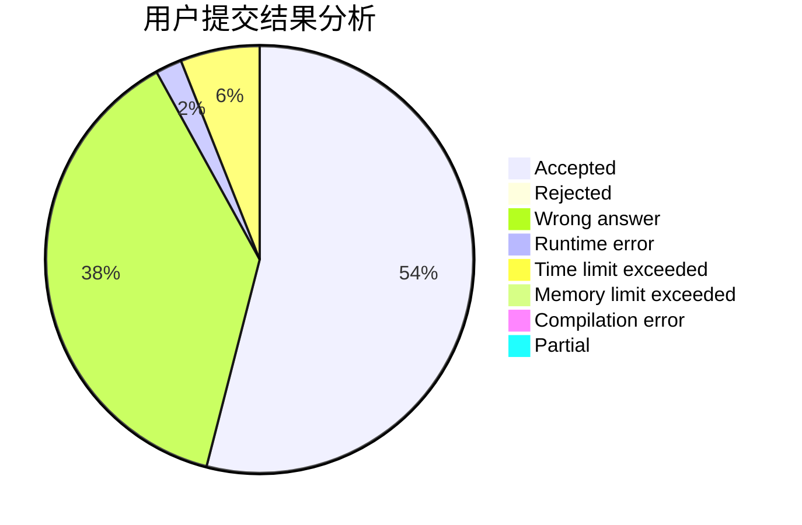
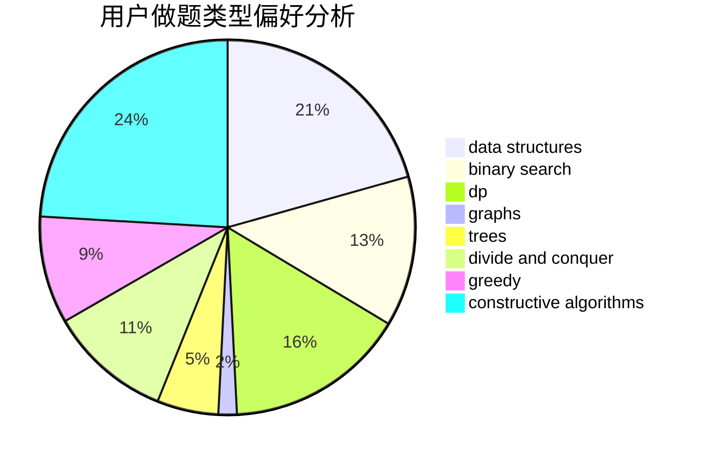

# Enter_
<!-- tabs:start -->
#### **用户提交结果分析**

#### **用户做题类型偏好分析**

#### **用户错题知识点分析**

<!-- tabs:end -->
# 推荐题目
[Digital Root](http://codeforces.com/problemset/problem/10/C)		number theory		  
[The Great Julya Calendar](http://codeforces.com/problemset/problem/331/C3)		dp		  
[Binary Protocol](http://codeforces.com/problemset/problem/825/A)		implementation		  
[Vasya and Golden Ticket](https://codeforces.com/contest/1058/problem/C)		implementation		  
[Quantum Classification - Dataset 5](http://codeforces.com/problemset/problem/1357/D3)		nan		  
[Drazil and Park](https://codeforces.com/contest/516/problem/C)		data structures		  
[Varying Kibibits](https://codeforces.com/contest/800/problem/D)		bitmasks,
                        dp		  
[Design Tutorial: Make It Nondeterministic](http://codeforces.com/problemset/problem/472/C)		greedy		  
[Helpful Maths](http://codeforces.com/problemset/problem/339/A)		greedy,
                        implementation,
                        sortings,
                        strings		  
[Company Income Growth](http://codeforces.com/problemset/problem/39/B)		greedy		  
<!-- tabs:start -->
#### **data structures**
[Drazil and Park](https://codeforces.com/contest/516/problem/C)		data structures		  
[Minimum spanning tree for each edge](http://codeforces.com/problemset/problem/609/E)		data structures,
                        dfs and similar,
                        dsu,
                        graphs,
                        trees		  
[Ivan and Burgers](http://codeforces.com/problemset/problem/1100/F)		data structures,
                        divide and conquer,
                        greedy,
                        math		  
[Avoid Rainbow Cycles](http://codeforces.com/problemset/problem/1408/E)		data structures,
                        dsu,
                        graphs,
                        greedy,
                        sortings,
                        trees		  
[Maximum width](http://codeforces.com/problemset/problem/1492/C)		binary search,
                        data structures,
                        dp,
                        greedy,
                        two pointers		  
[Old Floppy Drive](http://codeforces.com/problemset/problem/1490/G)		binary search,
                        data structures,
                        math		  
[Odd Mineral Resource](http://codeforces.com/problemset/problem/1479/D)		binary search,
                        bitmasks,
                        brute force,
                        data structures,
                        probabilities,
                        trees		  
[Meximization](http://codeforces.com/problemset/problem/1497/A)		brute force,
                        data structures,
                        greedy,
                        sortings		  
[Pekora and Trampoline](http://codeforces.com/problemset/problem/1491/C)		brute force,
                        data structures,
                        dp,
                        greedy,
                        implementation		  
[Card Deck](http://codeforces.com/problemset/problem/1492/B)		data structures,
                        greedy,
                        math		  
#### **binary search**
[Maximum width](http://codeforces.com/problemset/problem/1492/C)		binary search,
                        data structures,
                        dp,
                        greedy,
                        two pointers		  
[Pairs](http://codeforces.com/problemset/problem/1463/D)		binary search,
                        constructive algorithms,
                        greedy,
                        two pointers		  
[Old Floppy Drive](http://codeforces.com/problemset/problem/1490/G)		binary search,
                        data structures,
                        math		  
[Odd Mineral Resource](http://codeforces.com/problemset/problem/1479/D)		binary search,
                        bitmasks,
                        brute force,
                        data structures,
                        probabilities,
                        trees		  
[Complicated Computations](http://codeforces.com/problemset/problem/1436/E)		binary search,
                        data structures,
                        two pointers		  
[Divide and Summarize](http://codeforces.com/problemset/problem/1461/D)		binary search,
                        brute force,
                        data structures,
                        divide and conquer,
                        implementation,
                        sortings		  
[K-beautiful Strings](http://codeforces.com/problemset/problem/1493/C)		binary search,
                        brute force,
                        constructive algorithms,
                        greedy,
                        strings		  
[Pythagorean Triples](http://codeforces.com/problemset/problem/1487/D)		binary search,
                        brute force,
                        math,
                        number theory		  
[Eastern Exhibition](http://codeforces.com/problemset/problem/1486/B)		binary search,
                        geometry,
                        shortest paths,
                        sortings		  
[Guessing the Greatest (easy version)](http://codeforces.com/problemset/problem/1486/C1)		binary search,
                        interactive		  
#### **dp**
[The Great Julya Calendar](http://codeforces.com/problemset/problem/331/C3)		dp		  
[Varying Kibibits](https://codeforces.com/contest/800/problem/D)		bitmasks,
                        dp		  
[Covered Path](http://codeforces.com/problemset/problem/534/B)		dp,
                        greedy,
                        math		  
[Rarity and New Dress](http://codeforces.com/problemset/problem/1393/D)		dfs and similar,
                        dp,
                        implementation,
                        shortest paths		  
[Maximum width](http://codeforces.com/problemset/problem/1492/C)		binary search,
                        data structures,
                        dp,
                        greedy,
                        two pointers		  
[Bouncing Ball](https://codeforces.com/contest/1457/problem/C)		brute force,
                        dp,
                        implementation		  
[Pekora and Trampoline](http://codeforces.com/problemset/problem/1491/C)		brute force,
                        data structures,
                        dp,
                        greedy,
                        implementation		  
[Chef Monocarp](http://codeforces.com/problemset/problem/1437/C)		dp,
                        flows,
                        graph matchings,
                        greedy,
                        math,
                        sortings		  
[Binary Removals](http://codeforces.com/problemset/problem/1499/B)		brute force,
                        dp,
                        greedy,
                        implementation		  
[Zookeeper and The Infinite Zoo](http://codeforces.com/problemset/problem/1491/D)		bitmasks,
                        constructive algorithms,
                        dp,
                        greedy,
                        math		  
#### **graph**
[Minimum spanning tree for each edge](http://codeforces.com/problemset/problem/609/E)		data structures,
                        dfs and similar,
                        dsu,
                        graphs,
                        trees		  
[Resort](http://codeforces.com/problemset/problem/350/B)		graphs		  
[Send the Fool Further! (easy)](http://codeforces.com/problemset/problem/802/J)		dfs and similar,
                        graphs,
                        trees		  
[Andryusha and Colored Balloons](http://codeforces.com/problemset/problem/780/C)		dfs and similar,
                        graphs,
                        greedy,
                        trees		  
[Directing Edges](http://codeforces.com/problemset/problem/1385/E)		constructive algorithms,
                        dfs and similar,
                        graphs		  
[Directed Roads](http://codeforces.com/problemset/problem/711/D)		combinatorics,
                        dfs and similar,
                        graphs,
                        math		  
[Avoid Rainbow Cycles](http://codeforces.com/problemset/problem/1408/E)		data structures,
                        dsu,
                        graphs,
                        greedy,
                        sortings,
                        trees		  
[Minimum Ties](http://codeforces.com/problemset/problem/1487/C)		brute force,
                        constructive algorithms,
                        dfs and similar,
                        graphs,
                        greedy,
                        implementation,
                        math		  
[Chef Monocarp](http://codeforces.com/problemset/problem/1437/C)		dp,
                        flows,
                        graph matchings,
                        greedy,
                        math,
                        sortings		  
[Strange Housing](http://codeforces.com/problemset/problem/1470/D)		constructive algorithms,
                        dfs and similar,
                        graph matchings,
                        graphs,
                        greedy		  
#### **trees**
[Minimum spanning tree for each edge](http://codeforces.com/problemset/problem/609/E)		data structures,
                        dfs and similar,
                        dsu,
                        graphs,
                        trees		  
[Send the Fool Further! (easy)](http://codeforces.com/problemset/problem/802/J)		dfs and similar,
                        graphs,
                        trees		  
[Andryusha and Colored Balloons](http://codeforces.com/problemset/problem/780/C)		dfs and similar,
                        graphs,
                        greedy,
                        trees		  
[Avoid Rainbow Cycles](http://codeforces.com/problemset/problem/1408/E)		data structures,
                        dsu,
                        graphs,
                        greedy,
                        sortings,
                        trees		  
[Odd Mineral Resource](http://codeforces.com/problemset/problem/1479/D)		binary search,
                        bitmasks,
                        brute force,
                        data structures,
                        probabilities,
                        trees		  
[Yet Another Card Deck](http://codeforces.com/problemset/problem/1511/C)		brute force,
                        data structures,
                        implementation,
                        trees		  
[Diameter Cuts](http://codeforces.com/problemset/problem/1499/F)		combinatorics,
                        dfs and similar,
                        dp,
                        trees		  
[Fib-tree](http://codeforces.com/problemset/problem/1491/E)		brute force,
                        dfs and similar,
                        divide and conquer,
                        number theory,
                        trees		  
[13th Labour of Heracles](http://codeforces.com/problemset/problem/1466/D)		data structures,
                        greedy,
                        sortings,
                        trees		  
[BFS Trees](http://codeforces.com/problemset/problem/1495/D)		combinatorics,
                        dfs and similar,
                        graphs,
                        math,
                        shortest paths,
                        trees		  
#### **divide and conquer**
[Ivan and Burgers](http://codeforces.com/problemset/problem/1100/F)		data structures,
                        divide and conquer,
                        greedy,
                        math		  
[Divide and Summarize](http://codeforces.com/problemset/problem/1461/D)		binary search,
                        brute force,
                        data structures,
                        divide and conquer,
                        implementation,
                        sortings		  
[Song of the Sirens](http://codeforces.com/problemset/problem/1466/G)		combinatorics,
                        divide and conquer,
                        hashing,
                        math,
                        string suffix structures,
                        strings		  
[Permutation Transformation](http://codeforces.com/problemset/problem/1490/D)		dfs and similar,
                        divide and conquer,
                        implementation		  
[Skyline Photo](https://codeforces.com/contest/1483/problem/C)		data structures,
                        divide and conquer,
                        dp		  
[Fib-tree](http://codeforces.com/problemset/problem/1491/E)		brute force,
                        dfs and similar,
                        divide and conquer,
                        number theory,
                        trees		  
[Sum of Prefix Sums](http://codeforces.com/problemset/problem/1303/G)		data structures,
                        divide and conquer,
                        geometry,
                        trees		  
[Dogeforces](http://codeforces.com/problemset/problem/1494/D)		constructive algorithms,
                        data structures,
                        dfs and similar,
                        divide and conquer,
                        dsu,
                        greedy,
                        sortings,
                        trees		  
[Logistical Questions](http://codeforces.com/problemset/problem/566/C)		dfs and similar,
                        divide and conquer,
                        trees		  
[Fruit Sequences](http://codeforces.com/problemset/problem/1428/F)		binary search,
                        data structures,
                        divide and conquer,
                        dp,
                        two pointers		  
#### **greedy**
[Design Tutorial: Make It Nondeterministic](http://codeforces.com/problemset/problem/472/C)		greedy		  
[Helpful Maths](http://codeforces.com/problemset/problem/339/A)		greedy,
                        implementation,
                        sortings,
                        strings		  
[Company Income Growth](http://codeforces.com/problemset/problem/39/B)		greedy		  
[Covered Path](http://codeforces.com/problemset/problem/534/B)		dp,
                        greedy,
                        math		  
[Ivan and Burgers](http://codeforces.com/problemset/problem/1100/F)		data structures,
                        divide and conquer,
                        greedy,
                        math		  
[Beautiful Sequence](http://codeforces.com/problemset/problem/1264/B)		brute force,
                        constructive algorithms,
                        greedy		  
[Table Decorations](http://codeforces.com/problemset/problem/478/C)		greedy		  
[Andryusha and Colored Balloons](http://codeforces.com/problemset/problem/780/C)		dfs and similar,
                        graphs,
                        greedy,
                        trees		  
[Beautiful String](http://codeforces.com/problemset/problem/1265/A)		constructive algorithms,
                        greedy		  
[Avoid Rainbow Cycles](http://codeforces.com/problemset/problem/1408/E)		data structures,
                        dsu,
                        graphs,
                        greedy,
                        sortings,
                        trees		  
#### **constructive algorithms**
[Beautiful Sequence](http://codeforces.com/problemset/problem/1264/B)		brute force,
                        constructive algorithms,
                        greedy		  
[Beautiful String](http://codeforces.com/problemset/problem/1265/A)		constructive algorithms,
                        greedy		  
[Directing Edges](http://codeforces.com/problemset/problem/1385/E)		constructive algorithms,
                        dfs and similar,
                        graphs		  
[Anti-knapsack](http://codeforces.com/problemset/problem/1493/A)		constructive algorithms,
                        greedy		  
[Pairs](http://codeforces.com/problemset/problem/1463/D)		binary search,
                        constructive algorithms,
                        greedy,
                        two pointers		  
[XOR-gun](https://codeforces.com/contest/1456/problem/B)		bitmasks,
                        brute force,
                        constructive algorithms		  
[Genius's Gambit](http://codeforces.com/problemset/problem/1492/D)		bitmasks,
                        constructive algorithms,
                        greedy,
                        math		  
[3-Coloring](https://codeforces.com/contest/1504/problem/D)		constructive algorithms,
                        games,
                        interactive		  
[Basic Diplomacy](https://codeforces.com/contest/1483/problem/A)		brute force,
                        constructive algorithms,
                        greedy,
                        implementation		  
[Array and Peaks](http://codeforces.com/problemset/problem/1513/A)		constructive algorithms,
                        implementation		  
#### **sortings**
[Helpful Maths](http://codeforces.com/problemset/problem/339/A)		greedy,
                        implementation,
                        sortings,
                        strings		  
[Avoid Rainbow Cycles](http://codeforces.com/problemset/problem/1408/E)		data structures,
                        dsu,
                        graphs,
                        greedy,
                        sortings,
                        trees		  
[Diamond Miner](https://codeforces.com/contest/1496/problem/C)		geometry,
                        greedy,
                        math,
                        sortings		  
[Meximization](http://codeforces.com/problemset/problem/1497/A)		brute force,
                        data structures,
                        greedy,
                        sortings		  
[Avoiding Zero](http://codeforces.com/problemset/problem/1427/A)		math,
                        sortings		  
[Divide and Summarize](http://codeforces.com/problemset/problem/1461/D)		binary search,
                        brute force,
                        data structures,
                        divide and conquer,
                        implementation,
                        sortings		  
[Chef Monocarp](http://codeforces.com/problemset/problem/1437/C)		dp,
                        flows,
                        graph matchings,
                        greedy,
                        math,
                        sortings		  
[Replacing Elements](http://codeforces.com/problemset/problem/1473/A)		greedy,
                        implementation,
                        math,
                        sortings		  
[Eastern Exhibition](http://codeforces.com/problemset/problem/1486/B)		binary search,
                        geometry,
                        shortest paths,
                        sortings		  
[The Great Hero](http://codeforces.com/problemset/problem/1480/B)		greedy,
                        implementation,
                        sortings		  
<!-- tabs:end -->
