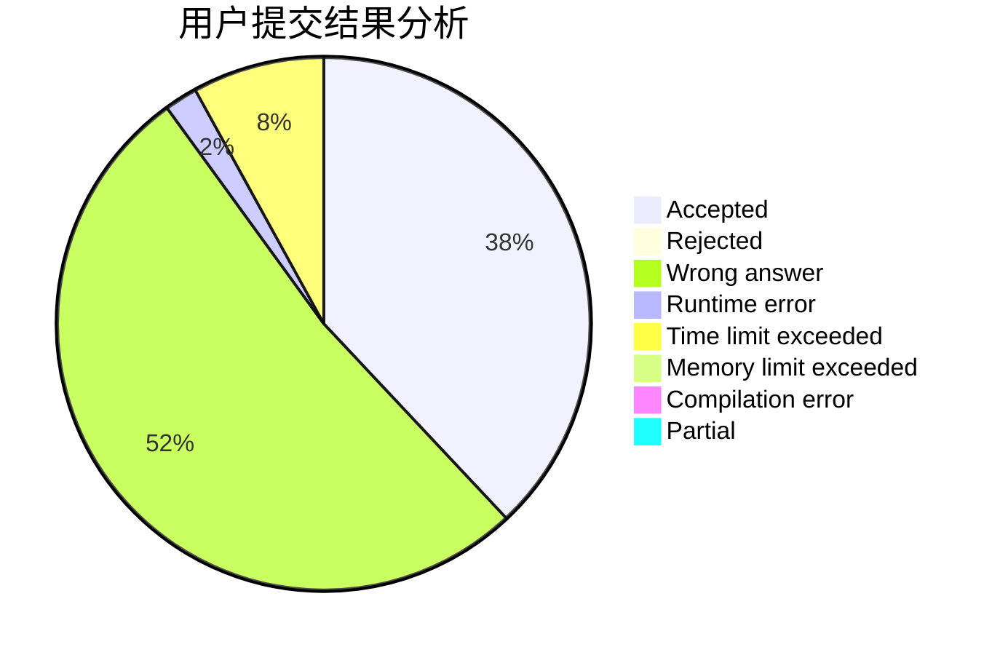
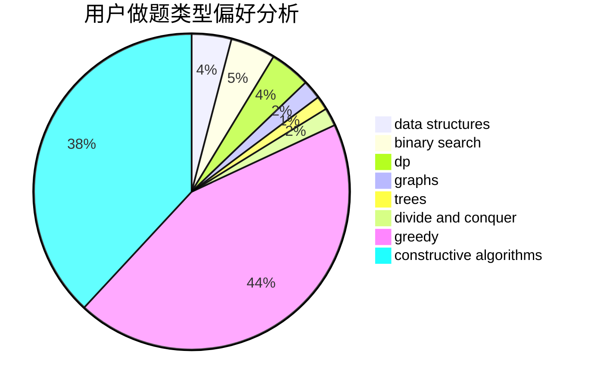

# Enthusiasticcitizens
<!-- tabs:start -->
#### **用户提交结果分析**

#### **用户做题类型偏好分析**

#### **用户错题知识点分析**

<!-- tabs:end -->
# 推荐题目
[Blue and Red of Our Faculty!](http://codeforces.com/problemset/problem/1425/B)		divide and conquer,
                        dp		  
[Platforms Jumping](https://codeforces.com/contest/1432/problem/F)		greedy		  
[Divide Candies](http://codeforces.com/problemset/problem/1056/B)		math,
                        number theory		  
[Simplified Nonogram](http://codeforces.com/problemset/problem/534/F)		bitmasks,
                        dp,
                        hashing,
                        meet-in-the-middle		  
[Martian Strings](http://codeforces.com/problemset/problem/149/E)		string suffix structures,
                        strings		  
[Tree Queries](http://codeforces.com/problemset/problem/825/G)		dfs and similar,
                        graphs,
                        trees		  
[Divisors](http://codeforces.com/problemset/problem/1033/D)		interactive,
                        math,
                        number theory		  
[Ebony and Ivory](http://codeforces.com/problemset/problem/633/A)		brute force,
                        math,
                        number theory		  
[Three Pairwise Maximums](http://codeforces.com/problemset/problem/1385/A)		math		  
[Dwarves, Hats and Extrasensory Abilities](http://codeforces.com/problemset/problem/1063/C)		binary search,
                        constructive algorithms,
                        geometry,
                        interactive		  
<!-- tabs:start -->
#### **data structures**
[Minimal Labels](http://codeforces.com/problemset/problem/825/E)		data structures,
                        dfs and similar,
                        graphs,
                        greedy		  
[Moonwalk challenge](http://codeforces.com/problemset/problem/1045/J)		data structures,
                        strings,
                        trees		  
[Matrix](http://codeforces.com/problemset/problem/364/A)		combinatorics,
                        data structures,
                        implementation		  
[Ants](http://codeforces.com/problemset/problem/1007/D)		2-sat,
                        data structures,
                        trees		  
[Sereja and Two Sequences](http://codeforces.com/problemset/problem/425/C)		data structures,
                        dp		  
[String Reconstruction](http://codeforces.com/problemset/problem/827/A)		data structures,
                        greedy,
                        sortings,
                        strings		  
[Maximum width](http://codeforces.com/problemset/problem/1492/C)		binary search,
                        data structures,
                        dp,
                        greedy,
                        two pointers		  
[Old Floppy Drive](http://codeforces.com/problemset/problem/1490/G)		binary search,
                        data structures,
                        math		  
[Odd Mineral Resource](http://codeforces.com/problemset/problem/1479/D)		binary search,
                        bitmasks,
                        brute force,
                        data structures,
                        probabilities,
                        trees		  
[Meximization](http://codeforces.com/problemset/problem/1497/A)		brute force,
                        data structures,
                        greedy,
                        sortings		  
#### **binary search**
[Dwarves, Hats and Extrasensory Abilities](http://codeforces.com/problemset/problem/1063/C)		binary search,
                        constructive algorithms,
                        geometry,
                        interactive		  
[Suitable Replacement](http://codeforces.com/problemset/problem/825/D)		binary search,
                        greedy,
                        implementation		  
[Maximum width](http://codeforces.com/problemset/problem/1492/C)		binary search,
                        data structures,
                        dp,
                        greedy,
                        two pointers		  
[Pairs](http://codeforces.com/problemset/problem/1463/D)		binary search,
                        constructive algorithms,
                        greedy,
                        two pointers		  
[Old Floppy Drive](http://codeforces.com/problemset/problem/1490/G)		binary search,
                        data structures,
                        math		  
[Odd Mineral Resource](http://codeforces.com/problemset/problem/1479/D)		binary search,
                        bitmasks,
                        brute force,
                        data structures,
                        probabilities,
                        trees		  
[Complicated Computations](http://codeforces.com/problemset/problem/1436/E)		binary search,
                        data structures,
                        two pointers		  
[Divide and Summarize](http://codeforces.com/problemset/problem/1461/D)		binary search,
                        brute force,
                        data structures,
                        divide and conquer,
                        implementation,
                        sortings		  
[K-beautiful Strings](http://codeforces.com/problemset/problem/1493/C)		binary search,
                        brute force,
                        constructive algorithms,
                        greedy,
                        strings		  
[Pythagorean Triples](http://codeforces.com/problemset/problem/1487/D)		binary search,
                        brute force,
                        math,
                        number theory		  
#### **dp**
[Blue and Red of Our Faculty!](http://codeforces.com/problemset/problem/1425/B)		divide and conquer,
                        dp		  
[Simplified Nonogram](http://codeforces.com/problemset/problem/534/F)		bitmasks,
                        dp,
                        hashing,
                        meet-in-the-middle		  
[Greenhouse Effect](http://codeforces.com/problemset/problem/269/B)		dp		  
[String Compression](http://codeforces.com/problemset/problem/825/F)		dp,
                        hashing,
                        string suffix structures,
                        strings		  
[Block Adventure](http://codeforces.com/problemset/problem/1200/B)		dp,
                        greedy		  
[Sereja and Two Sequences](http://codeforces.com/problemset/problem/425/C)		data structures,
                        dp		  
[Civilization](http://codeforces.com/problemset/problem/455/C)		dfs and similar,
                        dp,
                        dsu,
                        ternary search,
                        trees		  
[Maximum width](http://codeforces.com/problemset/problem/1492/C)		binary search,
                        data structures,
                        dp,
                        greedy,
                        two pointers		  
[Bouncing Ball](https://codeforces.com/contest/1457/problem/C)		brute force,
                        dp,
                        implementation		  
[Pekora and Trampoline](http://codeforces.com/problemset/problem/1491/C)		brute force,
                        data structures,
                        dp,
                        greedy,
                        implementation		  
#### **graph**
[Tree Queries](http://codeforces.com/problemset/problem/825/G)		dfs and similar,
                        graphs,
                        trees		  
[Minimal Labels](http://codeforces.com/problemset/problem/825/E)		data structures,
                        dfs and similar,
                        graphs,
                        greedy		  
[Colorful Graph](http://codeforces.com/problemset/problem/246/D)		brute force,
                        dfs and similar,
                        graphs		  
[News Distribution](http://codeforces.com/problemset/problem/1167/C)		dfs and similar,
                        dsu,
                        graphs		  
[BFS Trees](http://codeforces.com/problemset/problem/1495/D)		combinatorics,
                        dfs and similar,
                        graphs,
                        math,
                        shortest paths,
                        trees		  
[Recover it!](http://codeforces.com/problemset/problem/1176/D)		dfs and similar,
                        graphs,
                        greedy,
                        number theory,
                        sortings		  
[Minimum Ties](http://codeforces.com/problemset/problem/1487/C)		brute force,
                        constructive algorithms,
                        dfs and similar,
                        graphs,
                        greedy,
                        implementation,
                        math		  
[Chef Monocarp](http://codeforces.com/problemset/problem/1437/C)		dp,
                        flows,
                        graph matchings,
                        greedy,
                        math,
                        sortings		  
[Strange Housing](http://codeforces.com/problemset/problem/1470/D)		constructive algorithms,
                        dfs and similar,
                        graph matchings,
                        graphs,
                        greedy		  
[Longest Simple Cycle](http://codeforces.com/problemset/problem/1476/C)		dp,
                        graphs,
                        greedy		  
#### **trees**
[Tree Queries](http://codeforces.com/problemset/problem/825/G)		dfs and similar,
                        graphs,
                        trees		  
[High Load](http://codeforces.com/problemset/problem/827/B)		constructive algorithms,
                        greedy,
                        implementation,
                        trees		  
[Moonwalk challenge](http://codeforces.com/problemset/problem/1045/J)		data structures,
                        strings,
                        trees		  
[Ants](http://codeforces.com/problemset/problem/1007/D)		2-sat,
                        data structures,
                        trees		  
[Civilization](http://codeforces.com/problemset/problem/455/C)		dfs and similar,
                        dp,
                        dsu,
                        ternary search,
                        trees		  
[BFS Trees](http://codeforces.com/problemset/problem/1495/D)		combinatorics,
                        dfs and similar,
                        graphs,
                        math,
                        shortest paths,
                        trees		  
[Odd Mineral Resource](http://codeforces.com/problemset/problem/1479/D)		binary search,
                        bitmasks,
                        brute force,
                        data structures,
                        probabilities,
                        trees		  
[Yet Another Card Deck](http://codeforces.com/problemset/problem/1511/C)		brute force,
                        data structures,
                        implementation,
                        trees		  
[Diameter Cuts](http://codeforces.com/problemset/problem/1499/F)		combinatorics,
                        dfs and similar,
                        dp,
                        trees		  
[Fib-tree](http://codeforces.com/problemset/problem/1491/E)		brute force,
                        dfs and similar,
                        divide and conquer,
                        number theory,
                        trees		  
#### **divide and conquer**
[Blue and Red of Our Faculty!](http://codeforces.com/problemset/problem/1425/B)		divide and conquer,
                        dp		  
[Divide and Summarize](http://codeforces.com/problemset/problem/1461/D)		binary search,
                        brute force,
                        data structures,
                        divide and conquer,
                        implementation,
                        sortings		  
[Song of the Sirens](http://codeforces.com/problemset/problem/1466/G)		combinatorics,
                        divide and conquer,
                        hashing,
                        math,
                        string suffix structures,
                        strings		  
[Permutation Transformation](http://codeforces.com/problemset/problem/1490/D)		dfs and similar,
                        divide and conquer,
                        implementation		  
[Skyline Photo](https://codeforces.com/contest/1483/problem/C)		data structures,
                        divide and conquer,
                        dp		  
[Fib-tree](http://codeforces.com/problemset/problem/1491/E)		brute force,
                        dfs and similar,
                        divide and conquer,
                        number theory,
                        trees		  
[Sum of Prefix Sums](http://codeforces.com/problemset/problem/1303/G)		data structures,
                        divide and conquer,
                        geometry,
                        trees		  
[Dogeforces](http://codeforces.com/problemset/problem/1494/D)		constructive algorithms,
                        data structures,
                        dfs and similar,
                        divide and conquer,
                        dsu,
                        greedy,
                        sortings,
                        trees		  
[Logistical Questions](http://codeforces.com/problemset/problem/566/C)		dfs and similar,
                        divide and conquer,
                        trees		  
[Fruit Sequences](http://codeforces.com/problemset/problem/1428/F)		binary search,
                        data structures,
                        divide and conquer,
                        dp,
                        two pointers		  
#### **greedy**
[Platforms Jumping](https://codeforces.com/contest/1432/problem/F)		greedy		  
[Minimal Labels](http://codeforces.com/problemset/problem/825/E)		data structures,
                        dfs and similar,
                        graphs,
                        greedy		  
[High Load](http://codeforces.com/problemset/problem/827/B)		constructive algorithms,
                        greedy,
                        implementation,
                        trees		  
[Block Adventure](http://codeforces.com/problemset/problem/1200/B)		dp,
                        greedy		  
[Vasya and Templates](https://codeforces.com/contest/1086/problem/C)		greedy,
                        implementation,
                        strings		  
[Suitable Replacement](http://codeforces.com/problemset/problem/825/D)		binary search,
                        greedy,
                        implementation		  
[String Reconstruction](http://codeforces.com/problemset/problem/827/A)		data structures,
                        greedy,
                        sortings,
                        strings		  
[Berland Crossword](http://codeforces.com/problemset/problem/1494/B)		bitmasks,
                        brute force,
                        greedy,
                        implementation		  
[Multi-judge Solving](http://codeforces.com/problemset/problem/825/C)		greedy,
                        implementation		  
[Recover it!](http://codeforces.com/problemset/problem/1176/D)		dfs and similar,
                        graphs,
                        greedy,
                        number theory,
                        sortings		  
#### **constructive algorithms**
[Dwarves, Hats and Extrasensory Abilities](http://codeforces.com/problemset/problem/1063/C)		binary search,
                        constructive algorithms,
                        geometry,
                        interactive		  
[High Load](http://codeforces.com/problemset/problem/827/B)		constructive algorithms,
                        greedy,
                        implementation,
                        trees		  
[Anti-knapsack](http://codeforces.com/problemset/problem/1493/A)		constructive algorithms,
                        greedy		  
[Pairs](http://codeforces.com/problemset/problem/1463/D)		binary search,
                        constructive algorithms,
                        greedy,
                        two pointers		  
[XOR-gun](https://codeforces.com/contest/1456/problem/B)		bitmasks,
                        brute force,
                        constructive algorithms		  
[Genius's Gambit](http://codeforces.com/problemset/problem/1492/D)		bitmasks,
                        constructive algorithms,
                        greedy,
                        math		  
[3-Coloring](https://codeforces.com/contest/1504/problem/D)		constructive algorithms,
                        games,
                        interactive		  
[Basic Diplomacy](https://codeforces.com/contest/1483/problem/A)		brute force,
                        constructive algorithms,
                        greedy,
                        implementation		  
[Array and Peaks](http://codeforces.com/problemset/problem/1513/A)		constructive algorithms,
                        implementation		  
[No More Inversions](http://codeforces.com/problemset/problem/1473/C)		constructive algorithms,
                        math		  
#### **sortings**
[String Reconstruction](http://codeforces.com/problemset/problem/827/A)		data structures,
                        greedy,
                        sortings,
                        strings		  
[Recover it!](http://codeforces.com/problemset/problem/1176/D)		dfs and similar,
                        graphs,
                        greedy,
                        number theory,
                        sortings		  
[Diamond Miner](https://codeforces.com/contest/1496/problem/C)		geometry,
                        greedy,
                        math,
                        sortings		  
[Meximization](http://codeforces.com/problemset/problem/1497/A)		brute force,
                        data structures,
                        greedy,
                        sortings		  
[Avoiding Zero](http://codeforces.com/problemset/problem/1427/A)		math,
                        sortings		  
[Divide and Summarize](http://codeforces.com/problemset/problem/1461/D)		binary search,
                        brute force,
                        data structures,
                        divide and conquer,
                        implementation,
                        sortings		  
[Chef Monocarp](http://codeforces.com/problemset/problem/1437/C)		dp,
                        flows,
                        graph matchings,
                        greedy,
                        math,
                        sortings		  
[Replacing Elements](http://codeforces.com/problemset/problem/1473/A)		greedy,
                        implementation,
                        math,
                        sortings		  
[Eastern Exhibition](http://codeforces.com/problemset/problem/1486/B)		binary search,
                        geometry,
                        shortest paths,
                        sortings		  
[The Great Hero](http://codeforces.com/problemset/problem/1480/B)		greedy,
                        implementation,
                        sortings		  
<!-- tabs:end -->
