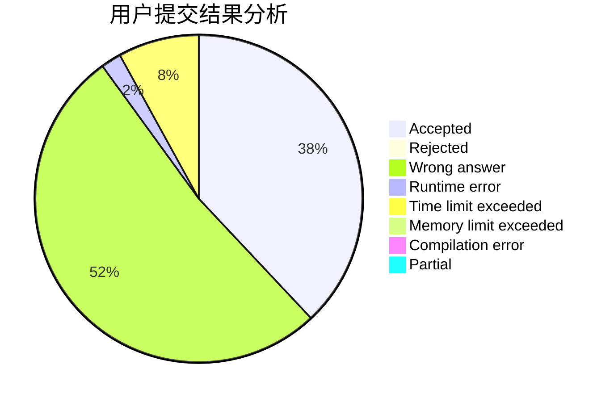
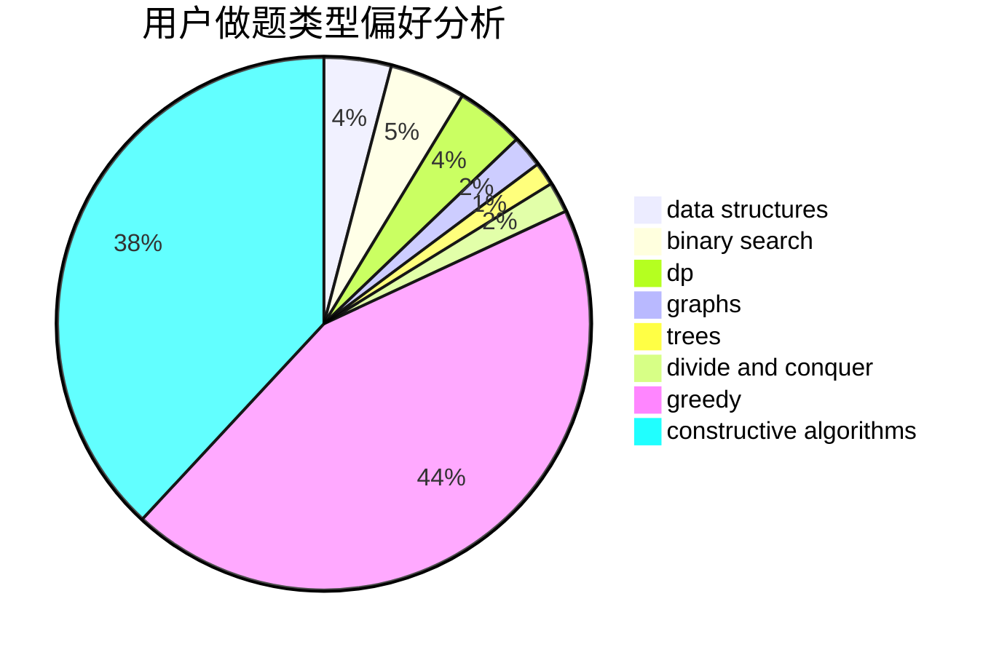

# Enthusiasticcitizens

<!-- tabs:start -->

#### **用户提交结果分析**

#### **用户做题类型偏好分析**

#### **用户错题知识点分析**

<!-- tabs:end -->
# 推荐题目
[1425B](https://codeforces.com/contest/1425/problem/B)		divide and conquer,
                        dp		  
[149E](https://codeforces.com/contest/149/problem/E)		string suffix structures,
                        strings		  
[246D](https://codeforces.com/contest/246/problem/D)		brute force,
                        dfs and similar,
                        graphs		  
[1033D](https://codeforces.com/contest/1033/problem/D)		interactive,
                        math,
                        number theory		  
[1385A](https://codeforces.com/contest/1385/problem/A)		math		  
[633A](https://codeforces.com/contest/633/problem/A)		brute force,
                        math,
                        number theory		  
[1063C](https://codeforces.com/contest/1063/problem/C)		binary search,
                        constructive algorithms,
                        geometry,
                        interactive		  
[705B](https://codeforces.com/contest/705/problem/B)		games,
                        math		  
[825G](https://codeforces.com/contest/825/problem/G)		dfs and similar,
                        graphs,
                        trees		  
[827A](https://codeforces.com/contest/827/problem/A)		data structures,
                        greedy,
                        sortings,
                        strings		  
