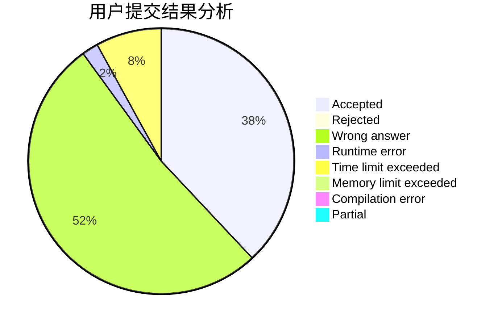
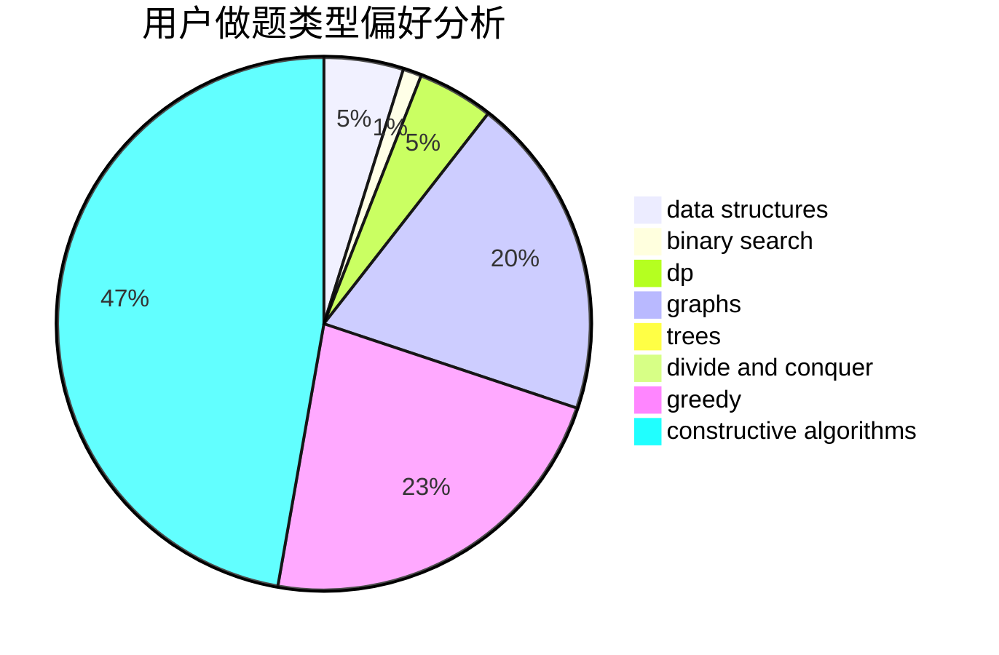

# Enthusiasticcitizens

<!-- tabs:start -->

#### **用户提交结果分析**

#### **用户做题类型偏好分析**

#### **用户错题知识点分析**

<!-- tabs:end -->
# 推荐题目
[1433E](https://codeforces.com/contest/1433/problem/E)		combinatorics,
                        math		  
[1510A](https://codeforces.com/contest/1510/problem/A)		nan		  
[267A](https://codeforces.com/contest/267/problem/A)		math,
                        number theory		  
[1033G](https://codeforces.com/contest/1033/problem/G)		games		  
[1395A](https://codeforces.com/contest/1395/problem/A)		brute force,
                        math		  
[665C](https://codeforces.com/contest/665/problem/C)		dp,
                        greedy,
                        strings		  
[1063F](https://codeforces.com/contest/1063/problem/F)		data structures,
                        dp,
                        string suffix structures		  
[724C](https://codeforces.com/contest/724/problem/C)		greedy,
                        hashing,
                        implementation,
                        math,
                        number theory,
                        sortings		  
[845C](https://codeforces.com/contest/845/problem/C)		data structures,
                        greedy,
                        sortings		  
[845D](https://codeforces.com/contest/845/problem/D)		data structures,
                        dp,
                        greedy		  
