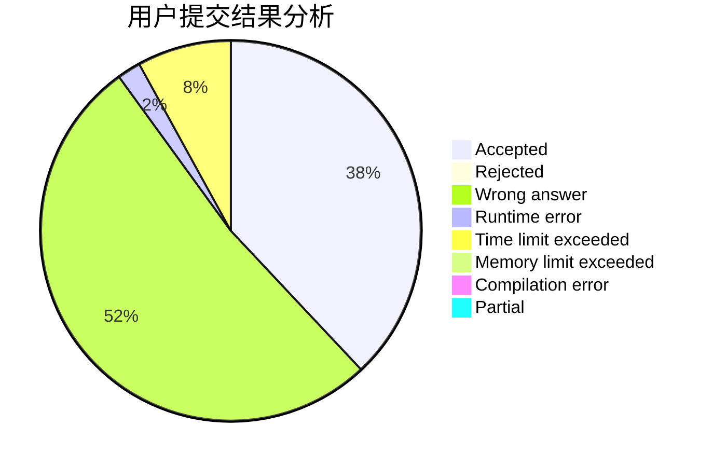
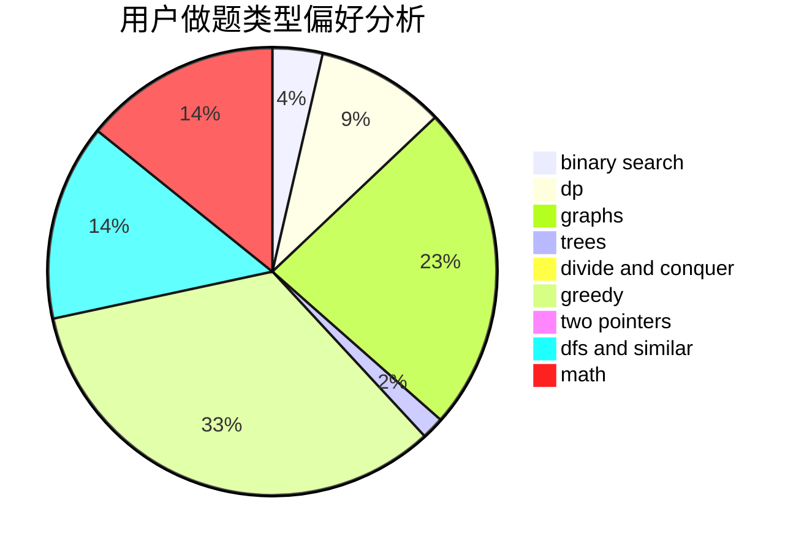

# Enthusiasticcitizens

<!-- tabs:start -->

#### **用户提交结果分析**

#### **用户做题类型偏好分析**

<!-- tabs:end -->
# 推荐题目
[1433E](https://codeforces.com/contest/1433/problem/E)
[1510A](https://codeforces.com/contest/1510/problem/A)
[267A](https://codeforces.com/contest/267/problem/A)
[1033G](https://codeforces.com/contest/1033/problem/G)
[1395A](https://codeforces.com/contest/1395/problem/A)
[665C](https://codeforces.com/contest/665/problem/C)
[1063F](https://codeforces.com/contest/1063/problem/F)
[724C](https://codeforces.com/contest/724/problem/C)
[845C](https://codeforces.com/contest/845/problem/C)
[845D](https://codeforces.com/contest/845/problem/D)
