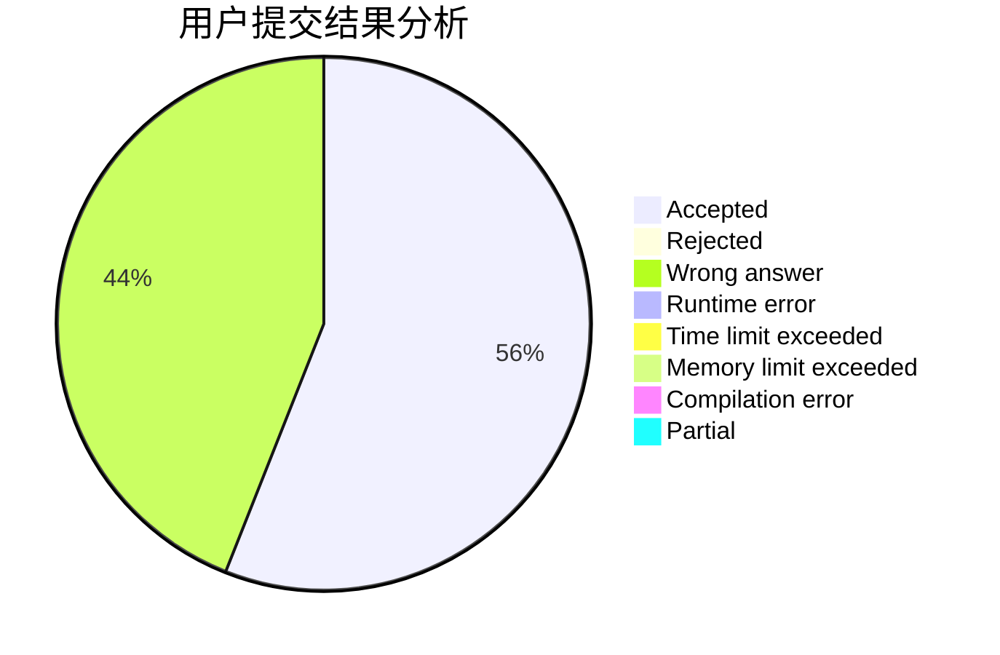
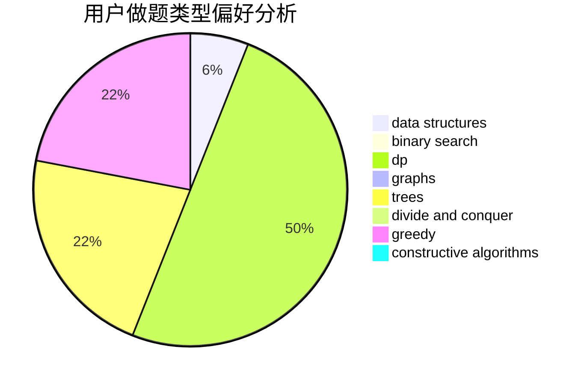
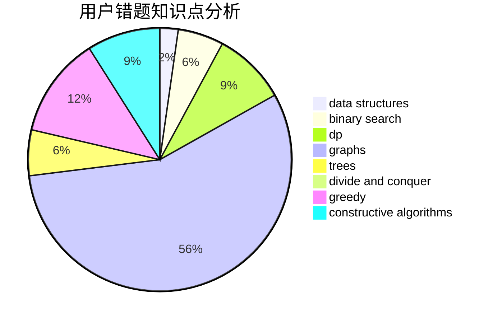

# EpIc-DesTinY

<!-- tabs:start -->

#### **用户提交结果分析**

#### **用户做题类型偏好分析**

#### **用户错题知识点分析**

<!-- tabs:end -->
# 推荐题目
[587D](https://codeforces.com/contest/587/problem/D)		2-sat,
                        binary search		  
[1227A](https://codeforces.com/contest/1227/problem/A)		math		  
[1227F2](https://codeforces.com/contest/1227F/problem/2)		combinatorics,
                        math		  
[827C](https://codeforces.com/contest/827/problem/C)		data structures,
                        strings		  
[778A](https://codeforces.com/contest/778/problem/A)		binary search,
                        greedy,
                        strings		  
[1285C](https://codeforces.com/contest/1285/problem/C)		brute force,
                        math,
                        number theory		  
[316F2](https://codeforces.com/contest/316F/problem/2)		nan		  
[1482E](https://codeforces.com/contest/1482/problem/E)		data structures,
                        divide and conquer,
                        dp		  
[1489D](https://codeforces.com/contest/1489/problem/D)		dsu,graphs,sortings,trees		  
[1483E](https://codeforces.com/contest/1483/problem/E)		dsu,graphs,sortings,trees		  
