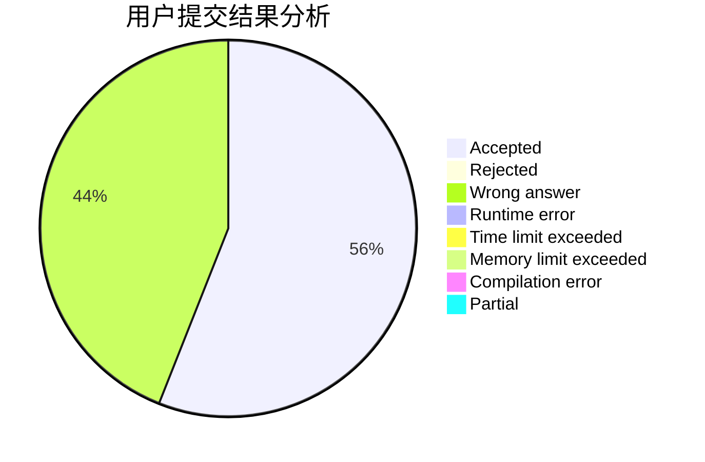
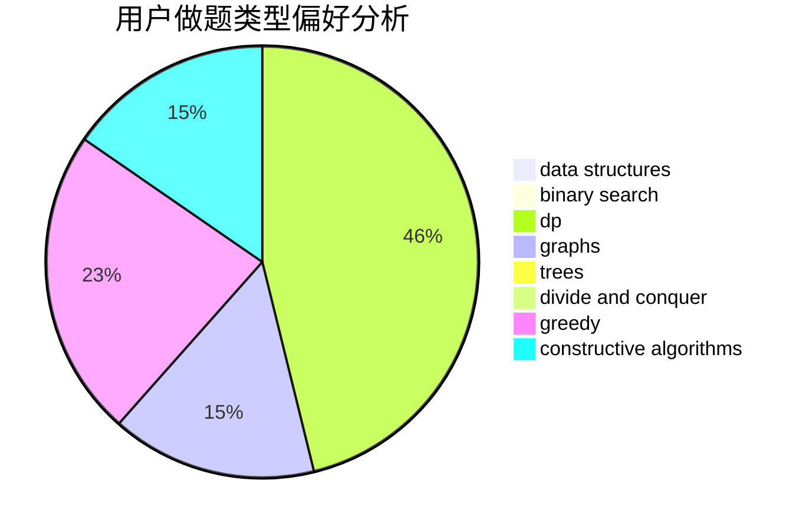
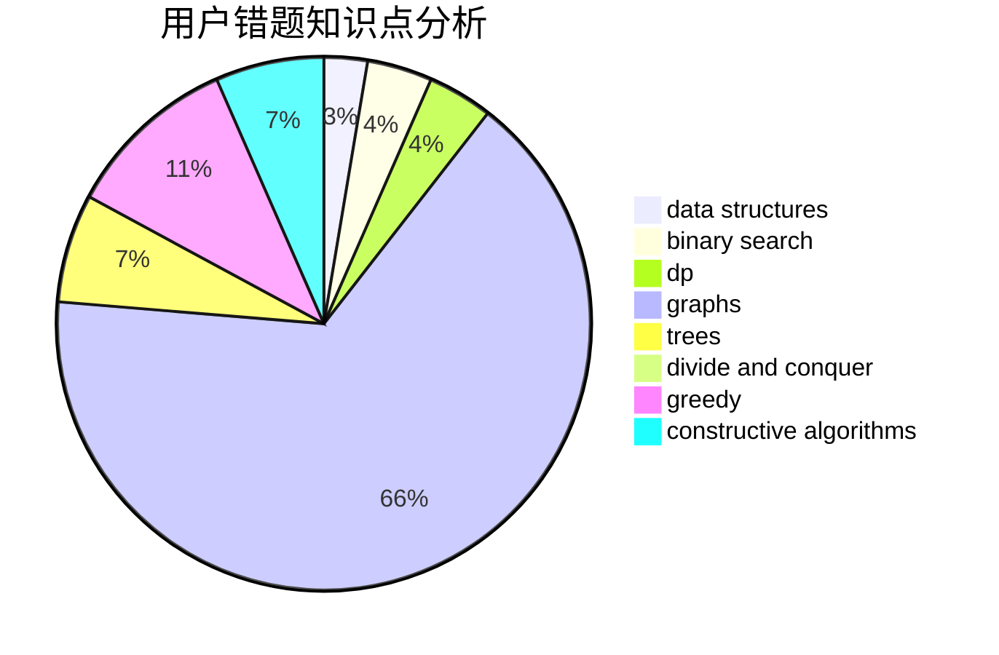

# EpIc-DesTinY

<!-- tabs:start -->

#### **用户提交结果分析**

#### **用户做题类型偏好分析**

#### **用户错题知识点分析**

<!-- tabs:end -->
# 推荐题目
[607E](https://codeforces.com/contest/607/problem/E)		binary search,
                        geometry		  
[1234E](https://codeforces.com/contest/1234/problem/E)		math		  
[1236D](https://codeforces.com/contest/1236/problem/D)		brute force,
                        data structures,
                        greedy,
                        implementation		  
[845F](https://codeforces.com/contest/845/problem/F)		bitmasks,
                        dp		  
[796C](https://codeforces.com/contest/796/problem/C)		constructive algorithms,
                        data structures,
                        dp,
                        trees		  
[1292D](https://codeforces.com/contest/1292/problem/D)		dp,
                        graphs,
                        greedy,
                        math,
                        number theory,
                        trees		  
[343D](https://codeforces.com/contest/343/problem/D)		data structures,
                        dfs and similar,
                        graphs,
                        trees		  
[1490C](https://codeforces.com/contest/1490/problem/C)		binary search,
                        brute force,
                        brute force,
                        math		  
[1497B](https://codeforces.com/contest/1497/problem/B)		constructive algorithms,
                        greedy,
                        math		  
[1491C](https://codeforces.com/contest/1491/problem/C)		brute force,
                        data structures,
                        dp,
                        greedy,
                        implementation		  
