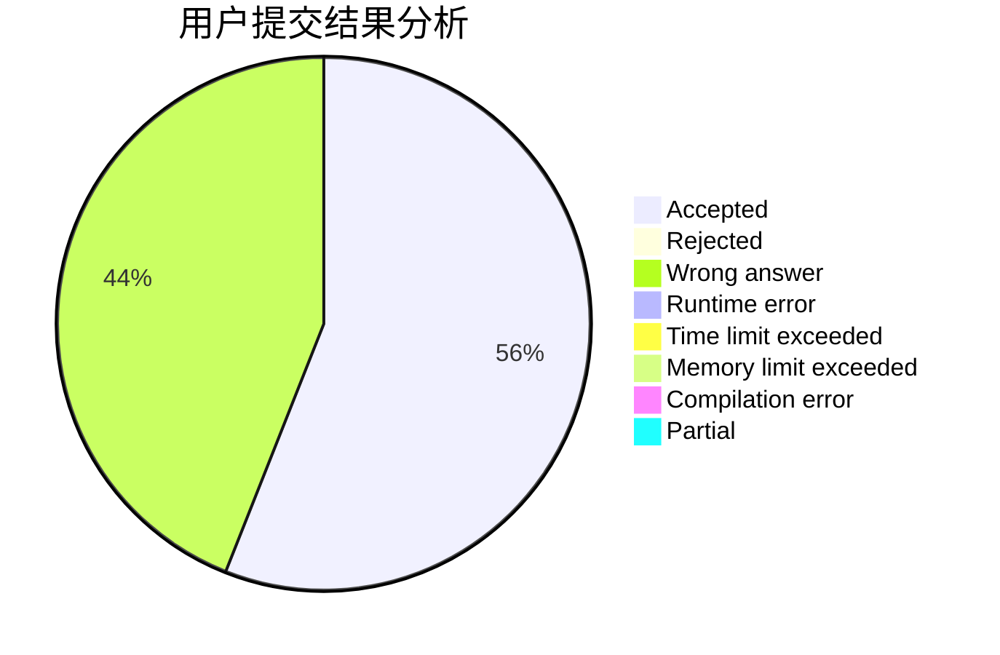
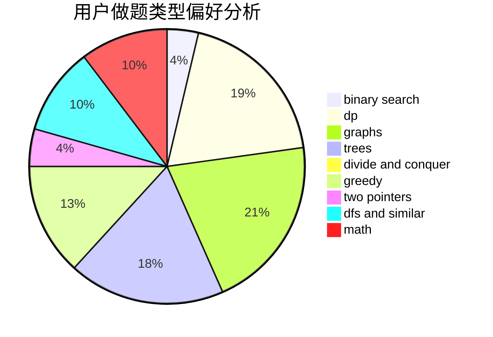

# EpIc-DesTinY

<!-- tabs:start -->

#### **用户提交结果分析**

#### **用户做题类型偏好分析**

<!-- tabs:end -->
# 推荐题目
[607E](https://codeforces.com/contest/607/problem/E)
[1234E](https://codeforces.com/contest/1234/problem/E)
[1236D](https://codeforces.com/contest/1236/problem/D)
[845F](https://codeforces.com/contest/845/problem/F)
[796C](https://codeforces.com/contest/796/problem/C)
[1292D](https://codeforces.com/contest/1292/problem/D)
[343D](https://codeforces.com/contest/343/problem/D)
[1490C](https://codeforces.com/contest/1490/problem/C)
[1497B](https://codeforces.com/contest/1497/problem/B)
[1491C](https://codeforces.com/contest/1491/problem/C)
