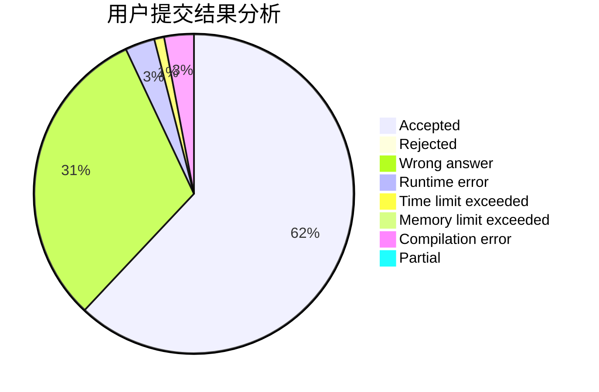
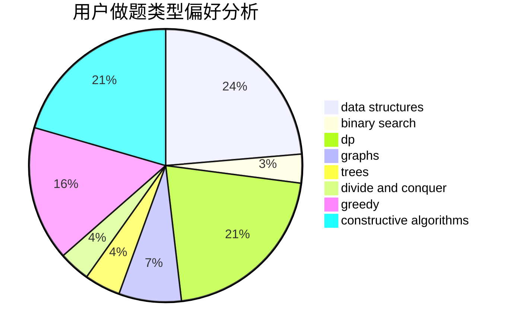

# 201811940162
<!-- tabs:start -->
#### **用户提交结果分析**

#### **用户做题类型偏好分析**

#### **用户错题知识点分析**

<!-- tabs:end -->
# 推荐题目
[Grow The Tree](http://codeforces.com/problemset/problem/1248/B)		greedy,
                        math,
                        sortings		  
[Show Must Go On](http://codeforces.com/problemset/problem/1250/I)		binary search,
                        brute force,
                        greedy,
                        shortest paths		  
[The Feast and the Bus](http://codeforces.com/problemset/problem/1250/B)		brute force,
                        constructive algorithms,
                        greedy,
                        math		  
[Data Center](http://codeforces.com/problemset/problem/1250/F)		brute force,
                        implementation		  
[Divide The Students](http://codeforces.com/problemset/problem/1250/L)		binary search,
                        greedy,
                        math		  
[Trip to Saint Petersburg](http://codeforces.com/problemset/problem/1250/C)		data structures		  
[The World Is Just a Programming Task (Hard Version)](https://codeforces.com/contest/1248/problem/D2)		implementation		  
[Summarize to the Power of Two](http://codeforces.com/problemset/problem/1005/C)		brute force,
                        greedy,
                        implementation		  
[Maximum Weight Subset](http://codeforces.com/problemset/problem/1249/F)		dp,
                        trees		  
[SmartGarden](http://codeforces.com/problemset/problem/1250/M)		constructive algorithms,
                        divide and conquer		  
<!-- tabs:start -->
#### **data structures**
[Trip to Saint Petersburg](http://codeforces.com/problemset/problem/1250/C)		data structures		  
[Three Parts of the Array](http://codeforces.com/problemset/problem/1006/C)		binary search,
                        data structures,
                        two pointers		  
[Count The Rectangles](http://codeforces.com/problemset/problem/1194/E)		bitmasks,
                        brute force,
                        data structures,
                        geometry,
                        sortings		  
[Too Many Segments (hard version)](http://codeforces.com/problemset/problem/1249/D2)		data structures,
                        greedy,
                        sortings		  
[Queue in the Train](https://codeforces.com/contest/1248/problem/E)		data structures,
                        greedy,
                        implementation		  
[Maximum width](http://codeforces.com/problemset/problem/1492/C)		binary search,
                        data structures,
                        dp,
                        greedy,
                        two pointers		  
[Old Floppy Drive](http://codeforces.com/problemset/problem/1490/G)		binary search,
                        data structures,
                        math		  
[Odd Mineral Resource](http://codeforces.com/problemset/problem/1479/D)		binary search,
                        bitmasks,
                        brute force,
                        data structures,
                        probabilities,
                        trees		  
[Meximization](http://codeforces.com/problemset/problem/1497/A)		brute force,
                        data structures,
                        greedy,
                        sortings		  
[Pekora and Trampoline](http://codeforces.com/problemset/problem/1491/C)		brute force,
                        data structures,
                        dp,
                        greedy,
                        implementation		  
#### **binary search**
[Show Must Go On](http://codeforces.com/problemset/problem/1250/I)		binary search,
                        brute force,
                        greedy,
                        shortest paths		  
[Divide The Students](http://codeforces.com/problemset/problem/1250/L)		binary search,
                        greedy,
                        math		  
[Good Numbers (hard version)](http://codeforces.com/problemset/problem/1249/C2)		binary search,
                        greedy,
                        math,
                        meet-in-the-middle		  
[Vasya and Robot](http://codeforces.com/problemset/problem/1073/C)		binary search,
                        two pointers		  
[Three Parts of the Array](http://codeforces.com/problemset/problem/1006/C)		binary search,
                        data structures,
                        two pointers		  
[The Parade](http://codeforces.com/problemset/problem/1250/J)		binary search,
                        greedy		  
[Coffee and Coursework (Hard Version)](http://codeforces.com/problemset/problem/1118/D2)		binary search,
                        greedy		  
[Hidden Bipartite Graph](http://codeforces.com/problemset/problem/1033/E)		binary search,
                        constructive algorithms,
                        dfs and similar,
                        graphs,
                        interactive		  
[Maximum width](http://codeforces.com/problemset/problem/1492/C)		binary search,
                        data structures,
                        dp,
                        greedy,
                        two pointers		  
[Pairs](http://codeforces.com/problemset/problem/1463/D)		binary search,
                        constructive algorithms,
                        greedy,
                        two pointers		  
#### **dp**
[Maximum Weight Subset](http://codeforces.com/problemset/problem/1249/F)		dp,
                        trees		  
[By Elevator or Stairs?](http://codeforces.com/problemset/problem/1249/E)		dp,
                        shortest paths		  
[Conference Problem](http://codeforces.com/problemset/problem/1250/D)		dp		  
[Mateusz and Escape Room](https://codeforces.com/contest/1229/problem/F)		dp		  
[Ivan the Fool and the Probability Theory](https://codeforces.com/contest/1248/problem/C)		combinatorics,
                        dp,
                        math		  
[Discarding Game](http://codeforces.com/problemset/problem/1250/G)		dp,
                        greedy,
                        two pointers		  
[Bicolorings](http://codeforces.com/problemset/problem/1051/D)		bitmasks,
                        dp		  
[The World Is Just a Programming Task (Easy Version)](http://codeforces.com/problemset/problem/1248/D1)		brute force,
                        dp,
                        greedy,
                        implementation		  
[Maximum width](http://codeforces.com/problemset/problem/1492/C)		binary search,
                        data structures,
                        dp,
                        greedy,
                        two pointers		  
[Bouncing Ball](https://codeforces.com/contest/1457/problem/C)		brute force,
                        dp,
                        implementation		  
#### **graph**
[Wires](http://codeforces.com/problemset/problem/1250/N)		dfs and similar,
                        graphs,
                        greedy		  
[Hide and Seek](http://codeforces.com/problemset/problem/1147/A)		graphs		  
[Maximum Diameter Graph](http://codeforces.com/problemset/problem/1082/D)		constructive algorithms,
                        graphs,
                        implementation		  
[Hidden Bipartite Graph](http://codeforces.com/problemset/problem/1033/E)		binary search,
                        constructive algorithms,
                        dfs and similar,
                        graphs,
                        interactive		  
[The Coronation](http://codeforces.com/problemset/problem/1250/E)		graphs,
                        implementation		  
[Minimum Ties](http://codeforces.com/problemset/problem/1487/C)		brute force,
                        constructive algorithms,
                        dfs and similar,
                        graphs,
                        greedy,
                        implementation,
                        math		  
[Chef Monocarp](http://codeforces.com/problemset/problem/1437/C)		dp,
                        flows,
                        graph matchings,
                        greedy,
                        math,
                        sortings		  
[Strange Housing](http://codeforces.com/problemset/problem/1470/D)		constructive algorithms,
                        dfs and similar,
                        graph matchings,
                        graphs,
                        greedy		  
[Longest Simple Cycle](http://codeforces.com/problemset/problem/1476/C)		dp,
                        graphs,
                        greedy		  
[Shortest and Longest LIS](http://codeforces.com/problemset/problem/1304/D)		constructive algorithms,
                        graphs,
                        greedy,
                        two pointers		  
#### **trees**
[Maximum Weight Subset](http://codeforces.com/problemset/problem/1249/F)		dp,
                        trees		  
[Odd Mineral Resource](http://codeforces.com/problemset/problem/1479/D)		binary search,
                        bitmasks,
                        brute force,
                        data structures,
                        probabilities,
                        trees		  
[Yet Another Card Deck](http://codeforces.com/problemset/problem/1511/C)		brute force,
                        data structures,
                        implementation,
                        trees		  
[Diameter Cuts](http://codeforces.com/problemset/problem/1499/F)		combinatorics,
                        dfs and similar,
                        dp,
                        trees		  
[Fib-tree](http://codeforces.com/problemset/problem/1491/E)		brute force,
                        dfs and similar,
                        divide and conquer,
                        number theory,
                        trees		  
[13th Labour of Heracles](http://codeforces.com/problemset/problem/1466/D)		data structures,
                        greedy,
                        sortings,
                        trees		  
[BFS Trees](http://codeforces.com/problemset/problem/1495/D)		combinatorics,
                        dfs and similar,
                        graphs,
                        math,
                        shortest paths,
                        trees		  
[Sum of Prefix Sums](http://codeforces.com/problemset/problem/1303/G)		data structures,
                        divide and conquer,
                        geometry,
                        trees		  
[Number of Simple Paths](http://codeforces.com/problemset/problem/1454/E)		combinatorics,
                        dfs and similar,
                        graphs,
                        trees		  
[Dogeforces](http://codeforces.com/problemset/problem/1494/D)		constructive algorithms,
                        data structures,
                        dfs and similar,
                        divide and conquer,
                        dsu,
                        greedy,
                        sortings,
                        trees		  
#### **divide and conquer**
[SmartGarden](http://codeforces.com/problemset/problem/1250/M)		constructive algorithms,
                        divide and conquer		  
[Divide and Summarize](http://codeforces.com/problemset/problem/1461/D)		binary search,
                        brute force,
                        data structures,
                        divide and conquer,
                        implementation,
                        sortings		  
[Song of the Sirens](http://codeforces.com/problemset/problem/1466/G)		combinatorics,
                        divide and conquer,
                        hashing,
                        math,
                        string suffix structures,
                        strings		  
[Permutation Transformation](http://codeforces.com/problemset/problem/1490/D)		dfs and similar,
                        divide and conquer,
                        implementation		  
[Skyline Photo](https://codeforces.com/contest/1483/problem/C)		data structures,
                        divide and conquer,
                        dp		  
[Fib-tree](http://codeforces.com/problemset/problem/1491/E)		brute force,
                        dfs and similar,
                        divide and conquer,
                        number theory,
                        trees		  
[Sum of Prefix Sums](http://codeforces.com/problemset/problem/1303/G)		data structures,
                        divide and conquer,
                        geometry,
                        trees		  
[Dogeforces](http://codeforces.com/problemset/problem/1494/D)		constructive algorithms,
                        data structures,
                        dfs and similar,
                        divide and conquer,
                        dsu,
                        greedy,
                        sortings,
                        trees		  
[Skyline Photo](http://codeforces.com/problemset/problem/1482/E)		data structures,
                        divide and conquer,
                        dp		  
[Logistical Questions](http://codeforces.com/problemset/problem/566/C)		dfs and similar,
                        divide and conquer,
                        trees		  
#### **greedy**
[Grow The Tree](http://codeforces.com/problemset/problem/1248/B)		greedy,
                        math,
                        sortings		  
[Show Must Go On](http://codeforces.com/problemset/problem/1250/I)		binary search,
                        brute force,
                        greedy,
                        shortest paths		  
[The Feast and the Bus](http://codeforces.com/problemset/problem/1250/B)		brute force,
                        constructive algorithms,
                        greedy,
                        math		  
[Divide The Students](http://codeforces.com/problemset/problem/1250/L)		binary search,
                        greedy,
                        math		  
[Summarize to the Power of Two](http://codeforces.com/problemset/problem/1005/C)		brute force,
                        greedy,
                        implementation		  
[Wires](http://codeforces.com/problemset/problem/1250/N)		dfs and similar,
                        graphs,
                        greedy		  
[Good Numbers (hard version)](http://codeforces.com/problemset/problem/1249/C2)		binary search,
                        greedy,
                        math,
                        meet-in-the-middle		  
[Too Many Segments (easy version)](http://codeforces.com/problemset/problem/1249/D1)		greedy		  
[Good Numbers (easy version)](http://codeforces.com/problemset/problem/1249/C1)		brute force,
                        greedy,
                        implementation		  
[The Parade](http://codeforces.com/problemset/problem/1250/J)		binary search,
                        greedy		  
#### **constructive algorithms**
[The Feast and the Bus](http://codeforces.com/problemset/problem/1250/B)		brute force,
                        constructive algorithms,
                        greedy,
                        math		  
[SmartGarden](http://codeforces.com/problemset/problem/1250/M)		constructive algorithms,
                        divide and conquer		  
[Maximum Diameter Graph](http://codeforces.com/problemset/problem/1082/D)		constructive algorithms,
                        graphs,
                        implementation		  
[Hidden Bipartite Graph](http://codeforces.com/problemset/problem/1033/E)		binary search,
                        constructive algorithms,
                        dfs and similar,
                        graphs,
                        interactive		  
[Labs](http://codeforces.com/problemset/problem/1236/C)		constructive algorithms,
                        greedy,
                        implementation		  
[Anti-knapsack](http://codeforces.com/problemset/problem/1493/A)		constructive algorithms,
                        greedy		  
[Pairs](http://codeforces.com/problemset/problem/1463/D)		binary search,
                        constructive algorithms,
                        greedy,
                        two pointers		  
[XOR-gun](https://codeforces.com/contest/1456/problem/B)		bitmasks,
                        brute force,
                        constructive algorithms		  
[Genius's Gambit](http://codeforces.com/problemset/problem/1492/D)		bitmasks,
                        constructive algorithms,
                        greedy,
                        math		  
[3-Coloring](https://codeforces.com/contest/1504/problem/D)		constructive algorithms,
                        games,
                        interactive		  
#### **sortings**
[Grow The Tree](http://codeforces.com/problemset/problem/1248/B)		greedy,
                        math,
                        sortings		  
[Count The Rectangles](http://codeforces.com/problemset/problem/1194/E)		bitmasks,
                        brute force,
                        data structures,
                        geometry,
                        sortings		  
[Too Many Segments (hard version)](http://codeforces.com/problemset/problem/1249/D2)		data structures,
                        greedy,
                        sortings		  
[Diamond Miner](https://codeforces.com/contest/1496/problem/C)		geometry,
                        greedy,
                        math,
                        sortings		  
[Diamond Miner](http://codeforces.com/problemset/problem/1495/A)		geometry,
                        greedy,
                        math,
                        sortings		  
[Meximization](http://codeforces.com/problemset/problem/1497/A)		brute force,
                        data structures,
                        greedy,
                        sortings		  
[Avoiding Zero](http://codeforces.com/problemset/problem/1427/A)		math,
                        sortings		  
[Divide and Summarize](http://codeforces.com/problemset/problem/1461/D)		binary search,
                        brute force,
                        data structures,
                        divide and conquer,
                        implementation,
                        sortings		  
[Chef Monocarp](http://codeforces.com/problemset/problem/1437/C)		dp,
                        flows,
                        graph matchings,
                        greedy,
                        math,
                        sortings		  
[Replacing Elements](http://codeforces.com/problemset/problem/1473/A)		greedy,
                        implementation,
                        math,
                        sortings		  
<!-- tabs:end -->
