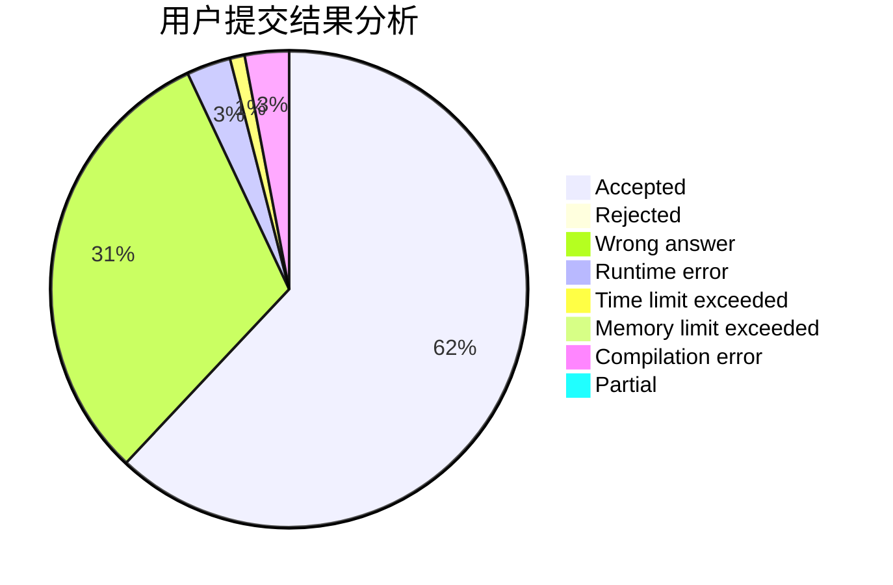
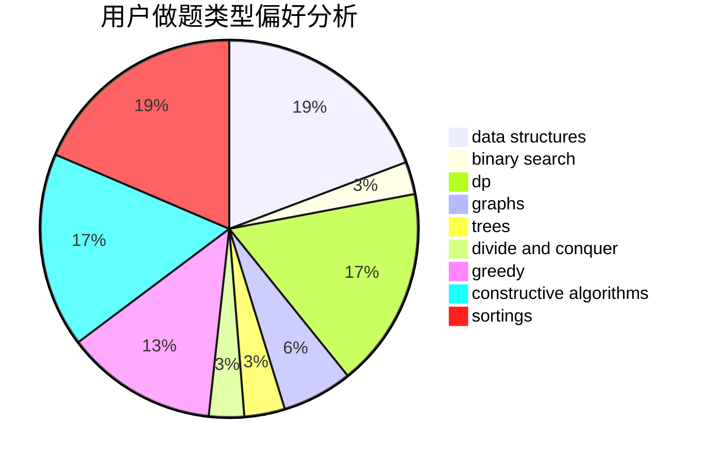

# 201811940162
<!-- tabs:start -->
#### **用户提交结果分析**

#### **用户做题类型偏好分析**

#### **用户错题知识点分析**

<!-- tabs:end -->
# 推荐题目
[1248B](http://codeforces.com/problemset/problem/1248/B)		greedy,
                        math,
                        sortings		  
[1250I](http://codeforces.com/problemset/problem/1250/I)		binary search,
                        brute force,
                        greedy,
                        shortest paths		  
[1250B](http://codeforces.com/problemset/problem/1250/B)		brute force,
                        constructive algorithms,
                        greedy,
                        math		  
[1250F](http://codeforces.com/problemset/problem/1250/F)		brute force,
                        implementation		  
[1250L](http://codeforces.com/problemset/problem/1250/L)		binary search,
                        greedy,
                        math		  
[1250C](http://codeforces.com/problemset/problem/1250/C)		data structures		  
[1248D2](https://codeforces.com/contest/1248/problem/D2)		implementation		  
[1005C](http://codeforces.com/problemset/problem/1005/C)		brute force,
                        greedy,
                        implementation		  
[1249F](http://codeforces.com/problemset/problem/1249/F)		dp,
                        trees		  
[1250M](http://codeforces.com/problemset/problem/1250/M)		constructive algorithms,
                        divide and conquer		  
<!-- tabs:start -->
#### **data structures**
[1250C](http://codeforces.com/problemset/problem/1250/C)		data structures		  
[1006C](http://codeforces.com/problemset/problem/1006/C)		binary search,
                        data structures,
                        two pointers		  
[1194E](http://codeforces.com/problemset/problem/1194/E)		bitmasks,
                        brute force,
                        data structures,
                        geometry,
                        sortings		  
[1249D2](http://codeforces.com/problemset/problem/1249/D2)		data structures,
                        greedy,
                        sortings		  
[1248E](https://codeforces.com/contest/1248/problem/E)		data structures,
                        greedy,
                        implementation		  
[1492C](http://codeforces.com/problemset/problem/1492/C)		binary search,
                        data structures,
                        dp,
                        greedy,
                        two pointers		  
[1490G](http://codeforces.com/problemset/problem/1490/G)		binary search,
                        data structures,
                        math		  
[1479D](http://codeforces.com/problemset/problem/1479/D)		binary search,
                        bitmasks,
                        brute force,
                        data structures,
                        probabilities,
                        trees		  
[1497A](http://codeforces.com/problemset/problem/1497/A)		brute force,
                        data structures,
                        greedy,
                        sortings		  
[1491C](http://codeforces.com/problemset/problem/1491/C)		brute force,
                        data structures,
                        dp,
                        greedy,
                        implementation		  
#### **binary search**
[1250I](http://codeforces.com/problemset/problem/1250/I)		binary search,
                        brute force,
                        greedy,
                        shortest paths		  
[1250L](http://codeforces.com/problemset/problem/1250/L)		binary search,
                        greedy,
                        math		  
[1249C2](http://codeforces.com/problemset/problem/1249/C2)		binary search,
                        greedy,
                        math,
                        meet-in-the-middle		  
[1073C](http://codeforces.com/problemset/problem/1073/C)		binary search,
                        two pointers		  
[1006C](http://codeforces.com/problemset/problem/1006/C)		binary search,
                        data structures,
                        two pointers		  
[1250J](http://codeforces.com/problemset/problem/1250/J)		binary search,
                        greedy		  
[1118D2](http://codeforces.com/problemset/problem/1118/D2)		binary search,
                        greedy		  
[1033E](http://codeforces.com/problemset/problem/1033/E)		binary search,
                        constructive algorithms,
                        dfs and similar,
                        graphs,
                        interactive		  
[1492C](http://codeforces.com/problemset/problem/1492/C)		binary search,
                        data structures,
                        dp,
                        greedy,
                        two pointers		  
[1463D](http://codeforces.com/problemset/problem/1463/D)		binary search,
                        constructive algorithms,
                        greedy,
                        two pointers		  
#### **dp**
[1249F](http://codeforces.com/problemset/problem/1249/F)		dp,
                        trees		  
[1249E](http://codeforces.com/problemset/problem/1249/E)		dp,
                        shortest paths		  
[1250D](http://codeforces.com/problemset/problem/1250/D)		dp		  
[1229F](https://codeforces.com/contest/1229/problem/F)		dp		  
[1248C](https://codeforces.com/contest/1248/problem/C)		combinatorics,
                        dp,
                        math		  
[1250G](http://codeforces.com/problemset/problem/1250/G)		dp,
                        greedy,
                        two pointers		  
[1051D](http://codeforces.com/problemset/problem/1051/D)		bitmasks,
                        dp		  
[1248D1](http://codeforces.com/problemset/problem/1248/D1)		brute force,
                        dp,
                        greedy,
                        implementation		  
[1492C](http://codeforces.com/problemset/problem/1492/C)		binary search,
                        data structures,
                        dp,
                        greedy,
                        two pointers		  
[1457C](https://codeforces.com/contest/1457/problem/C)		brute force,
                        dp,
                        implementation		  
#### **graph**
[1250N](http://codeforces.com/problemset/problem/1250/N)		dfs and similar,
                        graphs,
                        greedy		  
[1147A](http://codeforces.com/problemset/problem/1147/A)		graphs		  
[1082D](http://codeforces.com/problemset/problem/1082/D)		constructive algorithms,
                        graphs,
                        implementation		  
[1033E](http://codeforces.com/problemset/problem/1033/E)		binary search,
                        constructive algorithms,
                        dfs and similar,
                        graphs,
                        interactive		  
[1250E](http://codeforces.com/problemset/problem/1250/E)		graphs,
                        implementation		  
[1487C](http://codeforces.com/problemset/problem/1487/C)		brute force,
                        constructive algorithms,
                        dfs and similar,
                        graphs,
                        greedy,
                        implementation,
                        math		  
[1437C](http://codeforces.com/problemset/problem/1437/C)		dp,
                        flows,
                        graph matchings,
                        greedy,
                        math,
                        sortings		  
[1470D](http://codeforces.com/problemset/problem/1470/D)		constructive algorithms,
                        dfs and similar,
                        graph matchings,
                        graphs,
                        greedy		  
[1476C](http://codeforces.com/problemset/problem/1476/C)		dp,
                        graphs,
                        greedy		  
[1304D](http://codeforces.com/problemset/problem/1304/D)		constructive algorithms,
                        graphs,
                        greedy,
                        two pointers		  
#### **trees**
[1249F](http://codeforces.com/problemset/problem/1249/F)		dp,
                        trees		  
[1479D](http://codeforces.com/problemset/problem/1479/D)		binary search,
                        bitmasks,
                        brute force,
                        data structures,
                        probabilities,
                        trees		  
[1511C](http://codeforces.com/problemset/problem/1511/C)		brute force,
                        data structures,
                        implementation,
                        trees		  
[1499F](http://codeforces.com/problemset/problem/1499/F)		combinatorics,
                        dfs and similar,
                        dp,
                        trees		  
[1491E](http://codeforces.com/problemset/problem/1491/E)		brute force,
                        dfs and similar,
                        divide and conquer,
                        number theory,
                        trees		  
[1466D](http://codeforces.com/problemset/problem/1466/D)		data structures,
                        greedy,
                        sortings,
                        trees		  
[1495D](http://codeforces.com/problemset/problem/1495/D)		combinatorics,
                        dfs and similar,
                        graphs,
                        math,
                        shortest paths,
                        trees		  
[1303G](http://codeforces.com/problemset/problem/1303/G)		data structures,
                        divide and conquer,
                        geometry,
                        trees		  
[1454E](http://codeforces.com/problemset/problem/1454/E)		combinatorics,
                        dfs and similar,
                        graphs,
                        trees		  
[1494D](http://codeforces.com/problemset/problem/1494/D)		constructive algorithms,
                        data structures,
                        dfs and similar,
                        divide and conquer,
                        dsu,
                        greedy,
                        sortings,
                        trees		  
#### **divide and conquer**
[1250M](http://codeforces.com/problemset/problem/1250/M)		constructive algorithms,
                        divide and conquer		  
[1461D](http://codeforces.com/problemset/problem/1461/D)		binary search,
                        brute force,
                        data structures,
                        divide and conquer,
                        implementation,
                        sortings		  
[1466G](http://codeforces.com/problemset/problem/1466/G)		combinatorics,
                        divide and conquer,
                        hashing,
                        math,
                        string suffix structures,
                        strings		  
[1490D](http://codeforces.com/problemset/problem/1490/D)		dfs and similar,
                        divide and conquer,
                        implementation		  
[1483C](https://codeforces.com/contest/1483/problem/C)		data structures,
                        divide and conquer,
                        dp		  
[1491E](http://codeforces.com/problemset/problem/1491/E)		brute force,
                        dfs and similar,
                        divide and conquer,
                        number theory,
                        trees		  
[1303G](http://codeforces.com/problemset/problem/1303/G)		data structures,
                        divide and conquer,
                        geometry,
                        trees		  
[1494D](http://codeforces.com/problemset/problem/1494/D)		constructive algorithms,
                        data structures,
                        dfs and similar,
                        divide and conquer,
                        dsu,
                        greedy,
                        sortings,
                        trees		  
[1482E](http://codeforces.com/problemset/problem/1482/E)		data structures,
                        divide and conquer,
                        dp		  
[566C](http://codeforces.com/problemset/problem/566/C)		dfs and similar,
                        divide and conquer,
                        trees		  
#### **greedy**
[1248B](http://codeforces.com/problemset/problem/1248/B)		greedy,
                        math,
                        sortings		  
[1250I](http://codeforces.com/problemset/problem/1250/I)		binary search,
                        brute force,
                        greedy,
                        shortest paths		  
[1250B](http://codeforces.com/problemset/problem/1250/B)		brute force,
                        constructive algorithms,
                        greedy,
                        math		  
[1250L](http://codeforces.com/problemset/problem/1250/L)		binary search,
                        greedy,
                        math		  
[1005C](http://codeforces.com/problemset/problem/1005/C)		brute force,
                        greedy,
                        implementation		  
[1250N](http://codeforces.com/problemset/problem/1250/N)		dfs and similar,
                        graphs,
                        greedy		  
[1249C2](http://codeforces.com/problemset/problem/1249/C2)		binary search,
                        greedy,
                        math,
                        meet-in-the-middle		  
[1249D1](http://codeforces.com/problemset/problem/1249/D1)		greedy		  
[1249C1](http://codeforces.com/problemset/problem/1249/C1)		brute force,
                        greedy,
                        implementation		  
[1250J](http://codeforces.com/problemset/problem/1250/J)		binary search,
                        greedy		  
#### **constructive algorithms**
[1250B](http://codeforces.com/problemset/problem/1250/B)		brute force,
                        constructive algorithms,
                        greedy,
                        math		  
[1250M](http://codeforces.com/problemset/problem/1250/M)		constructive algorithms,
                        divide and conquer		  
[1082D](http://codeforces.com/problemset/problem/1082/D)		constructive algorithms,
                        graphs,
                        implementation		  
[1033E](http://codeforces.com/problemset/problem/1033/E)		binary search,
                        constructive algorithms,
                        dfs and similar,
                        graphs,
                        interactive		  
[1236C](http://codeforces.com/problemset/problem/1236/C)		constructive algorithms,
                        greedy,
                        implementation		  
[1493A](http://codeforces.com/problemset/problem/1493/A)		constructive algorithms,
                        greedy		  
[1463D](http://codeforces.com/problemset/problem/1463/D)		binary search,
                        constructive algorithms,
                        greedy,
                        two pointers		  
[1456B](https://codeforces.com/contest/1456/problem/B)		bitmasks,
                        brute force,
                        constructive algorithms		  
[1492D](http://codeforces.com/problemset/problem/1492/D)		bitmasks,
                        constructive algorithms,
                        greedy,
                        math		  
[1504D](https://codeforces.com/contest/1504/problem/D)		constructive algorithms,
                        games,
                        interactive		  
#### **sortings**
[1248B](http://codeforces.com/problemset/problem/1248/B)		greedy,
                        math,
                        sortings		  
[1194E](http://codeforces.com/problemset/problem/1194/E)		bitmasks,
                        brute force,
                        data structures,
                        geometry,
                        sortings		  
[1249D2](http://codeforces.com/problemset/problem/1249/D2)		data structures,
                        greedy,
                        sortings		  
[1496C](https://codeforces.com/contest/1496/problem/C)		geometry,
                        greedy,
                        math,
                        sortings		  
[1495A](http://codeforces.com/problemset/problem/1495/A)		geometry,
                        greedy,
                        math,
                        sortings		  
[1497A](http://codeforces.com/problemset/problem/1497/A)		brute force,
                        data structures,
                        greedy,
                        sortings		  
[1427A](http://codeforces.com/problemset/problem/1427/A)		math,
                        sortings		  
[1461D](http://codeforces.com/problemset/problem/1461/D)		binary search,
                        brute force,
                        data structures,
                        divide and conquer,
                        implementation,
                        sortings		  
[1437C](http://codeforces.com/problemset/problem/1437/C)		dp,
                        flows,
                        graph matchings,
                        greedy,
                        math,
                        sortings		  
[1473A](http://codeforces.com/problemset/problem/1473/A)		greedy,
                        implementation,
                        math,
                        sortings		  
<!-- tabs:end -->
