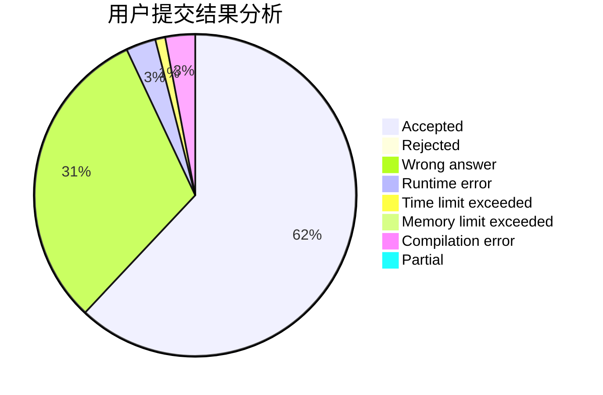
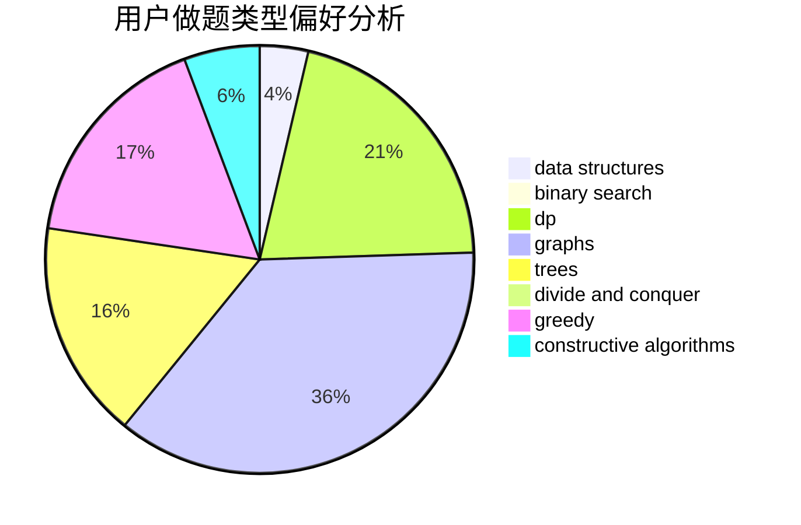

# 201811940162

<!-- tabs:start -->

#### **用户提交结果分析**

#### **用户做题类型偏好分析**

#### **用户错题知识点分析**

<!-- tabs:end -->
# 推荐题目
[1255A](https://codeforces.com/contest/1255/problem/A)		math		  
[1255C](https://codeforces.com/contest/1255/problem/C)		constructive algorithms,
                        implementation		  
[1254E](https://codeforces.com/contest/1254/problem/E)		combinatorics,
                        dfs and similar,
                        dsu,
                        trees		  
[1253D](https://codeforces.com/contest/1253/problem/D)		constructive algorithms,
                        dfs and similar,
                        dsu,
                        graphs,
                        greedy,
                        sortings		  
[12542](https://codeforces.com/contest/1254/problem/2)		dsu,graphs,sortings,trees		  
[1005D](https://codeforces.com/contest/1005/problem/D)		dp,
                        greedy,
                        number theory		  
[1255D](https://codeforces.com/contest/1255/problem/D)		dsu,graphs,sortings,trees		  
[1252C](https://codeforces.com/contest/1252/problem/C)		data structures,
                        implementation		  
[1252L](https://codeforces.com/contest/1252/problem/L)		flows,
                        graphs		  
[1252F](https://codeforces.com/contest/1252/problem/F)		hashing,
                        trees		  
