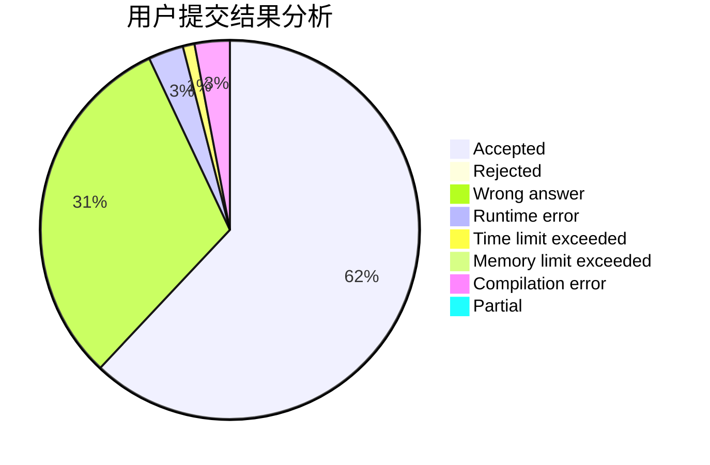
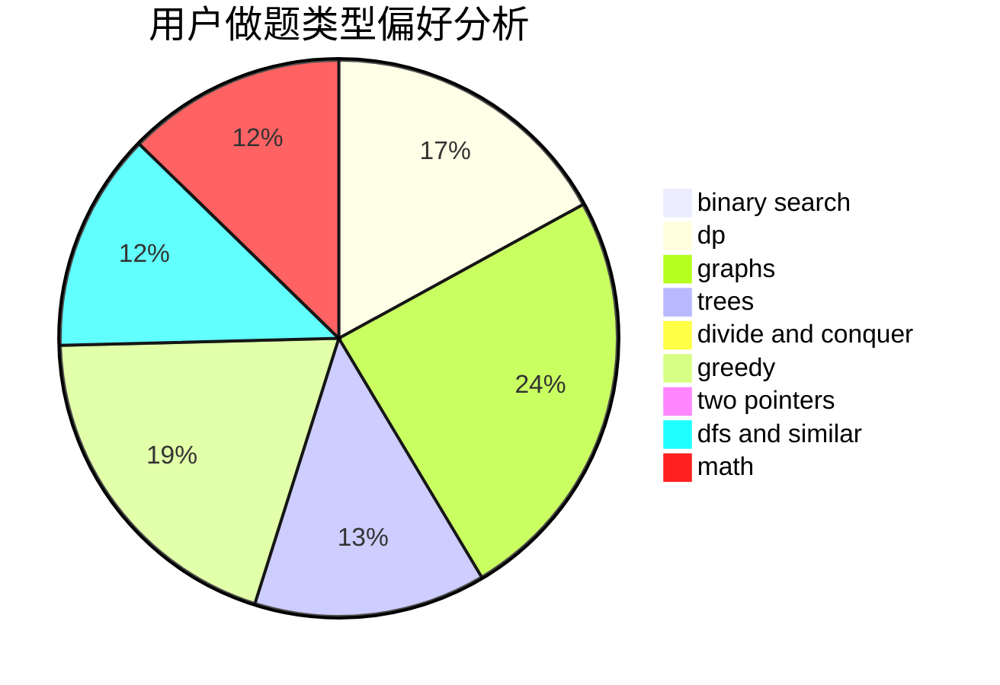

# 201811940162

<!-- tabs:start -->

#### **用户提交结果分析**

#### **用户做题类型偏好分析**

<!-- tabs:end -->
# 推荐题目
[1255A](https://codeforces.com/contest/1255/problem/A)
[1255C](https://codeforces.com/contest/1255/problem/C)
[1254E](https://codeforces.com/contest/1254/problem/E)
[1253D](https://codeforces.com/contest/1253/problem/D)
[12542](https://codeforces.com/contest/1254/problem/2)
[1005D](https://codeforces.com/contest/1005/problem/D)
[1255D](https://codeforces.com/contest/1255/problem/D)
[1252C](https://codeforces.com/contest/1252/problem/C)
[1252L](https://codeforces.com/contest/1252/problem/L)
[1252F](https://codeforces.com/contest/1252/problem/F)
