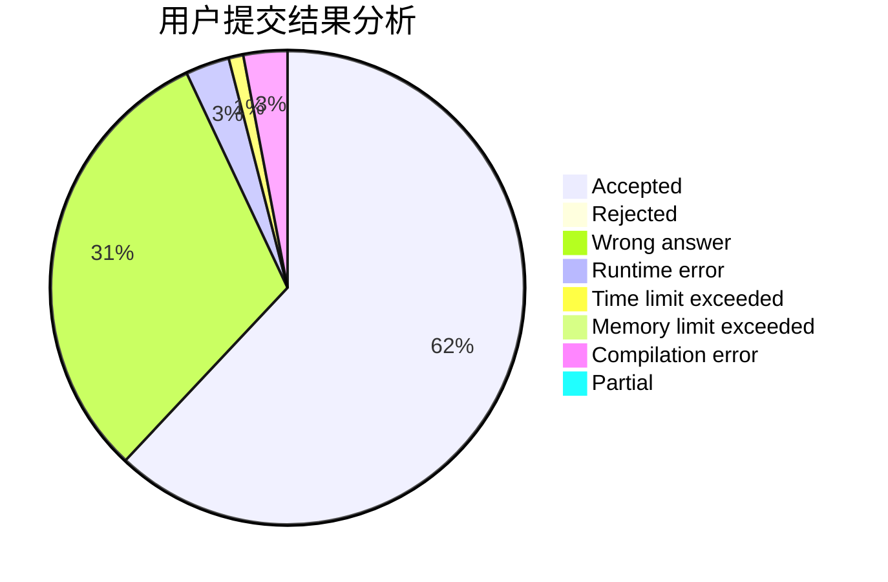
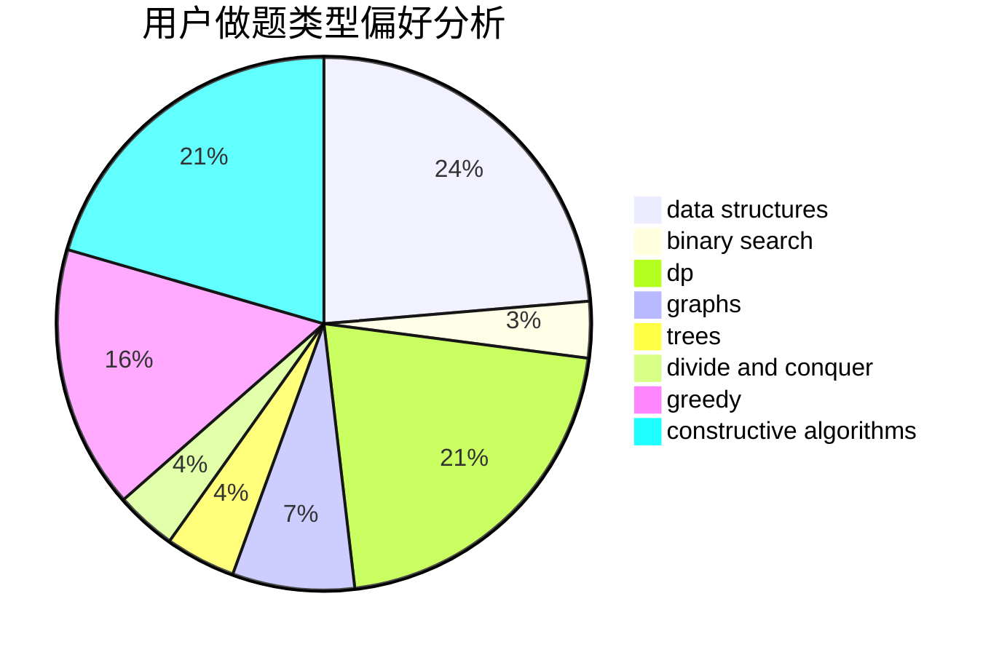

# 201811940162

<!-- tabs:start -->

#### **用户提交结果分析**

#### **用户做题类型偏好分析**

#### **用户错题知识点分析**

<!-- tabs:end -->
# 推荐题目
[1250I](https://codeforces.com/contest/1250/problem/I)		binary search,
                        brute force,
                        greedy,
                        shortest paths		  
[1250L](https://codeforces.com/contest/1250/problem/L)		binary search,
                        greedy,
                        math		  
[1250F](https://codeforces.com/contest/1250/problem/F)		brute force,
                        implementation		  
[1249E](https://codeforces.com/contest/1249/problem/E)		dp,
                        shortest paths		  
[1250B](https://codeforces.com/contest/1250/problem/B)		brute force,
                        constructive algorithms,
                        greedy,
                        math		  
[1005C](https://codeforces.com/contest/1005/problem/C)		brute force,
                        greedy,
                        implementation		  
[1250M](https://codeforces.com/contest/1250/problem/M)		constructive algorithms,
                        divide and conquer		  
[1248B](https://codeforces.com/contest/1248/problem/B)		greedy,
                        math,
                        sortings		  
[1249C1](https://codeforces.com/contest/1249C/problem/1)		brute force,
                        greedy,
                        implementation		  
[1248D2](https://codeforces.com/contest/1248D/problem/2)		dsu,graphs,sortings,trees		  
