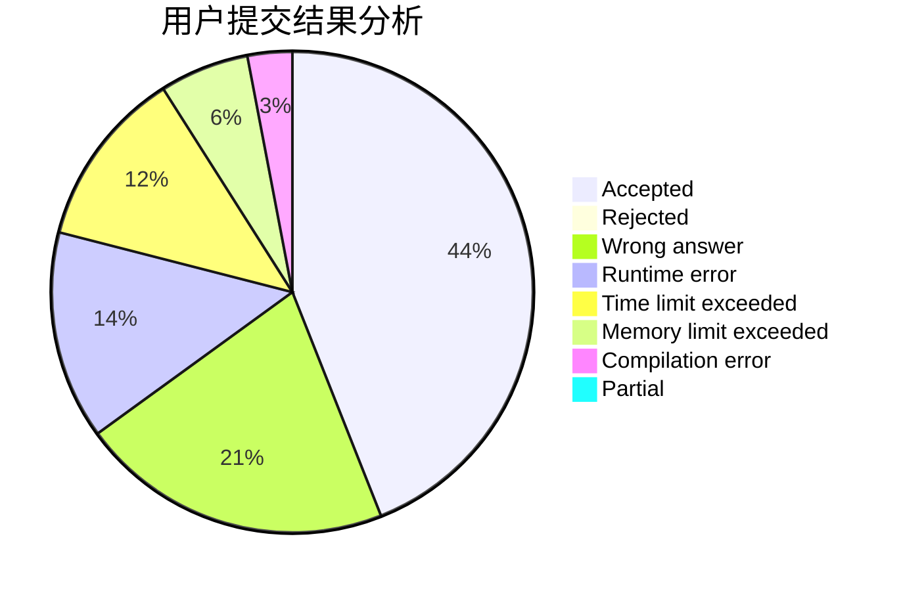
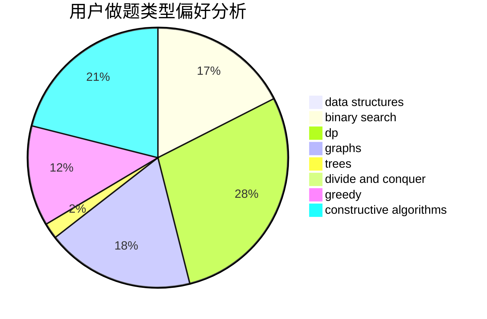
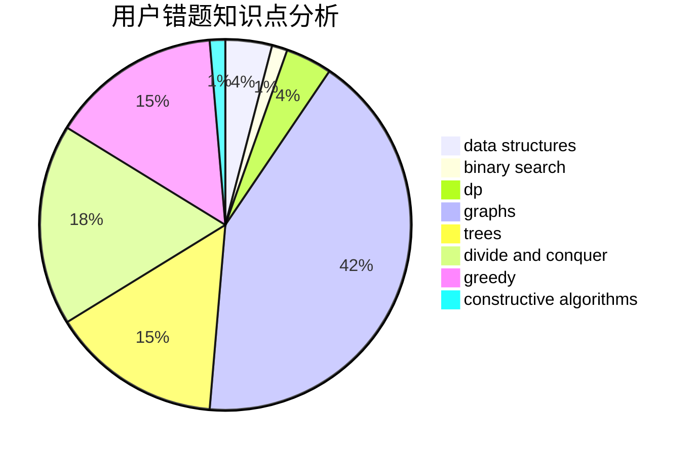

# Ephemeral.

<!-- tabs:start -->

#### **用户提交结果分析**

#### **用户做题类型偏好分析**

#### **用户错题知识点分析**

<!-- tabs:end -->
# 推荐题目
[845G](https://codeforces.com/contest/845/problem/G)		dfs and similar,
                        graphs,
                        math		  
[1430E](https://codeforces.com/contest/1430/problem/E)		data structures,
                        greedy,
                        strings		  
[787A](https://codeforces.com/contest/787/problem/A)		brute force,
                        math,
                        number theory		  
[594E](https://codeforces.com/contest/594/problem/E)		string suffix structures,
                        strings		  
[107B](https://codeforces.com/contest/107/problem/B)		combinatorics,
                        dp,
                        math,
                        probabilities		  
[1220E](https://codeforces.com/contest/1220/problem/E)		dfs and similar,
                        dp,
                        dsu,
                        graphs,
                        greedy,
                        trees		  
[27A](https://codeforces.com/contest/27/problem/A)		implementation,
                        sortings		  
[734D](https://codeforces.com/contest/734/problem/D)		implementation		  
[238C](https://codeforces.com/contest/238/problem/C)		dfs and similar,
                        dp,
                        greedy,
                        trees		  
[67B](https://codeforces.com/contest/67/problem/B)		greedy		  
