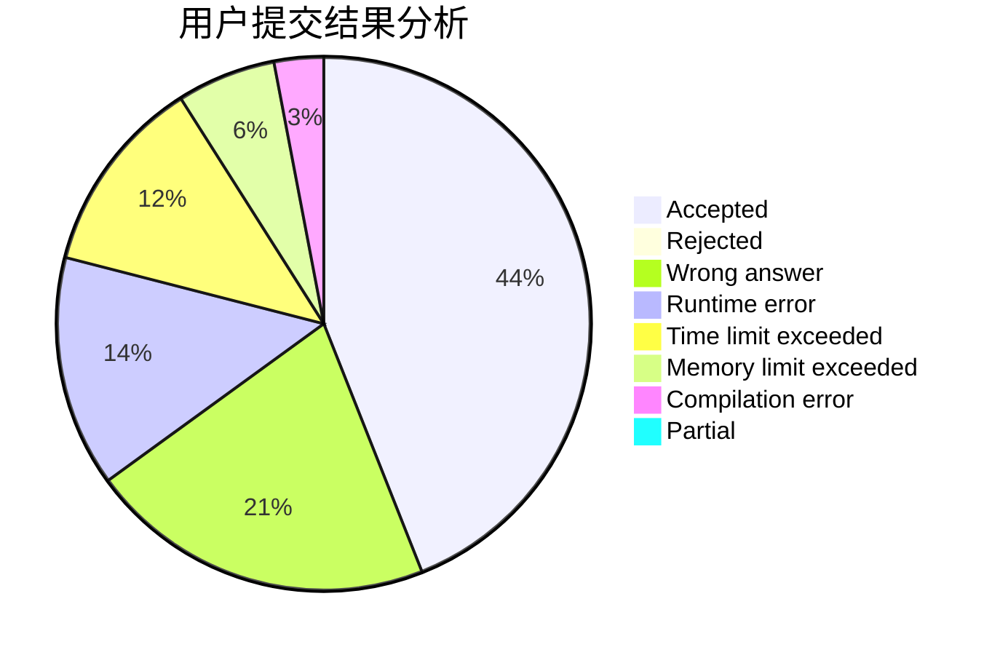
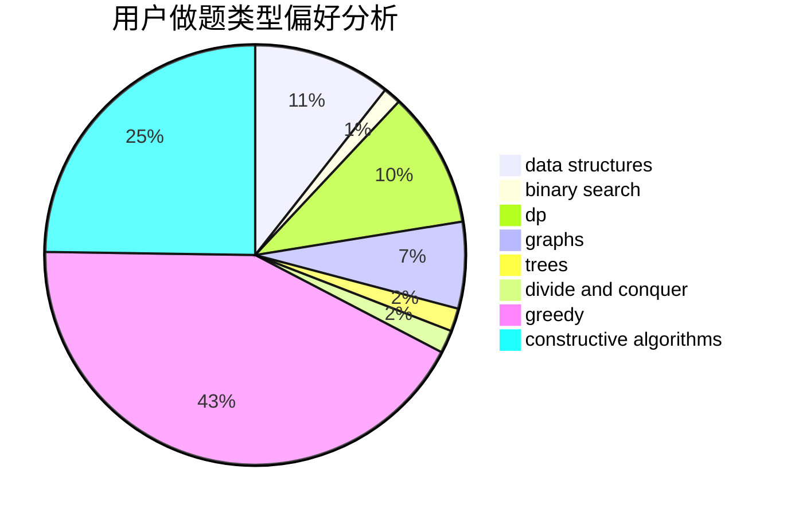
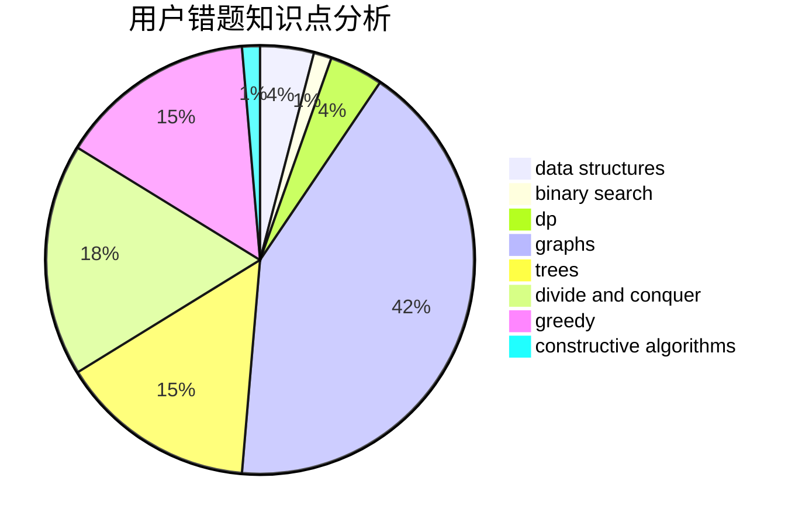

# Ephemeral.
<!-- tabs:start -->
#### **用户提交结果分析**

#### **用户做题类型偏好分析**

#### **用户错题知识点分析**

<!-- tabs:end -->
# 推荐题目
[Cartons of milk](http://codeforces.com/problemset/problem/767/D)		binary search,
                        data structures,
                        greedy,
                        sortings,
                        two pointers		  
[Fence Divercity](http://codeforces.com/problemset/problem/659/G)		combinatorics,
                        dp,
                        number theory		  
[Maxim and Matrix](http://codeforces.com/problemset/problem/261/C)		constructive algorithms,
                        dp,
                        math		  
[Bear and Blocks](https://codeforces.com/contest/574/problem/D)		binary search,
                        data structures,
                        dp,
                        math		  
[Rusty String](http://codeforces.com/problemset/problem/827/E)		fft,
                        math,
                        strings		  
[Voltage Keepsake](http://codeforces.com/problemset/problem/772/A)		binary search,
                        math		  
[Playing Piano](https://codeforces.com/contest/1079/problem/C)		constructive algorithms,
                        dp		  
[Festival Organization](http://codeforces.com/problemset/problem/717/A)		math,
                        number theory		  
[k-String](http://codeforces.com/problemset/problem/219/A)		implementation,
                        strings		  
[Yellow Cards](http://codeforces.com/problemset/problem/1215/A)		greedy,
                        implementation,
                        math		  
<!-- tabs:start -->
#### **data structures**
[Cartons of milk](http://codeforces.com/problemset/problem/767/D)		binary search,
                        data structures,
                        greedy,
                        sortings,
                        two pointers		  
[Fence Divercity](https://codeforces.com/contest/574/problem/D)		binary search,
                        data structures,
                        dp,
                        math		  
[Maxim and Matrix](http://codeforces.com/problemset/problem/827/D)		data structures,
                        dfs and similar,
                        graphs,
                        trees		  
[Bear and Blocks](http://codeforces.com/problemset/problem/1139/F)		data structures,
                        divide and conquer		  
[Rusty String](http://codeforces.com/problemset/problem/827/F)		data structures,
                        dp,
                        graphs,
                        shortest paths		  
[Voltage Keepsake](http://codeforces.com/problemset/problem/603/E)		data structures,
                        divide and conquer,
                        dsu,
                        math,
                        trees		  
[Playing Piano](http://codeforces.com/problemset/problem/1455/G)		data structures,
                        dp		  
[Festival Organization](http://codeforces.com/problemset/problem/526/F)		data structures,
                        divide and conquer		  
[k-String](http://codeforces.com/problemset/problem/1492/C)		binary search,
                        data structures,
                        dp,
                        greedy,
                        two pointers		  
[Yellow Cards](http://codeforces.com/problemset/problem/1490/G)		binary search,
                        data structures,
                        math		  
#### **binary search**
[Cartons of milk](http://codeforces.com/problemset/problem/767/D)		binary search,
                        data structures,
                        greedy,
                        sortings,
                        two pointers		  
[Fence Divercity](https://codeforces.com/contest/574/problem/D)		binary search,
                        data structures,
                        dp,
                        math		  
[Maxim and Matrix](http://codeforces.com/problemset/problem/772/A)		binary search,
                        math		  
[Bear and Blocks](http://codeforces.com/problemset/problem/1423/B)		binary search,
                        flows,
                        graph matchings,
                        graphs		  
[Rusty String](https://codeforces.com/contest/801/problem/C)		binary search,
                        math		  
[Voltage Keepsake](http://codeforces.com/problemset/problem/1443/C)		binary search,
                        greedy,
                        sortings		  
[Playing Piano](http://codeforces.com/problemset/problem/1492/C)		binary search,
                        data structures,
                        dp,
                        greedy,
                        two pointers		  
[Festival Organization](http://codeforces.com/problemset/problem/1463/D)		binary search,
                        constructive algorithms,
                        greedy,
                        two pointers		  
[k-String](http://codeforces.com/problemset/problem/1490/G)		binary search,
                        data structures,
                        math		  
[Yellow Cards](http://codeforces.com/problemset/problem/1479/D)		binary search,
                        bitmasks,
                        brute force,
                        data structures,
                        probabilities,
                        trees		  
#### **dp**
[Cartons of milk](http://codeforces.com/problemset/problem/659/G)		combinatorics,
                        dp,
                        number theory		  
[Fence Divercity](http://codeforces.com/problemset/problem/261/C)		constructive algorithms,
                        dp,
                        math		  
[Maxim and Matrix](https://codeforces.com/contest/574/problem/D)		binary search,
                        data structures,
                        dp,
                        math		  
[Bear and Blocks](https://codeforces.com/contest/1079/problem/C)		constructive algorithms,
                        dp		  
[Rusty String](http://codeforces.com/problemset/problem/827/F)		data structures,
                        dp,
                        graphs,
                        shortest paths		  
[Voltage Keepsake](http://codeforces.com/problemset/problem/505/B)		dfs and similar,
                        dp,
                        dsu,
                        graphs		  
[Playing Piano](http://codeforces.com/problemset/problem/1455/G)		data structures,
                        dp		  
[Festival Organization](http://codeforces.com/problemset/problem/1389/B)		brute force,
                        dp,
                        greedy		  
[k-String](http://codeforces.com/problemset/problem/1492/C)		binary search,
                        data structures,
                        dp,
                        greedy,
                        two pointers		  
[Yellow Cards](https://codeforces.com/contest/1457/problem/C)		brute force,
                        dp,
                        implementation		  
#### **graph**
[Cartons of milk](http://codeforces.com/problemset/problem/1423/B)		binary search,
                        flows,
                        graph matchings,
                        graphs		  
[Fence Divercity](http://codeforces.com/problemset/problem/1423/C)		divide and conquer,
                        graphs,
                        trees		  
[Maxim and Matrix](http://codeforces.com/problemset/problem/827/D)		data structures,
                        dfs and similar,
                        graphs,
                        trees		  
[Bear and Blocks](https://codeforces.com/contest/1229/problem/C)		graphs		  
[Rusty String](http://codeforces.com/problemset/problem/827/F)		data structures,
                        dp,
                        graphs,
                        shortest paths		  
[Voltage Keepsake](http://codeforces.com/problemset/problem/505/B)		dfs and similar,
                        dp,
                        dsu,
                        graphs		  
[Playing Piano](https://codeforces.com/contest/528/problem/C)		dfs and similar,
                        graphs		  
[Festival Organization](http://codeforces.com/problemset/problem/1487/C)		brute force,
                        constructive algorithms,
                        dfs and similar,
                        graphs,
                        greedy,
                        implementation,
                        math		  
[k-String](http://codeforces.com/problemset/problem/1437/C)		dp,
                        flows,
                        graph matchings,
                        greedy,
                        math,
                        sortings		  
[Yellow Cards](http://codeforces.com/problemset/problem/1470/D)		constructive algorithms,
                        dfs and similar,
                        graph matchings,
                        graphs,
                        greedy		  
#### **trees**
[Cartons of milk](http://codeforces.com/problemset/problem/1423/C)		divide and conquer,
                        graphs,
                        trees		  
[Fence Divercity](http://codeforces.com/problemset/problem/827/D)		data structures,
                        dfs and similar,
                        graphs,
                        trees		  
[Maxim and Matrix](http://codeforces.com/problemset/problem/603/E)		data structures,
                        divide and conquer,
                        dsu,
                        math,
                        trees		  
[Bear and Blocks](http://codeforces.com/problemset/problem/1479/D)		binary search,
                        bitmasks,
                        brute force,
                        data structures,
                        probabilities,
                        trees		  
[Rusty String](http://codeforces.com/problemset/problem/1511/C)		brute force,
                        data structures,
                        implementation,
                        trees		  
[Voltage Keepsake](http://codeforces.com/problemset/problem/1499/F)		combinatorics,
                        dfs and similar,
                        dp,
                        trees		  
[Playing Piano](http://codeforces.com/problemset/problem/1491/E)		brute force,
                        dfs and similar,
                        divide and conquer,
                        number theory,
                        trees		  
[Festival Organization](http://codeforces.com/problemset/problem/1466/D)		data structures,
                        greedy,
                        sortings,
                        trees		  
[k-String](http://codeforces.com/problemset/problem/1495/D)		combinatorics,
                        dfs and similar,
                        graphs,
                        math,
                        shortest paths,
                        trees		  
[Yellow Cards](http://codeforces.com/problemset/problem/1303/G)		data structures,
                        divide and conquer,
                        geometry,
                        trees		  
#### **divide and conquer**
[Cartons of milk](http://codeforces.com/problemset/problem/1423/C)		divide and conquer,
                        graphs,
                        trees		  
[Fence Divercity](http://codeforces.com/problemset/problem/1139/F)		data structures,
                        divide and conquer		  
[Maxim and Matrix](http://codeforces.com/problemset/problem/603/E)		data structures,
                        divide and conquer,
                        dsu,
                        math,
                        trees		  
[Bear and Blocks](http://codeforces.com/problemset/problem/526/F)		data structures,
                        divide and conquer		  
[Rusty String](http://codeforces.com/problemset/problem/1461/D)		binary search,
                        brute force,
                        data structures,
                        divide and conquer,
                        implementation,
                        sortings		  
[Voltage Keepsake](http://codeforces.com/problemset/problem/1466/G)		combinatorics,
                        divide and conquer,
                        hashing,
                        math,
                        string suffix structures,
                        strings		  
[Playing Piano](http://codeforces.com/problemset/problem/1490/D)		dfs and similar,
                        divide and conquer,
                        implementation		  
[Festival Organization](https://codeforces.com/contest/1483/problem/C)		data structures,
                        divide and conquer,
                        dp		  
[k-String](http://codeforces.com/problemset/problem/1491/E)		brute force,
                        dfs and similar,
                        divide and conquer,
                        number theory,
                        trees		  
[Yellow Cards](http://codeforces.com/problemset/problem/1303/G)		data structures,
                        divide and conquer,
                        geometry,
                        trees		  
#### **greedy**
[Cartons of milk](http://codeforces.com/problemset/problem/767/D)		binary search,
                        data structures,
                        greedy,
                        sortings,
                        two pointers		  
[Fence Divercity](http://codeforces.com/problemset/problem/1215/A)		greedy,
                        implementation,
                        math		  
[Maxim and Matrix](http://codeforces.com/problemset/problem/1061/A)		greedy,
                        implementation,
                        math		  
[Bear and Blocks](http://codeforces.com/problemset/problem/787/B)		greedy,
                        implementation,
                        math		  
[Rusty String](http://codeforces.com/problemset/problem/616/B)		games,
                        greedy		  
[Voltage Keepsake](http://codeforces.com/problemset/problem/1358/B)		greedy,
                        sortings		  
[Playing Piano](http://codeforces.com/problemset/problem/1443/C)		binary search,
                        greedy,
                        sortings		  
[Festival Organization](https://codeforces.com/contest/1509/problem/D)		constructive algorithms,
                        greedy,
                        implementation,
                        math,
                        strings,
                        two pointers		  
[k-String](http://codeforces.com/problemset/problem/351/E)		greedy		  
[Yellow Cards](http://codeforces.com/problemset/problem/1389/B)		brute force,
                        dp,
                        greedy		  
#### **constructive algorithms**
[Cartons of milk](http://codeforces.com/problemset/problem/261/C)		constructive algorithms,
                        dp,
                        math		  
[Fence Divercity](https://codeforces.com/contest/1079/problem/C)		constructive algorithms,
                        dp		  
[Maxim and Matrix](http://codeforces.com/problemset/problem/1335/D)		constructive algorithms,
                        implementation		  
[Bear and Blocks](http://codeforces.com/problemset/problem/1451/E1)		bitmasks,
                        constructive algorithms,
                        interactive,
                        math		  
[Rusty String](http://codeforces.com/problemset/problem/1109/B)		constructive algorithms,
                        hashing,
                        strings		  
[Voltage Keepsake](https://codeforces.com/contest/1509/problem/D)		constructive algorithms,
                        greedy,
                        implementation,
                        math,
                        strings,
                        two pointers		  
[Playing Piano](http://codeforces.com/problemset/problem/1493/A)		constructive algorithms,
                        greedy		  
[Festival Organization](http://codeforces.com/problemset/problem/1463/D)		binary search,
                        constructive algorithms,
                        greedy,
                        two pointers		  
[k-String](https://codeforces.com/contest/1456/problem/B)		bitmasks,
                        brute force,
                        constructive algorithms		  
[Yellow Cards](http://codeforces.com/problemset/problem/1492/D)		bitmasks,
                        constructive algorithms,
                        greedy,
                        math		  
#### **sortings**
[Cartons of milk](http://codeforces.com/problemset/problem/767/D)		binary search,
                        data structures,
                        greedy,
                        sortings,
                        two pointers		  
[Fence Divercity](http://codeforces.com/problemset/problem/1358/B)		greedy,
                        sortings		  
[Maxim and Matrix](http://codeforces.com/problemset/problem/1443/C)		binary search,
                        greedy,
                        sortings		  
[Bear and Blocks](https://codeforces.com/contest/1496/problem/C)		geometry,
                        greedy,
                        math,
                        sortings		  
[Rusty String](http://codeforces.com/problemset/problem/1495/A)		geometry,
                        greedy,
                        math,
                        sortings		  
[Voltage Keepsake](http://codeforces.com/problemset/problem/1497/A)		brute force,
                        data structures,
                        greedy,
                        sortings		  
[Playing Piano](http://codeforces.com/problemset/problem/1427/A)		math,
                        sortings		  
[Festival Organization](http://codeforces.com/problemset/problem/1461/D)		binary search,
                        brute force,
                        data structures,
                        divide and conquer,
                        implementation,
                        sortings		  
[k-String](http://codeforces.com/problemset/problem/1437/C)		dp,
                        flows,
                        graph matchings,
                        greedy,
                        math,
                        sortings		  
[Yellow Cards](http://codeforces.com/problemset/problem/1473/A)		greedy,
                        implementation,
                        math,
                        sortings		  
<!-- tabs:end -->
