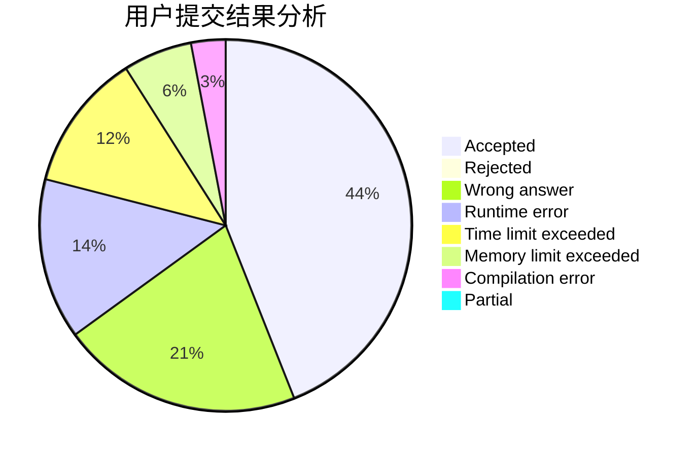
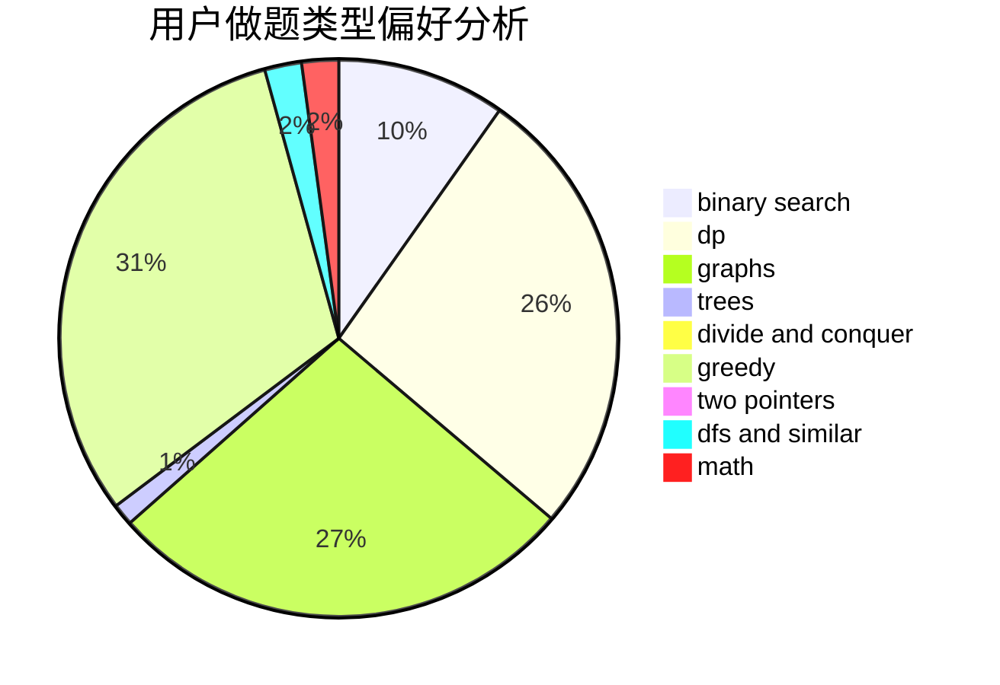

# Ephemeral.

<!-- tabs:start -->

#### **用户提交结果分析**

#### **用户做题类型偏好分析**

<!-- tabs:end -->
# 推荐题目
[845G](https://codeforces.com/contest/845/problem/G)
[1430E](https://codeforces.com/contest/1430/problem/E)
[787A](https://codeforces.com/contest/787/problem/A)
[594E](https://codeforces.com/contest/594/problem/E)
[107B](https://codeforces.com/contest/107/problem/B)
[1220E](https://codeforces.com/contest/1220/problem/E)
[27A](https://codeforces.com/contest/27/problem/A)
[734D](https://codeforces.com/contest/734/problem/D)
[238C](https://codeforces.com/contest/238/problem/C)
[67B](https://codeforces.com/contest/67/problem/B)
