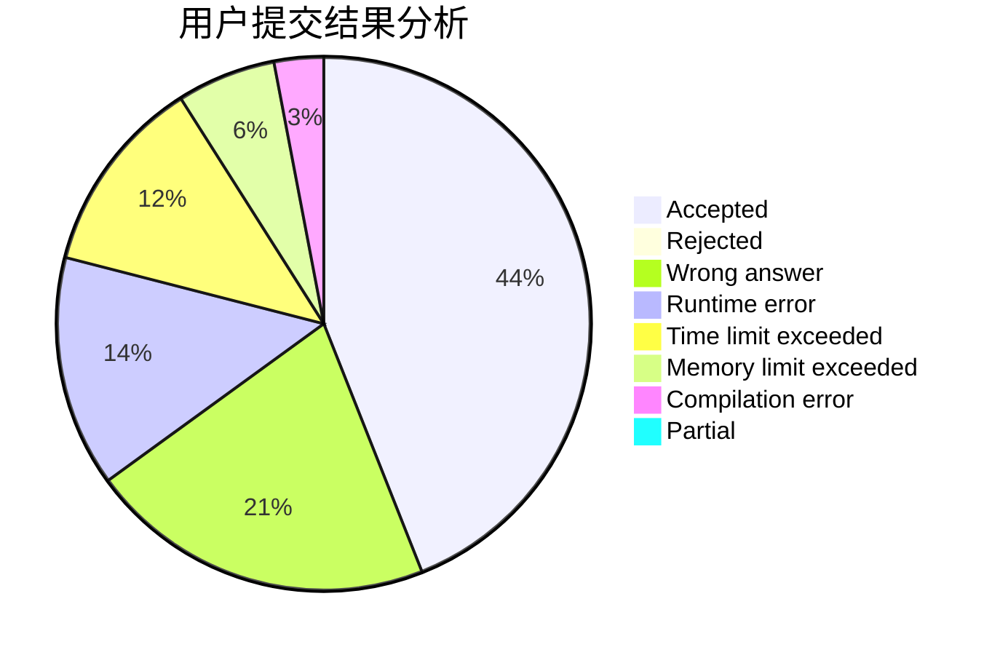
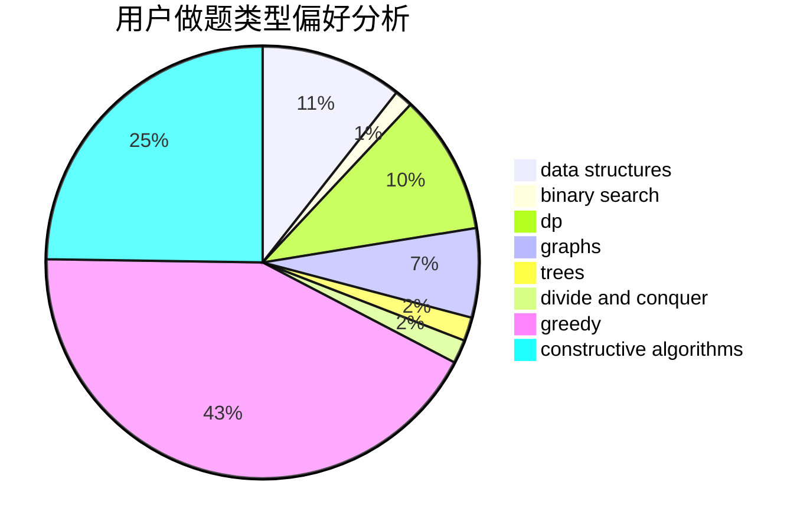
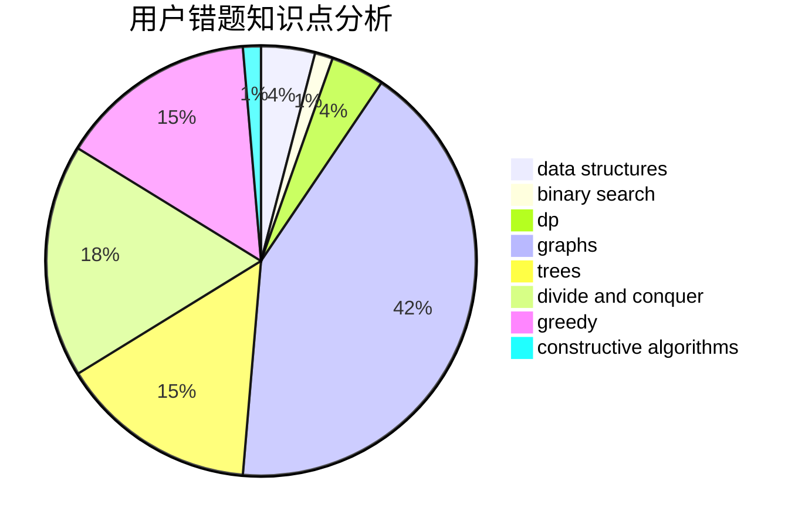

# Ephemeral.

<!-- tabs:start -->

#### **用户提交结果分析**

#### **用户做题类型偏好分析**

#### **用户错题知识点分析**

<!-- tabs:end -->
# 推荐题目
[827D](https://codeforces.com/contest/827/problem/D)		data structures,
                        dfs and similar,
                        graphs,
                        trees		  
[1423B](https://codeforces.com/contest/1423/problem/B)		binary search,
                        flows,
                        graph matchings,
                        graphs		  
[767D](https://codeforces.com/contest/767/problem/D)		binary search,
                        data structures,
                        greedy,
                        sortings,
                        two pointers		  
[574D](https://codeforces.com/contest/574/problem/D)		dsu,graphs,sortings,trees		  
[1079C](https://codeforces.com/contest/1079/problem/C)		dsu,graphs,sortings,trees		  
[1215A](https://codeforces.com/contest/1215/problem/A)		greedy,
                        implementation,
                        math		  
[261C](https://codeforces.com/contest/261/problem/C)		constructive algorithms,
                        dp,
                        math		  
[717A](https://codeforces.com/contest/717/problem/A)		math,
                        number theory		  
[219A](https://codeforces.com/contest/219/problem/A)		implementation,
                        strings		  
[659G](https://codeforces.com/contest/659/problem/G)		combinatorics,
                        dp,
                        number theory		  
