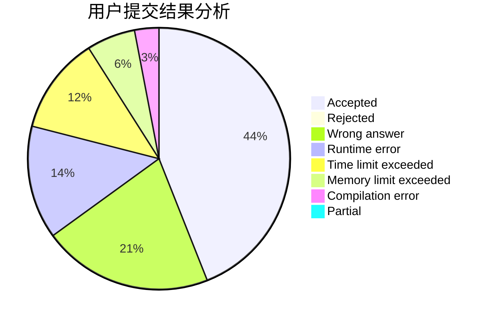
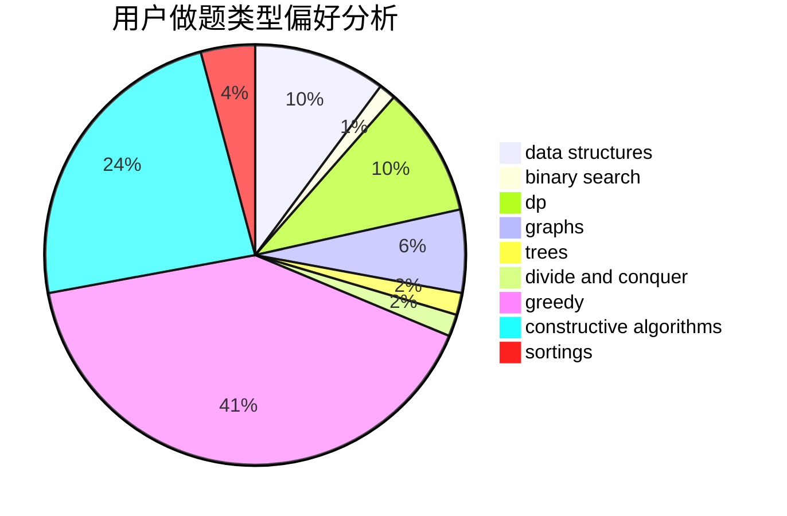
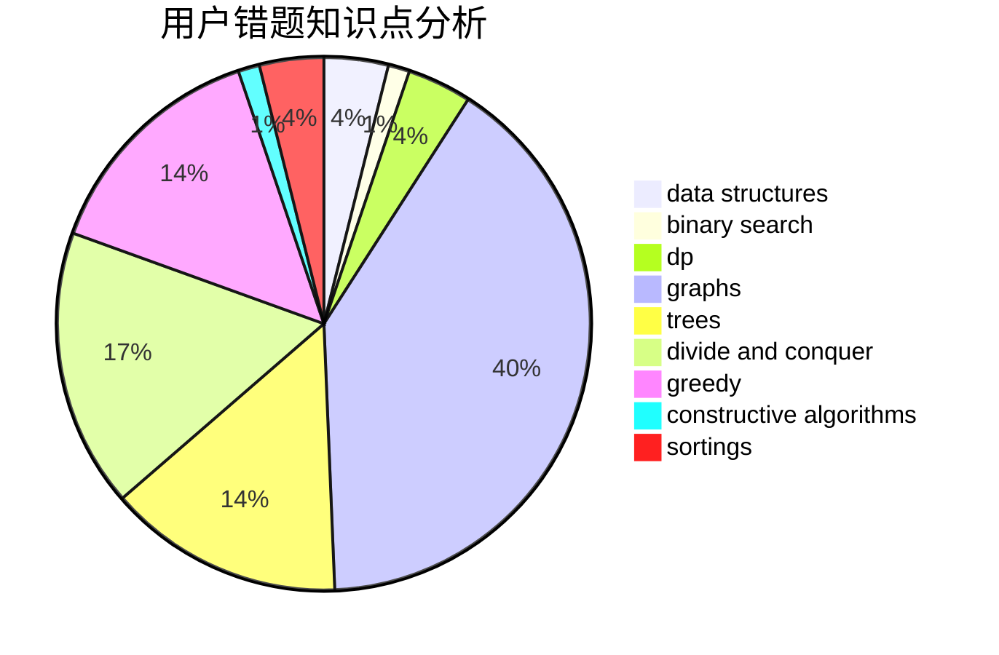

# Ephemeral.
<!-- tabs:start -->
#### **用户提交结果分析**

#### **用户做题类型偏好分析**

#### **用户错题知识点分析**

<!-- tabs:end -->
# 推荐题目
[767D](http://codeforces.com/problemset/problem/767/D)		binary search,
                        data structures,
                        greedy,
                        sortings,
                        two pointers		  
[659G](http://codeforces.com/problemset/problem/659/G)		combinatorics,
                        dp,
                        number theory		  
[261C](http://codeforces.com/problemset/problem/261/C)		constructive algorithms,
                        dp,
                        math		  
[574D](https://codeforces.com/contest/574/problem/D)		binary search,
                        data structures,
                        dp,
                        math		  
[827E](http://codeforces.com/problemset/problem/827/E)		fft,
                        math,
                        strings		  
[772A](http://codeforces.com/problemset/problem/772/A)		binary search,
                        math		  
[1079C](https://codeforces.com/contest/1079/problem/C)		constructive algorithms,
                        dp		  
[717A](http://codeforces.com/problemset/problem/717/A)		math,
                        number theory		  
[219A](http://codeforces.com/problemset/problem/219/A)		implementation,
                        strings		  
[1215A](http://codeforces.com/problemset/problem/1215/A)		greedy,
                        implementation,
                        math		  
<!-- tabs:start -->
#### **data structures**
[767D](http://codeforces.com/problemset/problem/767/D)		binary search,
                        data structures,
                        greedy,
                        sortings,
                        two pointers		  
[574D](https://codeforces.com/contest/574/problem/D)		binary search,
                        data structures,
                        dp,
                        math		  
[827D](http://codeforces.com/problemset/problem/827/D)		data structures,
                        dfs and similar,
                        graphs,
                        trees		  
[1139F](http://codeforces.com/problemset/problem/1139/F)		data structures,
                        divide and conquer		  
[827F](http://codeforces.com/problemset/problem/827/F)		data structures,
                        dp,
                        graphs,
                        shortest paths		  
[603E](http://codeforces.com/problemset/problem/603/E)		data structures,
                        divide and conquer,
                        dsu,
                        math,
                        trees		  
[1455G](http://codeforces.com/problemset/problem/1455/G)		data structures,
                        dp		  
[526F](http://codeforces.com/problemset/problem/526/F)		data structures,
                        divide and conquer		  
[1492C](http://codeforces.com/problemset/problem/1492/C)		binary search,
                        data structures,
                        dp,
                        greedy,
                        two pointers		  
[1490G](http://codeforces.com/problemset/problem/1490/G)		binary search,
                        data structures,
                        math		  
#### **binary search**
[767D](http://codeforces.com/problemset/problem/767/D)		binary search,
                        data structures,
                        greedy,
                        sortings,
                        two pointers		  
[574D](https://codeforces.com/contest/574/problem/D)		binary search,
                        data structures,
                        dp,
                        math		  
[772A](http://codeforces.com/problemset/problem/772/A)		binary search,
                        math		  
[1423B](http://codeforces.com/problemset/problem/1423/B)		binary search,
                        flows,
                        graph matchings,
                        graphs		  
[801C](https://codeforces.com/contest/801/problem/C)		binary search,
                        math		  
[1443C](http://codeforces.com/problemset/problem/1443/C)		binary search,
                        greedy,
                        sortings		  
[1492C](http://codeforces.com/problemset/problem/1492/C)		binary search,
                        data structures,
                        dp,
                        greedy,
                        two pointers		  
[1463D](http://codeforces.com/problemset/problem/1463/D)		binary search,
                        constructive algorithms,
                        greedy,
                        two pointers		  
[1490G](http://codeforces.com/problemset/problem/1490/G)		binary search,
                        data structures,
                        math		  
[1479D](http://codeforces.com/problemset/problem/1479/D)		binary search,
                        bitmasks,
                        brute force,
                        data structures,
                        probabilities,
                        trees		  
#### **dp**
[659G](http://codeforces.com/problemset/problem/659/G)		combinatorics,
                        dp,
                        number theory		  
[261C](http://codeforces.com/problemset/problem/261/C)		constructive algorithms,
                        dp,
                        math		  
[574D](https://codeforces.com/contest/574/problem/D)		binary search,
                        data structures,
                        dp,
                        math		  
[1079C](https://codeforces.com/contest/1079/problem/C)		constructive algorithms,
                        dp		  
[827F](http://codeforces.com/problemset/problem/827/F)		data structures,
                        dp,
                        graphs,
                        shortest paths		  
[505B](http://codeforces.com/problemset/problem/505/B)		dfs and similar,
                        dp,
                        dsu,
                        graphs		  
[1455G](http://codeforces.com/problemset/problem/1455/G)		data structures,
                        dp		  
[1389B](http://codeforces.com/problemset/problem/1389/B)		brute force,
                        dp,
                        greedy		  
[1492C](http://codeforces.com/problemset/problem/1492/C)		binary search,
                        data structures,
                        dp,
                        greedy,
                        two pointers		  
[1457C](https://codeforces.com/contest/1457/problem/C)		brute force,
                        dp,
                        implementation		  
#### **graph**
[1423B](http://codeforces.com/problemset/problem/1423/B)		binary search,
                        flows,
                        graph matchings,
                        graphs		  
[1423C](http://codeforces.com/problemset/problem/1423/C)		divide and conquer,
                        graphs,
                        trees		  
[827D](http://codeforces.com/problemset/problem/827/D)		data structures,
                        dfs and similar,
                        graphs,
                        trees		  
[1229C](https://codeforces.com/contest/1229/problem/C)		graphs		  
[827F](http://codeforces.com/problemset/problem/827/F)		data structures,
                        dp,
                        graphs,
                        shortest paths		  
[505B](http://codeforces.com/problemset/problem/505/B)		dfs and similar,
                        dp,
                        dsu,
                        graphs		  
[528C](https://codeforces.com/contest/528/problem/C)		dfs and similar,
                        graphs		  
[1487C](http://codeforces.com/problemset/problem/1487/C)		brute force,
                        constructive algorithms,
                        dfs and similar,
                        graphs,
                        greedy,
                        implementation,
                        math		  
[1437C](http://codeforces.com/problemset/problem/1437/C)		dp,
                        flows,
                        graph matchings,
                        greedy,
                        math,
                        sortings		  
[1470D](http://codeforces.com/problemset/problem/1470/D)		constructive algorithms,
                        dfs and similar,
                        graph matchings,
                        graphs,
                        greedy		  
#### **trees**
[1423C](http://codeforces.com/problemset/problem/1423/C)		divide and conquer,
                        graphs,
                        trees		  
[827D](http://codeforces.com/problemset/problem/827/D)		data structures,
                        dfs and similar,
                        graphs,
                        trees		  
[603E](http://codeforces.com/problemset/problem/603/E)		data structures,
                        divide and conquer,
                        dsu,
                        math,
                        trees		  
[1479D](http://codeforces.com/problemset/problem/1479/D)		binary search,
                        bitmasks,
                        brute force,
                        data structures,
                        probabilities,
                        trees		  
[1511C](http://codeforces.com/problemset/problem/1511/C)		brute force,
                        data structures,
                        implementation,
                        trees		  
[1499F](http://codeforces.com/problemset/problem/1499/F)		combinatorics,
                        dfs and similar,
                        dp,
                        trees		  
[1491E](http://codeforces.com/problemset/problem/1491/E)		brute force,
                        dfs and similar,
                        divide and conquer,
                        number theory,
                        trees		  
[1466D](http://codeforces.com/problemset/problem/1466/D)		data structures,
                        greedy,
                        sortings,
                        trees		  
[1495D](http://codeforces.com/problemset/problem/1495/D)		combinatorics,
                        dfs and similar,
                        graphs,
                        math,
                        shortest paths,
                        trees		  
[1303G](http://codeforces.com/problemset/problem/1303/G)		data structures,
                        divide and conquer,
                        geometry,
                        trees		  
#### **divide and conquer**
[1423C](http://codeforces.com/problemset/problem/1423/C)		divide and conquer,
                        graphs,
                        trees		  
[1139F](http://codeforces.com/problemset/problem/1139/F)		data structures,
                        divide and conquer		  
[603E](http://codeforces.com/problemset/problem/603/E)		data structures,
                        divide and conquer,
                        dsu,
                        math,
                        trees		  
[526F](http://codeforces.com/problemset/problem/526/F)		data structures,
                        divide and conquer		  
[1461D](http://codeforces.com/problemset/problem/1461/D)		binary search,
                        brute force,
                        data structures,
                        divide and conquer,
                        implementation,
                        sortings		  
[1466G](http://codeforces.com/problemset/problem/1466/G)		combinatorics,
                        divide and conquer,
                        hashing,
                        math,
                        string suffix structures,
                        strings		  
[1490D](http://codeforces.com/problemset/problem/1490/D)		dfs and similar,
                        divide and conquer,
                        implementation		  
[1483C](https://codeforces.com/contest/1483/problem/C)		data structures,
                        divide and conquer,
                        dp		  
[1491E](http://codeforces.com/problemset/problem/1491/E)		brute force,
                        dfs and similar,
                        divide and conquer,
                        number theory,
                        trees		  
[1303G](http://codeforces.com/problemset/problem/1303/G)		data structures,
                        divide and conquer,
                        geometry,
                        trees		  
#### **greedy**
[767D](http://codeforces.com/problemset/problem/767/D)		binary search,
                        data structures,
                        greedy,
                        sortings,
                        two pointers		  
[1215A](http://codeforces.com/problemset/problem/1215/A)		greedy,
                        implementation,
                        math		  
[1061A](http://codeforces.com/problemset/problem/1061/A)		greedy,
                        implementation,
                        math		  
[787B](http://codeforces.com/problemset/problem/787/B)		greedy,
                        implementation,
                        math		  
[616B](http://codeforces.com/problemset/problem/616/B)		games,
                        greedy		  
[1358B](http://codeforces.com/problemset/problem/1358/B)		greedy,
                        sortings		  
[1443C](http://codeforces.com/problemset/problem/1443/C)		binary search,
                        greedy,
                        sortings		  
[1509D](https://codeforces.com/contest/1509/problem/D)		constructive algorithms,
                        greedy,
                        implementation,
                        math,
                        strings,
                        two pointers		  
[351E](http://codeforces.com/problemset/problem/351/E)		greedy		  
[1389B](http://codeforces.com/problemset/problem/1389/B)		brute force,
                        dp,
                        greedy		  
#### **constructive algorithms**
[261C](http://codeforces.com/problemset/problem/261/C)		constructive algorithms,
                        dp,
                        math		  
[1079C](https://codeforces.com/contest/1079/problem/C)		constructive algorithms,
                        dp		  
[1335D](http://codeforces.com/problemset/problem/1335/D)		constructive algorithms,
                        implementation		  
[1451E1](http://codeforces.com/problemset/problem/1451/E1)		bitmasks,
                        constructive algorithms,
                        interactive,
                        math		  
[1109B](http://codeforces.com/problemset/problem/1109/B)		constructive algorithms,
                        hashing,
                        strings		  
[1509D](https://codeforces.com/contest/1509/problem/D)		constructive algorithms,
                        greedy,
                        implementation,
                        math,
                        strings,
                        two pointers		  
[1493A](http://codeforces.com/problemset/problem/1493/A)		constructive algorithms,
                        greedy		  
[1463D](http://codeforces.com/problemset/problem/1463/D)		binary search,
                        constructive algorithms,
                        greedy,
                        two pointers		  
[1456B](https://codeforces.com/contest/1456/problem/B)		bitmasks,
                        brute force,
                        constructive algorithms		  
[1492D](http://codeforces.com/problemset/problem/1492/D)		bitmasks,
                        constructive algorithms,
                        greedy,
                        math		  
#### **sortings**
[767D](http://codeforces.com/problemset/problem/767/D)		binary search,
                        data structures,
                        greedy,
                        sortings,
                        two pointers		  
[1358B](http://codeforces.com/problemset/problem/1358/B)		greedy,
                        sortings		  
[1443C](http://codeforces.com/problemset/problem/1443/C)		binary search,
                        greedy,
                        sortings		  
[1496C](https://codeforces.com/contest/1496/problem/C)		geometry,
                        greedy,
                        math,
                        sortings		  
[1495A](http://codeforces.com/problemset/problem/1495/A)		geometry,
                        greedy,
                        math,
                        sortings		  
[1497A](http://codeforces.com/problemset/problem/1497/A)		brute force,
                        data structures,
                        greedy,
                        sortings		  
[1427A](http://codeforces.com/problemset/problem/1427/A)		math,
                        sortings		  
[1461D](http://codeforces.com/problemset/problem/1461/D)		binary search,
                        brute force,
                        data structures,
                        divide and conquer,
                        implementation,
                        sortings		  
[1437C](http://codeforces.com/problemset/problem/1437/C)		dp,
                        flows,
                        graph matchings,
                        greedy,
                        math,
                        sortings		  
[1473A](http://codeforces.com/problemset/problem/1473/A)		greedy,
                        implementation,
                        math,
                        sortings		  
<!-- tabs:end -->
