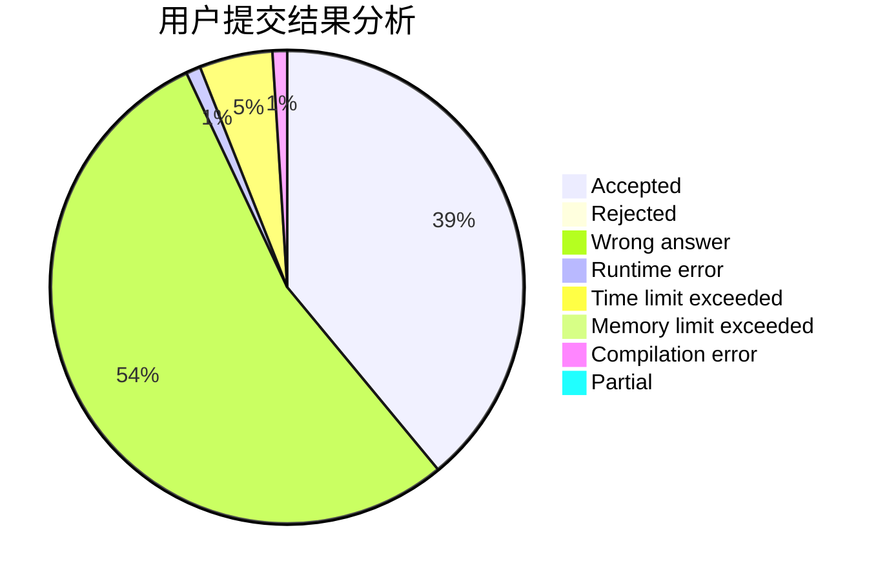
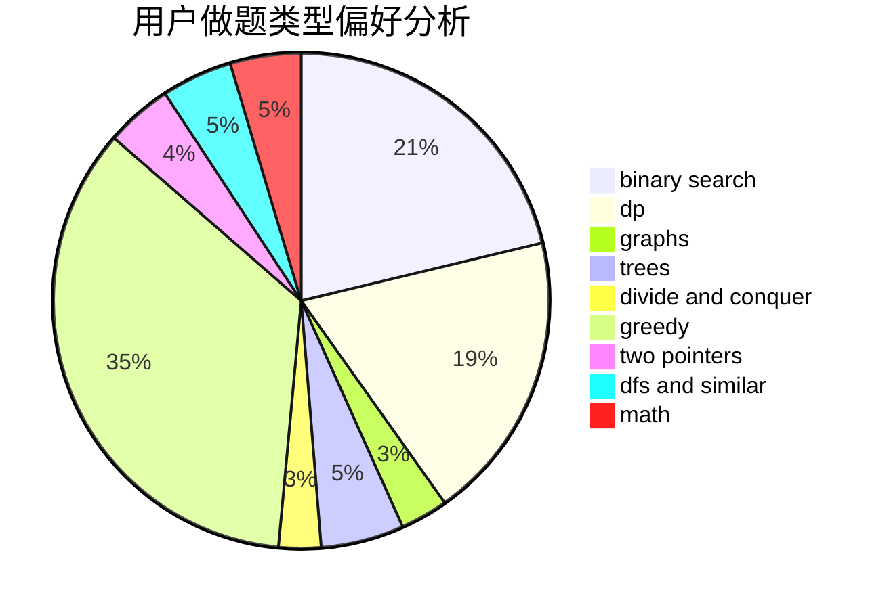

# Epiphyllum

<!-- tabs:start -->

#### **用户提交结果分析**

#### **用户做题类型偏好分析**

<!-- tabs:end -->
# 推荐题目
[198B](https://codeforces.com/contest/198/problem/B)
[771C](https://codeforces.com/contest/771/problem/C)
[1005A](https://codeforces.com/contest/1005/problem/A)
[120H](https://codeforces.com/contest/120/problem/H)
[553A](https://codeforces.com/contest/553/problem/A)
[847B](https://codeforces.com/contest/847/problem/B)
[847F](https://codeforces.com/contest/847/problem/F)
[1246F](https://codeforces.com/contest/1246/problem/F)
[1341E](https://codeforces.com/contest/1341/problem/E)
[290B](https://codeforces.com/contest/290/problem/B)
