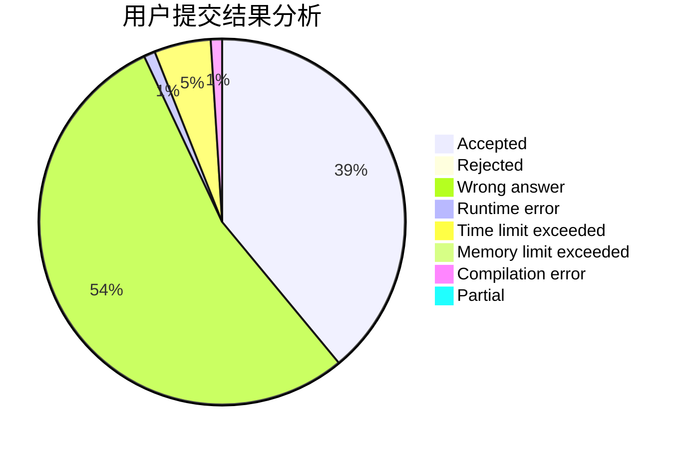
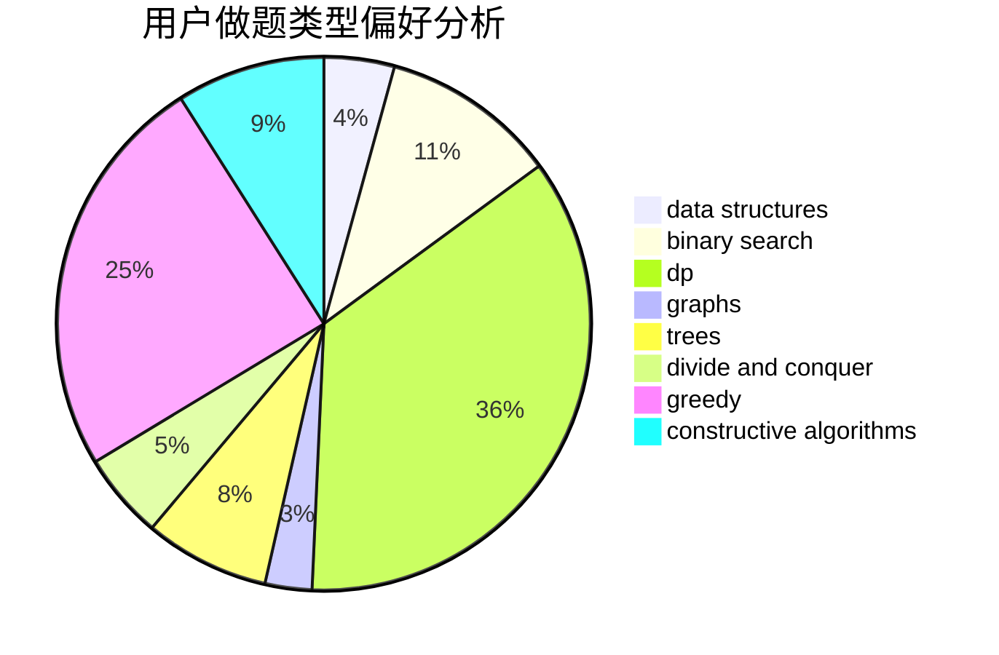
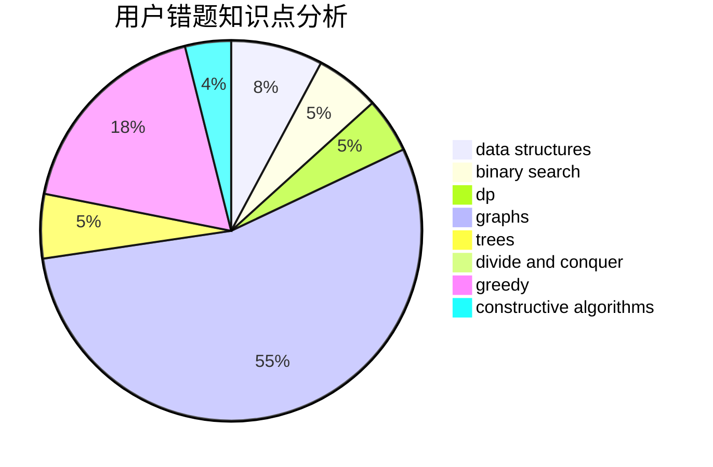

# Epiphyllum

<!-- tabs:start -->

#### **用户提交结果分析**

#### **用户做题类型偏好分析**

#### **用户错题知识点分析**

<!-- tabs:end -->
# 推荐题目
[198B](https://codeforces.com/contest/198/problem/B)		shortest paths		  
[771C](https://codeforces.com/contest/771/problem/C)		dfs and similar,
                        dp,
                        trees		  
[1005A](https://codeforces.com/contest/1005/problem/A)		implementation		  
[120H](https://codeforces.com/contest/120/problem/H)		graph matchings		  
[553A](https://codeforces.com/contest/553/problem/A)		combinatorics,
                        dp,
                        math		  
[847B](https://codeforces.com/contest/847/problem/B)		binary search,
                        data structures		  
[847F](https://codeforces.com/contest/847/problem/F)		greedy,
                        sortings		  
[1246F](https://codeforces.com/contest/1246/problem/F)		nan		  
[1341E](https://codeforces.com/contest/1341/problem/E)		dsu,graphs,sortings,trees		  
[290B](https://codeforces.com/contest/290/problem/B)		*special problem,
                        implementation		  
