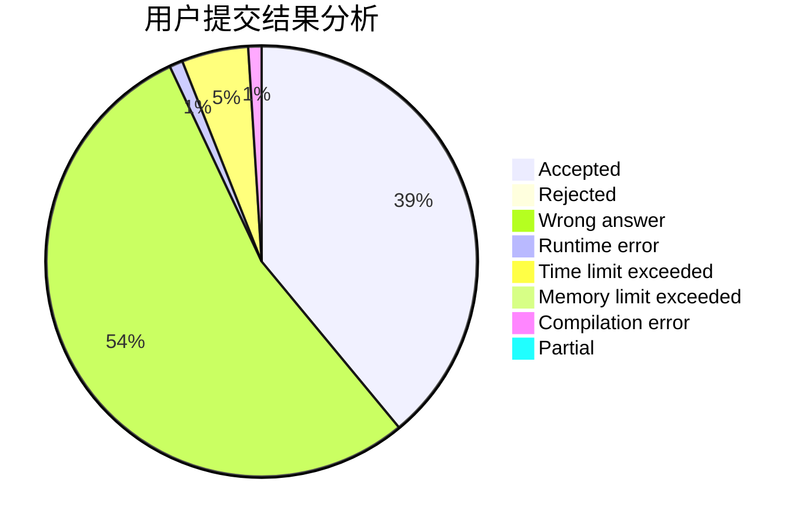
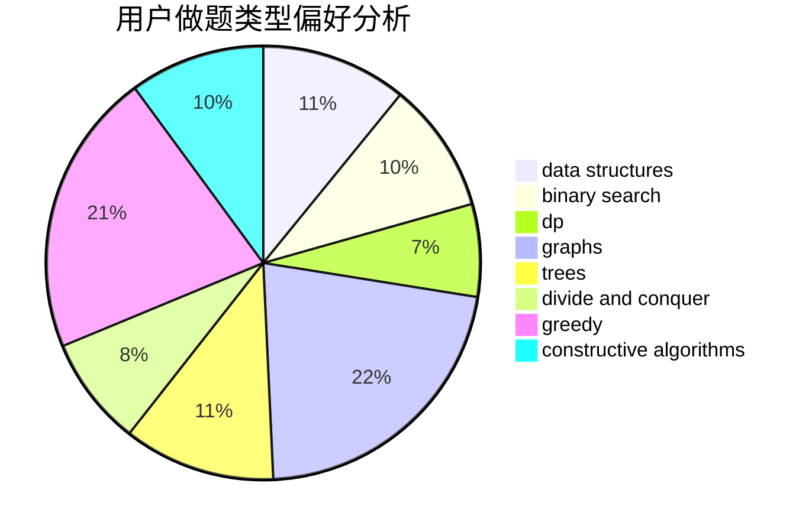
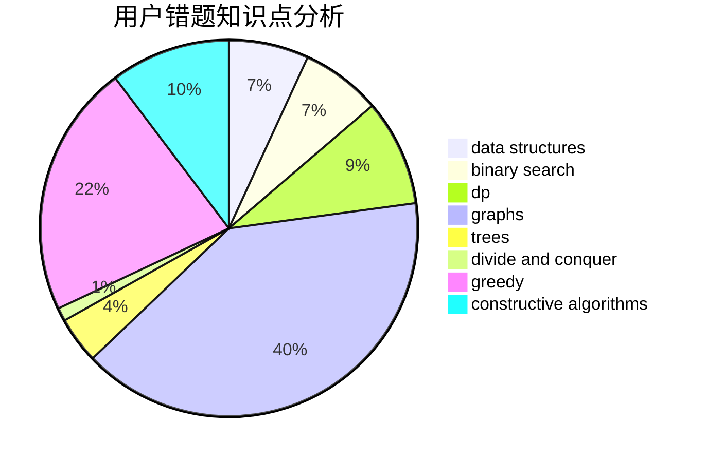

# Epiphyllum

<!-- tabs:start -->

#### **用户提交结果分析**

#### **用户做题类型偏好分析**

#### **用户错题知识点分析**

<!-- tabs:end -->
# 推荐题目
[171B](https://codeforces.com/contest/171/problem/B)		*special problem,
                        combinatorics		  
[750G](https://codeforces.com/contest/750/problem/G)		bitmasks,
                        brute force,
                        combinatorics,
                        dp		  
[1004F](https://codeforces.com/contest/1004/problem/F)		bitmasks,
                        data structures,
                        divide and conquer		  
[1205E](https://codeforces.com/contest/1205/problem/E)		combinatorics,
                        strings		  
[529B](https://codeforces.com/contest/529/problem/B)		brute force,
                        greedy,
                        sortings		  
[828D](https://codeforces.com/contest/828/problem/D)		dsu,graphs,sortings,trees		  
[82A](https://codeforces.com/contest/82/problem/A)		implementation,
                        math		  
[1241B](https://codeforces.com/contest/1241/problem/B)		dsu,graphs,sortings,trees		  
[1334F](https://codeforces.com/contest/1334/problem/F)		binary search,
                        data structures,
                        dp,
                        greedy		  
[275B](https://codeforces.com/contest/275/problem/B)		constructive algorithms,
                        implementation		  
