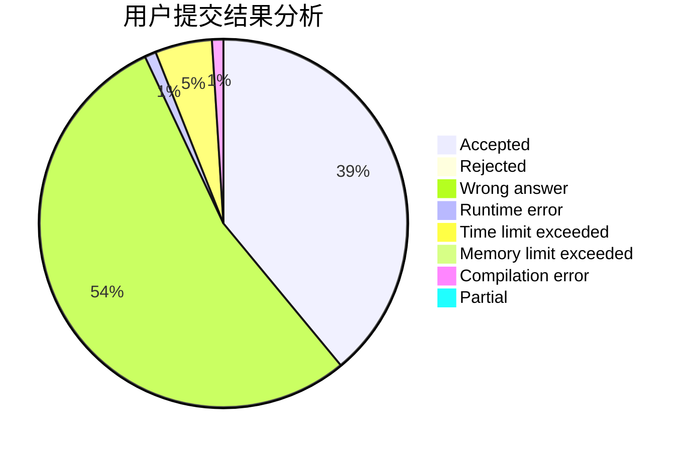
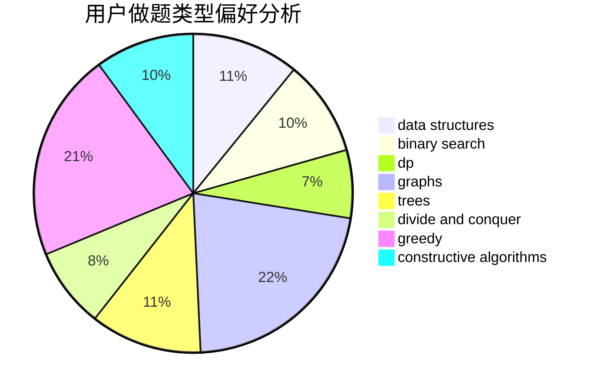
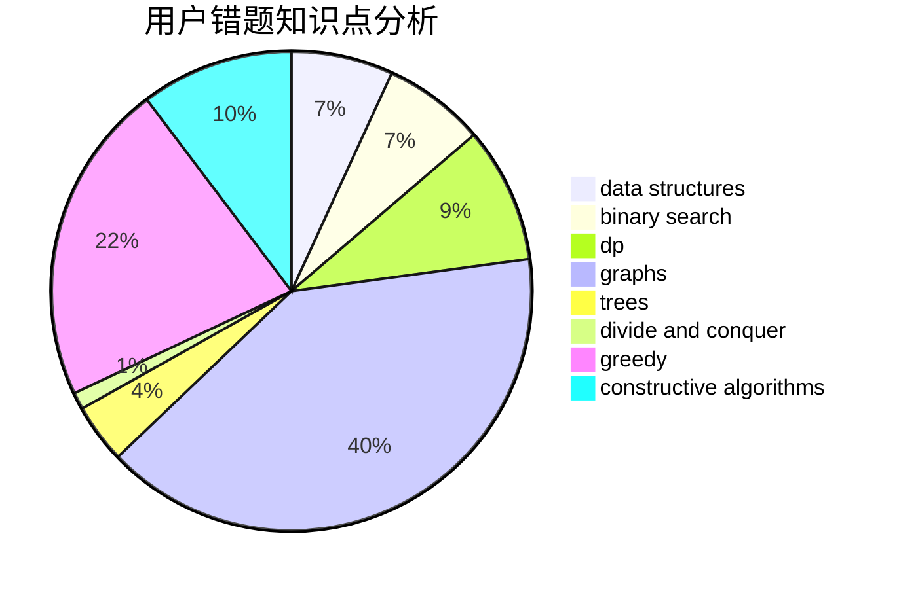

# Epiphyllum
<!-- tabs:start -->
#### **用户提交结果分析**

#### **用户做题类型偏好分析**

#### **用户错题知识点分析**

<!-- tabs:end -->
# 推荐题目
[Star](http://codeforces.com/problemset/problem/171/B)		*special problem,
                        combinatorics		  
[Rotate Columns (easy version)](http://codeforces.com/problemset/problem/1209/E1)		bitmasks,
                        brute force,
                        dp,
                        greedy,
                        sortings		  
[DZY Loves Fibonacci Numbers](https://codeforces.com/contest/447/problem/E)		data structures,
                        math,
                        number theory		  
[Two Rival Students](http://codeforces.com/problemset/problem/1257/A)		greedy,
                        math		  
[Wizards and Huge Prize](http://codeforces.com/problemset/problem/167/B)		dp,
                        math,
                        probabilities		  
[Convex Shape](http://codeforces.com/problemset/problem/275/B)		constructive algorithms,
                        implementation		  
[Increasing Subsequence (easy version)](http://codeforces.com/problemset/problem/1157/C1)		greedy		  
[Lever](http://codeforces.com/problemset/problem/376/A)		implementation,
                        math		  
[Double Cola](http://codeforces.com/problemset/problem/82/A)		implementation,
                        math		  
[New Year and Fireworks](http://codeforces.com/problemset/problem/750/D)		brute force,
                        data structures,
                        dfs and similar,
                        dp,
                        implementation		  
<!-- tabs:start -->
#### **data structures**
[Star](https://codeforces.com/contest/447/problem/E)		data structures,
                        math,
                        number theory		  
[Rotate Columns (easy version)](http://codeforces.com/problemset/problem/750/D)		brute force,
                        data structures,
                        dfs and similar,
                        dp,
                        implementation		  
[DZY Loves Fibonacci Numbers](http://codeforces.com/problemset/problem/1004/F)		bitmasks,
                        data structures,
                        divide and conquer		  
[Two Rival Students](https://codeforces.com/contest/828/problem/E)		data structures,
                        strings		  
[Wizards and Huge Prize](https://codeforces.com/contest/828/problem/C)		data structures,
                        greedy,
                        sortings,
                        strings		  
[Convex Shape](http://codeforces.com/problemset/problem/38/G)		data structures		  
[Increasing Subsequence (easy version)](http://codeforces.com/problemset/problem/1334/F)		binary search,
                        data structures,
                        dp,
                        greedy		  
[Lever](http://codeforces.com/problemset/problem/1482/H)		data structures,
                        string suffix structures,
                        trees		  
[Double Cola](http://codeforces.com/problemset/problem/1194/E)		bitmasks,
                        brute force,
                        data structures,
                        geometry,
                        sortings		  
[New Year and Fireworks](http://codeforces.com/problemset/problem/1492/C)		binary search,
                        data structures,
                        dp,
                        greedy,
                        two pointers		  
#### **binary search**
[Star](http://codeforces.com/problemset/problem/1334/F)		binary search,
                        data structures,
                        dp,
                        greedy		  
[Rotate Columns (easy version)](http://codeforces.com/problemset/problem/1153/D)		binary search,
                        dfs and similar,
                        dp,
                        greedy,
                        trees		  
[DZY Loves Fibonacci Numbers](http://codeforces.com/problemset/problem/1492/C)		binary search,
                        data structures,
                        dp,
                        greedy,
                        two pointers		  
[Two Rival Students](http://codeforces.com/problemset/problem/1463/D)		binary search,
                        constructive algorithms,
                        greedy,
                        two pointers		  
[Wizards and Huge Prize](http://codeforces.com/problemset/problem/1490/G)		binary search,
                        data structures,
                        math		  
[Convex Shape](http://codeforces.com/problemset/problem/1479/D)		binary search,
                        bitmasks,
                        brute force,
                        data structures,
                        probabilities,
                        trees		  
[Increasing Subsequence (easy version)](http://codeforces.com/problemset/problem/1436/E)		binary search,
                        data structures,
                        two pointers		  
[Lever](http://codeforces.com/problemset/problem/1461/D)		binary search,
                        brute force,
                        data structures,
                        divide and conquer,
                        implementation,
                        sortings		  
[Double Cola](http://codeforces.com/problemset/problem/1493/C)		binary search,
                        brute force,
                        constructive algorithms,
                        greedy,
                        strings		  
[New Year and Fireworks](http://codeforces.com/problemset/problem/1487/D)		binary search,
                        brute force,
                        math,
                        number theory		  
#### **dp**
[Star](http://codeforces.com/problemset/problem/1209/E1)		bitmasks,
                        brute force,
                        dp,
                        greedy,
                        sortings		  
[Rotate Columns (easy version)](http://codeforces.com/problemset/problem/167/B)		dp,
                        math,
                        probabilities		  
[DZY Loves Fibonacci Numbers](http://codeforces.com/problemset/problem/750/D)		brute force,
                        data structures,
                        dfs and similar,
                        dp,
                        implementation		  
[Two Rival Students](http://codeforces.com/problemset/problem/1334/F)		binary search,
                        data structures,
                        dp,
                        greedy		  
[Wizards and Huge Prize](http://codeforces.com/problemset/problem/750/G)		bitmasks,
                        brute force,
                        combinatorics,
                        dp		  
[Convex Shape](http://codeforces.com/problemset/problem/1076/F)		dp,
                        greedy		  
[Increasing Subsequence (easy version)](http://codeforces.com/problemset/problem/1149/D)		brute force,
                        dp,
                        graphs,
                        greedy		  
[Lever](http://codeforces.com/problemset/problem/1153/D)		binary search,
                        dfs and similar,
                        dp,
                        greedy,
                        trees		  
[Double Cola](http://codeforces.com/problemset/problem/545/C)		dp,
                        greedy		  
[New Year and Fireworks](http://codeforces.com/problemset/problem/538/B)		constructive algorithms,
                        dp,
                        greedy,
                        implementation		  
#### **graph**
[Star](http://codeforces.com/problemset/problem/1343/E)		brute force,
                        graphs,
                        greedy,
                        shortest paths,
                        sortings		  
[Rotate Columns (easy version)](http://codeforces.com/problemset/problem/1156/G)		graphs,
                        greedy,
                        hashing,
                        implementation		  
[DZY Loves Fibonacci Numbers](http://codeforces.com/problemset/problem/1093/D)		dfs and similar,
                        graphs		  
[Two Rival Students](http://codeforces.com/problemset/problem/1149/D)		brute force,
                        dp,
                        graphs,
                        greedy		  
[Wizards and Huge Prize](http://codeforces.com/problemset/problem/1487/C)		brute force,
                        constructive algorithms,
                        dfs and similar,
                        graphs,
                        greedy,
                        implementation,
                        math		  
[Convex Shape](http://codeforces.com/problemset/problem/1437/C)		dp,
                        flows,
                        graph matchings,
                        greedy,
                        math,
                        sortings		  
[Increasing Subsequence (easy version)](http://codeforces.com/problemset/problem/1470/D)		constructive algorithms,
                        dfs and similar,
                        graph matchings,
                        graphs,
                        greedy		  
[Lever](http://codeforces.com/problemset/problem/1476/C)		dp,
                        graphs,
                        greedy		  
[Double Cola](http://codeforces.com/problemset/problem/1304/D)		constructive algorithms,
                        graphs,
                        greedy,
                        two pointers		  
[New Year and Fireworks](http://codeforces.com/problemset/problem/1475/C)		combinatorics,
                        graphs,
                        math		  
#### **trees**
[Star](https://codeforces.com/contest/828/problem/D)		constructive algorithms,
                        greedy,
                        implementation,
                        trees		  
[Rotate Columns (easy version)](http://codeforces.com/problemset/problem/1482/H)		data structures,
                        string suffix structures,
                        trees		  
[DZY Loves Fibonacci Numbers](http://codeforces.com/problemset/problem/1153/D)		binary search,
                        dfs and similar,
                        dp,
                        greedy,
                        trees		  
[Two Rival Students](http://codeforces.com/problemset/problem/1479/D)		binary search,
                        bitmasks,
                        brute force,
                        data structures,
                        probabilities,
                        trees		  
[Wizards and Huge Prize](http://codeforces.com/problemset/problem/1511/C)		brute force,
                        data structures,
                        implementation,
                        trees		  
[Convex Shape](http://codeforces.com/problemset/problem/1499/F)		combinatorics,
                        dfs and similar,
                        dp,
                        trees		  
[Increasing Subsequence (easy version)](http://codeforces.com/problemset/problem/1491/E)		brute force,
                        dfs and similar,
                        divide and conquer,
                        number theory,
                        trees		  
[Lever](http://codeforces.com/problemset/problem/1466/D)		data structures,
                        greedy,
                        sortings,
                        trees		  
[Double Cola](http://codeforces.com/problemset/problem/1495/D)		combinatorics,
                        dfs and similar,
                        graphs,
                        math,
                        shortest paths,
                        trees		  
[New Year and Fireworks](http://codeforces.com/problemset/problem/1303/G)		data structures,
                        divide and conquer,
                        geometry,
                        trees		  
#### **divide and conquer**
[Star](http://codeforces.com/problemset/problem/1004/F)		bitmasks,
                        data structures,
                        divide and conquer		  
[Rotate Columns (easy version)](http://codeforces.com/problemset/problem/1461/D)		binary search,
                        brute force,
                        data structures,
                        divide and conquer,
                        implementation,
                        sortings		  
[DZY Loves Fibonacci Numbers](http://codeforces.com/problemset/problem/1466/G)		combinatorics,
                        divide and conquer,
                        hashing,
                        math,
                        string suffix structures,
                        strings		  
[Two Rival Students](http://codeforces.com/problemset/problem/1490/D)		dfs and similar,
                        divide and conquer,
                        implementation		  
[Wizards and Huge Prize](https://codeforces.com/contest/1483/problem/C)		data structures,
                        divide and conquer,
                        dp		  
[Convex Shape](http://codeforces.com/problemset/problem/1491/E)		brute force,
                        dfs and similar,
                        divide and conquer,
                        number theory,
                        trees		  
[Increasing Subsequence (easy version)](http://codeforces.com/problemset/problem/1303/G)		data structures,
                        divide and conquer,
                        geometry,
                        trees		  
[Lever](http://codeforces.com/problemset/problem/1494/D)		constructive algorithms,
                        data structures,
                        dfs and similar,
                        divide and conquer,
                        dsu,
                        greedy,
                        sortings,
                        trees		  
[Double Cola](http://codeforces.com/problemset/problem/1482/E)		data structures,
                        divide and conquer,
                        dp		  
[New Year and Fireworks](http://codeforces.com/problemset/problem/566/C)		dfs and similar,
                        divide and conquer,
                        trees		  
#### **greedy**
[Star](http://codeforces.com/problemset/problem/1209/E1)		bitmasks,
                        brute force,
                        dp,
                        greedy,
                        sortings		  
[Rotate Columns (easy version)](http://codeforces.com/problemset/problem/1257/A)		greedy,
                        math		  
[DZY Loves Fibonacci Numbers](http://codeforces.com/problemset/problem/1157/C1)		greedy		  
[Two Rival Students](http://codeforces.com/problemset/problem/246/B)		greedy,
                        math		  
[Wizards and Huge Prize](https://codeforces.com/contest/828/problem/C)		data structures,
                        greedy,
                        sortings,
                        strings		  
[Convex Shape](http://codeforces.com/problemset/problem/1334/F)		binary search,
                        data structures,
                        dp,
                        greedy		  
[Increasing Subsequence (easy version)](http://codeforces.com/problemset/problem/529/B)		brute force,
                        greedy,
                        sortings		  
[Lever](http://codeforces.com/problemset/problem/1343/E)		brute force,
                        graphs,
                        greedy,
                        shortest paths,
                        sortings		  
[Double Cola](http://codeforces.com/problemset/problem/1076/F)		dp,
                        greedy		  
[New Year and Fireworks](https://codeforces.com/contest/828/problem/D)		constructive algorithms,
                        greedy,
                        implementation,
                        trees		  
#### **constructive algorithms**
[Star](http://codeforces.com/problemset/problem/275/B)		constructive algorithms,
                        implementation		  
[Rotate Columns (easy version)](http://codeforces.com/problemset/problem/297/C)		constructive algorithms		  
[DZY Loves Fibonacci Numbers](https://codeforces.com/contest/828/problem/D)		constructive algorithms,
                        greedy,
                        implementation,
                        trees		  
[Two Rival Students](http://codeforces.com/problemset/problem/538/B)		constructive algorithms,
                        dp,
                        greedy,
                        implementation		  
[Wizards and Huge Prize](http://codeforces.com/problemset/problem/1493/A)		constructive algorithms,
                        greedy		  
[Convex Shape](http://codeforces.com/problemset/problem/1463/D)		binary search,
                        constructive algorithms,
                        greedy,
                        two pointers		  
[Increasing Subsequence (easy version)](https://codeforces.com/contest/1456/problem/B)		bitmasks,
                        brute force,
                        constructive algorithms		  
[Lever](http://codeforces.com/problemset/problem/1492/D)		bitmasks,
                        constructive algorithms,
                        greedy,
                        math		  
[Double Cola](https://codeforces.com/contest/1504/problem/D)		constructive algorithms,
                        games,
                        interactive		  
[New Year and Fireworks](https://codeforces.com/contest/1483/problem/A)		brute force,
                        constructive algorithms,
                        greedy,
                        implementation		  
#### **sortings**
[Star](http://codeforces.com/problemset/problem/1209/E1)		bitmasks,
                        brute force,
                        dp,
                        greedy,
                        sortings		  
[Rotate Columns (easy version)](https://codeforces.com/contest/828/problem/C)		data structures,
                        greedy,
                        sortings,
                        strings		  
[DZY Loves Fibonacci Numbers](http://codeforces.com/problemset/problem/529/B)		brute force,
                        greedy,
                        sortings		  
[Two Rival Students](http://codeforces.com/problemset/problem/1343/E)		brute force,
                        graphs,
                        greedy,
                        shortest paths,
                        sortings		  
[Wizards and Huge Prize](http://codeforces.com/problemset/problem/437/B)		bitmasks,
                        greedy,
                        implementation,
                        sortings		  
[Convex Shape](http://codeforces.com/problemset/problem/1194/E)		bitmasks,
                        brute force,
                        data structures,
                        geometry,
                        sortings		  
[Increasing Subsequence (easy version)](https://codeforces.com/contest/1496/problem/C)		geometry,
                        greedy,
                        math,
                        sortings		  
[Lever](http://codeforces.com/problemset/problem/1495/A)		geometry,
                        greedy,
                        math,
                        sortings		  
[Double Cola](http://codeforces.com/problemset/problem/1497/A)		brute force,
                        data structures,
                        greedy,
                        sortings		  
[New Year and Fireworks](http://codeforces.com/problemset/problem/1427/A)		math,
                        sortings		  
<!-- tabs:end -->
