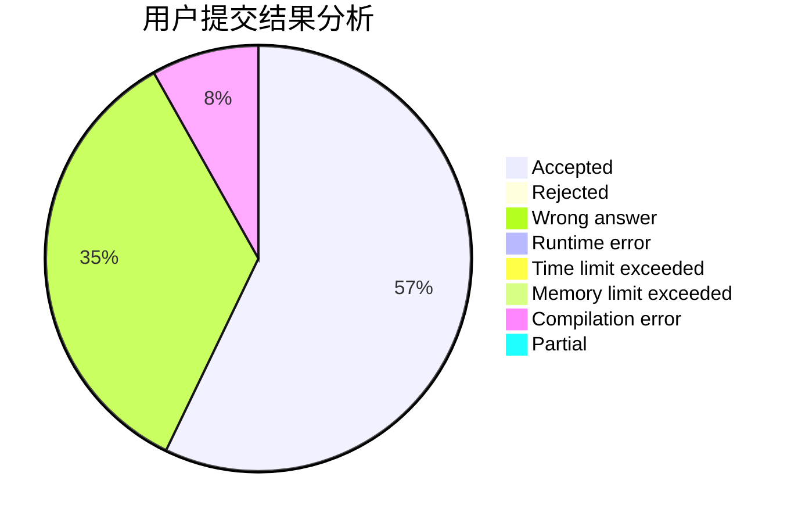
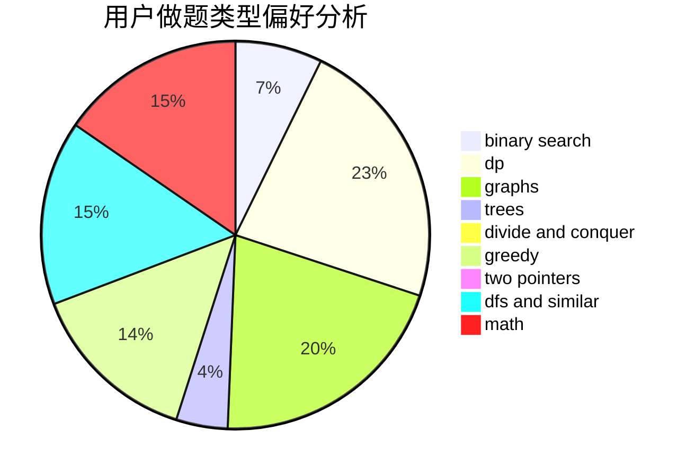

# Eqvpkbz

<!-- tabs:start -->

#### **用户提交结果分析**

#### **用户做题类型偏好分析**

<!-- tabs:end -->
# 推荐题目
[766C](https://codeforces.com/contest/766/problem/C)
[282C](https://codeforces.com/contest/282/problem/C)
[44G](https://codeforces.com/contest/44/problem/G)
[847K](https://codeforces.com/contest/847/problem/K)
[59A](https://codeforces.com/contest/59/problem/A)
[848A](https://codeforces.com/contest/848/problem/A)
[253A](https://codeforces.com/contest/253/problem/A)
[733E](https://codeforces.com/contest/733/problem/E)
[566G](https://codeforces.com/contest/566/problem/G)
[1298B](https://codeforces.com/contest/1298/problem/B)
