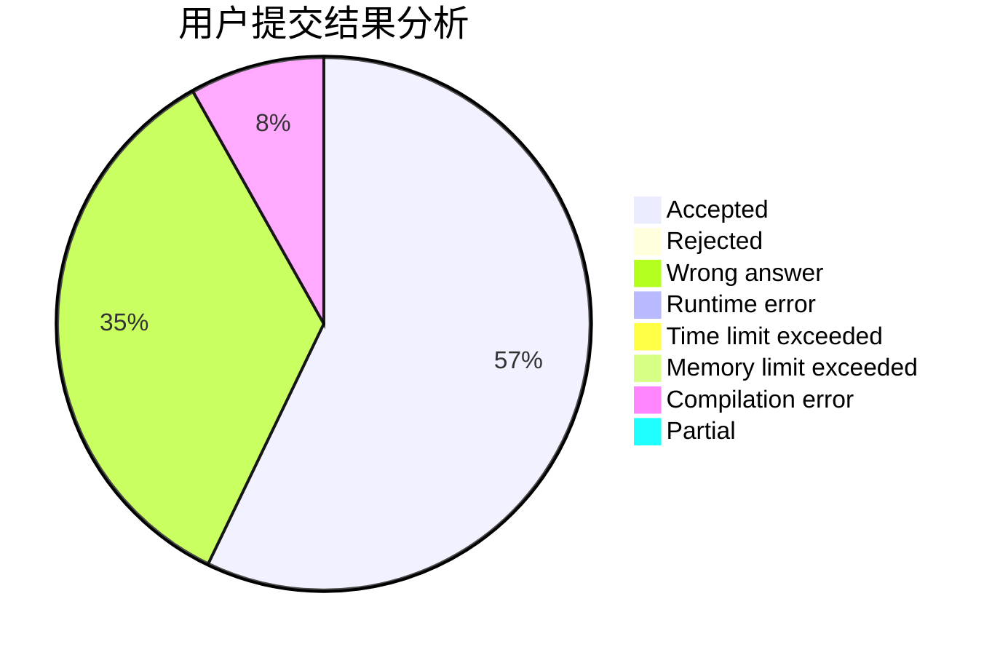
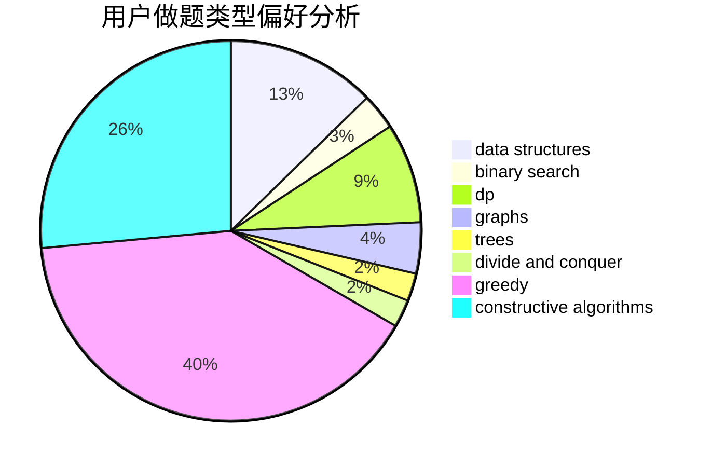

# Eqvpkbz
<!-- tabs:start -->
#### **用户提交结果分析**

#### **用户做题类型偏好分析**

#### **用户错题知识点分析**

<!-- tabs:end -->
# 推荐题目
[New Roads](http://codeforces.com/problemset/problem/746/G)		constructive algorithms,
                        graphs,
                        trees		  
[BerDonalds](http://codeforces.com/problemset/problem/266/D)		graphs,
                        math,
                        shortest paths		  
[LCS Again](http://codeforces.com/problemset/problem/578/D)		dp,
                        greedy		  
[Working out](http://codeforces.com/problemset/problem/429/B)		dp		  
[Superhero's Job](http://codeforces.com/problemset/problem/542/D)		dfs and similar,
                        dp,
                        hashing,
                        math,
                        number theory		  
[Two out of Three](http://codeforces.com/problemset/problem/82/D)		dp		  
[Excitation of Atoms](http://codeforces.com/problemset/problem/1425/E)		greedy,
                        implementation		  
[Office Keys](http://codeforces.com/problemset/problem/830/A)		binary search,
                        brute force,
                        dp,
                        greedy,
                        sortings		  
[To Add or Not to Add](http://codeforces.com/problemset/problem/231/C)		binary search,
                        sortings,
                        two pointers		  
[Obtain a Permutation](http://codeforces.com/problemset/problem/1294/E)		greedy,
                        implementation,
                        math		  
<!-- tabs:start -->
#### **data structures**
[New Roads](https://codeforces.com/contest/1291/problem/C)		brute force,
                        data structures,
                        implementation		  
[BerDonalds](http://codeforces.com/problemset/problem/1492/C)		binary search,
                        data structures,
                        dp,
                        greedy,
                        two pointers		  
[LCS Again](http://codeforces.com/problemset/problem/1490/G)		binary search,
                        data structures,
                        math		  
[Working out](http://codeforces.com/problemset/problem/1479/D)		binary search,
                        bitmasks,
                        brute force,
                        data structures,
                        probabilities,
                        trees		  
[Superhero's Job](http://codeforces.com/problemset/problem/1497/A)		brute force,
                        data structures,
                        greedy,
                        sortings		  
[Two out of Three](http://codeforces.com/problemset/problem/1491/C)		brute force,
                        data structures,
                        dp,
                        greedy,
                        implementation		  
[Excitation of Atoms](http://codeforces.com/problemset/problem/1492/B)		data structures,
                        greedy,
                        math		  
[Office Keys](http://codeforces.com/problemset/problem/1436/E)		binary search,
                        data structures,
                        two pointers		  
[To Add or Not to Add](http://codeforces.com/problemset/problem/1461/D)		binary search,
                        brute force,
                        data structures,
                        divide and conquer,
                        implementation,
                        sortings		  
[Obtain a Permutation](http://codeforces.com/problemset/problem/1511/C)		brute force,
                        data structures,
                        implementation,
                        trees		  
#### **binary search**
[New Roads](http://codeforces.com/problemset/problem/830/A)		binary search,
                        brute force,
                        dp,
                        greedy,
                        sortings		  
[BerDonalds](http://codeforces.com/problemset/problem/231/C)		binary search,
                        sortings,
                        two pointers		  
[LCS Again](http://codeforces.com/problemset/problem/348/A)		binary search,
                        math,
                        sortings		  
[Working out](http://codeforces.com/problemset/problem/1492/C)		binary search,
                        data structures,
                        dp,
                        greedy,
                        two pointers		  
[Superhero's Job](http://codeforces.com/problemset/problem/1463/D)		binary search,
                        constructive algorithms,
                        greedy,
                        two pointers		  
[Two out of Three](http://codeforces.com/problemset/problem/1490/G)		binary search,
                        data structures,
                        math		  
[Excitation of Atoms](http://codeforces.com/problemset/problem/1479/D)		binary search,
                        bitmasks,
                        brute force,
                        data structures,
                        probabilities,
                        trees		  
[Office Keys](http://codeforces.com/problemset/problem/1436/E)		binary search,
                        data structures,
                        two pointers		  
[To Add or Not to Add](http://codeforces.com/problemset/problem/1461/D)		binary search,
                        brute force,
                        data structures,
                        divide and conquer,
                        implementation,
                        sortings		  
[Obtain a Permutation](http://codeforces.com/problemset/problem/1493/C)		binary search,
                        brute force,
                        constructive algorithms,
                        greedy,
                        strings		  
#### **dp**
[New Roads](http://codeforces.com/problemset/problem/578/D)		dp,
                        greedy		  
[BerDonalds](http://codeforces.com/problemset/problem/429/B)		dp		  
[LCS Again](http://codeforces.com/problemset/problem/542/D)		dfs and similar,
                        dp,
                        hashing,
                        math,
                        number theory		  
[Working out](http://codeforces.com/problemset/problem/82/D)		dp		  
[Superhero's Job](http://codeforces.com/problemset/problem/830/A)		binary search,
                        brute force,
                        dp,
                        greedy,
                        sortings		  
[Two out of Three](http://codeforces.com/problemset/problem/601/C)		dp,
                        math,
                        probabilities		  
[Excitation of Atoms](http://codeforces.com/problemset/problem/1421/E)		brute force,
                        dp,
                        implementation		  
[Office Keys](http://codeforces.com/problemset/problem/148/D)		dp,
                        games,
                        math,
                        probabilities		  
[To Add or Not to Add](http://codeforces.com/problemset/problem/1198/D)		dp		  
[Obtain a Permutation](http://codeforces.com/problemset/problem/1492/C)		binary search,
                        data structures,
                        dp,
                        greedy,
                        two pointers		  
#### **graph**
[New Roads](http://codeforces.com/problemset/problem/746/G)		constructive algorithms,
                        graphs,
                        trees		  
[BerDonalds](http://codeforces.com/problemset/problem/266/D)		graphs,
                        math,
                        shortest paths		  
[LCS Again](http://codeforces.com/problemset/problem/1139/C)		dfs and similar,
                        dsu,
                        graphs,
                        math,
                        trees		  
[Working out](http://codeforces.com/problemset/problem/1487/C)		brute force,
                        constructive algorithms,
                        dfs and similar,
                        graphs,
                        greedy,
                        implementation,
                        math		  
[Superhero's Job](http://codeforces.com/problemset/problem/1437/C)		dp,
                        flows,
                        graph matchings,
                        greedy,
                        math,
                        sortings		  
[Two out of Three](http://codeforces.com/problemset/problem/1470/D)		constructive algorithms,
                        dfs and similar,
                        graph matchings,
                        graphs,
                        greedy		  
[Excitation of Atoms](http://codeforces.com/problemset/problem/1476/C)		dp,
                        graphs,
                        greedy		  
[Office Keys](http://codeforces.com/problemset/problem/1304/D)		constructive algorithms,
                        graphs,
                        greedy,
                        two pointers		  
[To Add or Not to Add](http://codeforces.com/problemset/problem/1475/C)		combinatorics,
                        graphs,
                        math		  
[Obtain a Permutation](http://codeforces.com/problemset/problem/553/E)		dp,
                        fft,
                        graphs,
                        math,
                        probabilities		  
#### **trees**
[New Roads](http://codeforces.com/problemset/problem/746/G)		constructive algorithms,
                        graphs,
                        trees		  
[BerDonalds](http://codeforces.com/problemset/problem/1139/C)		dfs and similar,
                        dsu,
                        graphs,
                        math,
                        trees		  
[LCS Again](http://codeforces.com/problemset/problem/715/C)		dfs and similar,
                        divide and conquer,
                        dsu,
                        trees		  
[Working out](http://codeforces.com/problemset/problem/1479/D)		binary search,
                        bitmasks,
                        brute force,
                        data structures,
                        probabilities,
                        trees		  
[Superhero's Job](http://codeforces.com/problemset/problem/1511/C)		brute force,
                        data structures,
                        implementation,
                        trees		  
[Two out of Three](http://codeforces.com/problemset/problem/1499/F)		combinatorics,
                        dfs and similar,
                        dp,
                        trees		  
[Excitation of Atoms](http://codeforces.com/problemset/problem/1491/E)		brute force,
                        dfs and similar,
                        divide and conquer,
                        number theory,
                        trees		  
[Office Keys](http://codeforces.com/problemset/problem/1466/D)		data structures,
                        greedy,
                        sortings,
                        trees		  
[To Add or Not to Add](http://codeforces.com/problemset/problem/1495/D)		combinatorics,
                        dfs and similar,
                        graphs,
                        math,
                        shortest paths,
                        trees		  
[Obtain a Permutation](http://codeforces.com/problemset/problem/1303/G)		data structures,
                        divide and conquer,
                        geometry,
                        trees		  
#### **divide and conquer**
[New Roads](http://codeforces.com/problemset/problem/715/C)		dfs and similar,
                        divide and conquer,
                        dsu,
                        trees		  
[BerDonalds](http://codeforces.com/problemset/problem/1461/D)		binary search,
                        brute force,
                        data structures,
                        divide and conquer,
                        implementation,
                        sortings		  
[LCS Again](http://codeforces.com/problemset/problem/1466/G)		combinatorics,
                        divide and conquer,
                        hashing,
                        math,
                        string suffix structures,
                        strings		  
[Working out](http://codeforces.com/problemset/problem/1490/D)		dfs and similar,
                        divide and conquer,
                        implementation		  
[Superhero's Job](https://codeforces.com/contest/1483/problem/C)		data structures,
                        divide and conquer,
                        dp		  
[Two out of Three](http://codeforces.com/problemset/problem/1491/E)		brute force,
                        dfs and similar,
                        divide and conquer,
                        number theory,
                        trees		  
[Excitation of Atoms](http://codeforces.com/problemset/problem/1303/G)		data structures,
                        divide and conquer,
                        geometry,
                        trees		  
[Office Keys](http://codeforces.com/problemset/problem/1494/D)		constructive algorithms,
                        data structures,
                        dfs and similar,
                        divide and conquer,
                        dsu,
                        greedy,
                        sortings,
                        trees		  
[To Add or Not to Add](http://codeforces.com/problemset/problem/1482/E)		data structures,
                        divide and conquer,
                        dp		  
[Obtain a Permutation](http://codeforces.com/problemset/problem/566/C)		dfs and similar,
                        divide and conquer,
                        trees		  
#### **greedy**
[New Roads](http://codeforces.com/problemset/problem/578/D)		dp,
                        greedy		  
[BerDonalds](http://codeforces.com/problemset/problem/1425/E)		greedy,
                        implementation		  
[LCS Again](http://codeforces.com/problemset/problem/830/A)		binary search,
                        brute force,
                        dp,
                        greedy,
                        sortings		  
[Working out](http://codeforces.com/problemset/problem/1294/E)		greedy,
                        implementation,
                        math		  
[Superhero's Job](http://codeforces.com/problemset/problem/1415/B)		brute force,
                        brute force,
                        greedy		  
[Two out of Three](http://codeforces.com/problemset/problem/1393/A)		greedy,
                        math		  
[Excitation of Atoms](http://codeforces.com/problemset/problem/1397/A)		greedy,
                        strings		  
[Office Keys](http://codeforces.com/problemset/problem/1492/C)		binary search,
                        data structures,
                        dp,
                        greedy,
                        two pointers		  
[To Add or Not to Add](https://codeforces.com/contest/1496/problem/C)		geometry,
                        greedy,
                        math,
                        sortings		  
[Obtain a Permutation](http://codeforces.com/problemset/problem/1493/A)		constructive algorithms,
                        greedy		  
#### **constructive algorithms**
[New Roads](http://codeforces.com/problemset/problem/746/G)		constructive algorithms,
                        graphs,
                        trees		  
[BerDonalds](http://codeforces.com/problemset/problem/820/B)		constructive algorithms,
                        geometry,
                        math		  
[LCS Again](http://codeforces.com/problemset/problem/766/A)		constructive algorithms,
                        strings		  
[Working out](http://codeforces.com/problemset/problem/1493/A)		constructive algorithms,
                        greedy		  
[Superhero's Job](http://codeforces.com/problemset/problem/1463/D)		binary search,
                        constructive algorithms,
                        greedy,
                        two pointers		  
[Two out of Three](https://codeforces.com/contest/1456/problem/B)		bitmasks,
                        brute force,
                        constructive algorithms		  
[Excitation of Atoms](http://codeforces.com/problemset/problem/1492/D)		bitmasks,
                        constructive algorithms,
                        greedy,
                        math		  
[Office Keys](https://codeforces.com/contest/1504/problem/D)		constructive algorithms,
                        games,
                        interactive		  
[To Add or Not to Add](https://codeforces.com/contest/1483/problem/A)		brute force,
                        constructive algorithms,
                        greedy,
                        implementation		  
[Obtain a Permutation](https://codeforces.com/contest/1457/problem/D)		bitmasks,
                        brute force,
                        constructive algorithms		  
#### **sortings**
[New Roads](http://codeforces.com/problemset/problem/830/A)		binary search,
                        brute force,
                        dp,
                        greedy,
                        sortings		  
[BerDonalds](http://codeforces.com/problemset/problem/231/C)		binary search,
                        sortings,
                        two pointers		  
[LCS Again](http://codeforces.com/problemset/problem/348/A)		binary search,
                        math,
                        sortings		  
[Working out](https://codeforces.com/contest/1496/problem/C)		geometry,
                        greedy,
                        math,
                        sortings		  
[Superhero's Job](http://codeforces.com/problemset/problem/1495/A)		geometry,
                        greedy,
                        math,
                        sortings		  
[Two out of Three](http://codeforces.com/problemset/problem/1497/A)		brute force,
                        data structures,
                        greedy,
                        sortings		  
[Excitation of Atoms](http://codeforces.com/problemset/problem/1427/A)		math,
                        sortings		  
[Office Keys](http://codeforces.com/problemset/problem/1461/D)		binary search,
                        brute force,
                        data structures,
                        divide and conquer,
                        implementation,
                        sortings		  
[To Add or Not to Add](http://codeforces.com/problemset/problem/1437/C)		dp,
                        flows,
                        graph matchings,
                        greedy,
                        math,
                        sortings		  
[Obtain a Permutation](http://codeforces.com/problemset/problem/1473/A)		greedy,
                        implementation,
                        math,
                        sortings		  
<!-- tabs:end -->
