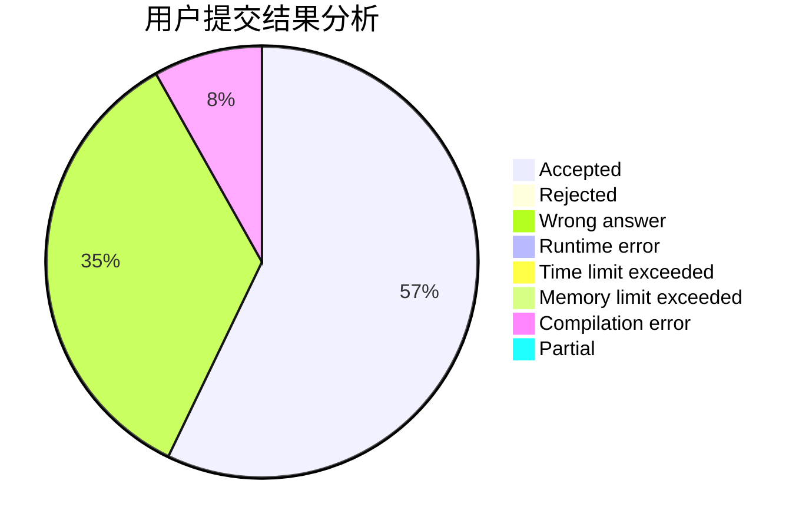
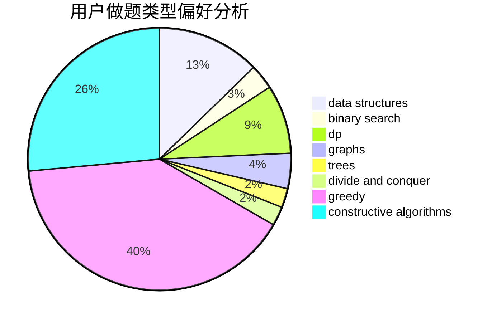

# Eqvpkbz

<!-- tabs:start -->

#### **用户提交结果分析**

#### **用户做题类型偏好分析**

#### **用户错题知识点分析**

<!-- tabs:end -->
# 推荐题目
[746G](https://codeforces.com/contest/746/problem/G)		constructive algorithms,
                        graphs,
                        trees		  
[266D](https://codeforces.com/contest/266/problem/D)		graphs,
                        math,
                        shortest paths		  
[429B](https://codeforces.com/contest/429/problem/B)		dp		  
[82D](https://codeforces.com/contest/82/problem/D)		dp		  
[578D](https://codeforces.com/contest/578/problem/D)		dp,
                        greedy		  
[830A](https://codeforces.com/contest/830/problem/A)		binary search,
                        brute force,
                        dp,
                        greedy,
                        sortings		  
[231C](https://codeforces.com/contest/231/problem/C)		binary search,
                        sortings,
                        two pointers		  
[715C](https://codeforces.com/contest/715/problem/C)		dfs and similar,
                        divide and conquer,
                        dsu,
                        trees		  
[542D](https://codeforces.com/contest/542/problem/D)		dfs and similar,
                        dp,
                        hashing,
                        math,
                        number theory		  
[1291C](https://codeforces.com/contest/1291/problem/C)		dsu,graphs,sortings,trees		  
