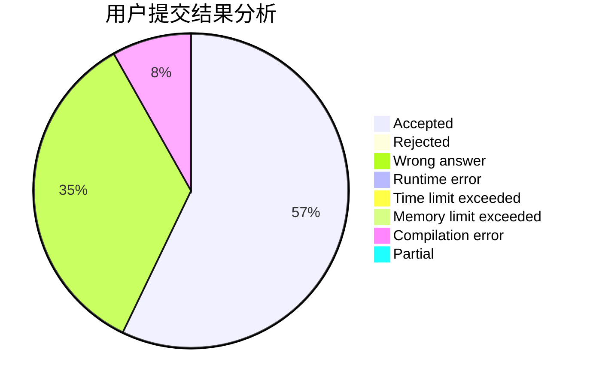
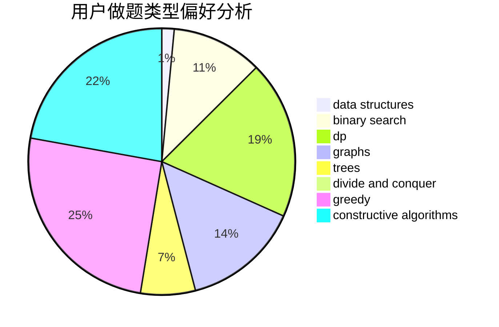

# Eqvpkbz

<!-- tabs:start -->

#### **用户提交结果分析**

#### **用户做题类型偏好分析**

#### **用户错题知识点分析**

<!-- tabs:end -->
# 推荐题目
[766C](https://codeforces.com/contest/766/problem/C)		brute force,
                        dp,
                        greedy,
                        strings		  
[282C](https://codeforces.com/contest/282/problem/C)		constructive algorithms,
                        implementation,
                        math		  
[44G](https://codeforces.com/contest/44/problem/G)		data structures,
                        implementation		  
[847K](https://codeforces.com/contest/847/problem/K)		greedy,
                        implementation,
                        sortings		  
[59A](https://codeforces.com/contest/59/problem/A)		implementation,
                        strings		  
[848A](https://codeforces.com/contest/848/problem/A)		constructive algorithms		  
[253A](https://codeforces.com/contest/253/problem/A)		greedy		  
[733E](https://codeforces.com/contest/733/problem/E)		constructive algorithms,
                        data structures,
                        math,
                        two pointers		  
[566G](https://codeforces.com/contest/566/problem/G)		geometry		  
[1298B](https://codeforces.com/contest/1298/problem/B)		dsu,graphs,sortings,trees		  
