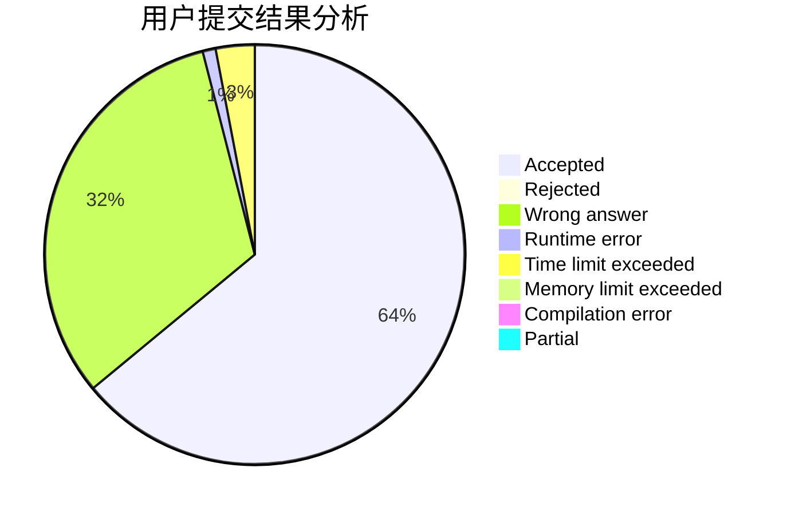
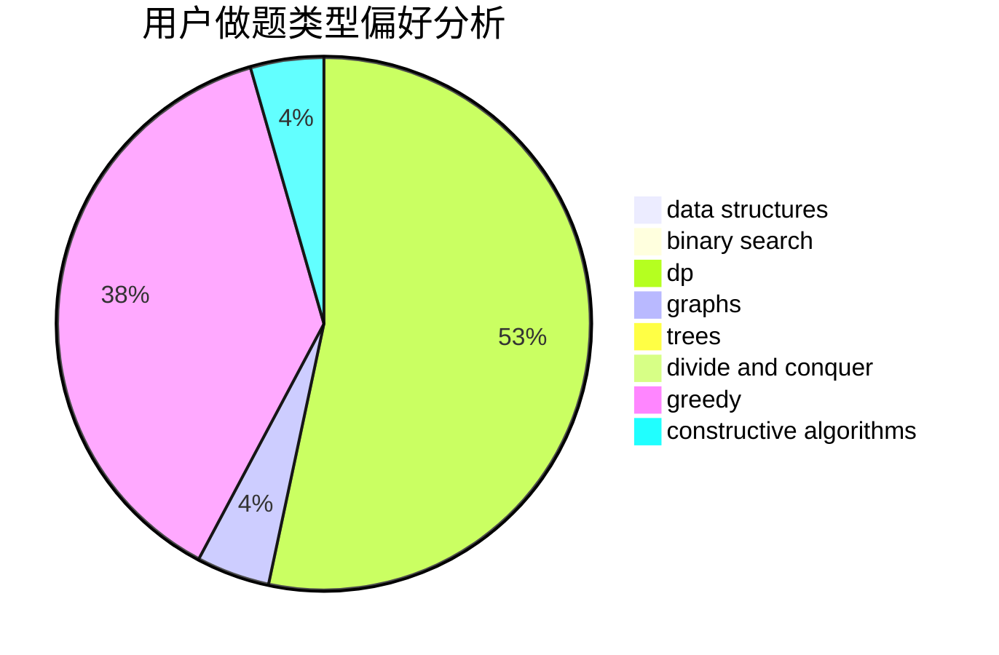

# EricQian

<!-- tabs:start -->

#### **用户提交结果分析**

#### **用户做题类型偏好分析**

#### **用户错题知识点分析**

<!-- tabs:end -->
# 推荐题目
[830C](https://codeforces.com/contest/830/problem/C)		brute force,
                        data structures,
                        implementation,
                        math,
                        number theory,
                        sortings,
                        two pointers		  
[1288D](https://codeforces.com/contest/1288/problem/D)		binary search,
                        bitmasks,
                        dp		  
[199E](https://codeforces.com/contest/199/problem/E)		dsu,graphs,sortings,trees		  
[559E](https://codeforces.com/contest/559/problem/E)		dp,
                        sortings		  
[1416E](https://codeforces.com/contest/1416/problem/E)		binary search,
                        data structures,
                        dp,
                        greedy		  
[309C](https://codeforces.com/contest/309/problem/C)		binary search,
                        bitmasks,
                        greedy		  
[1398F](https://codeforces.com/contest/1398/problem/F)		binary search,
                        data structures,
                        dp,
                        greedy,
                        two pointers		  
[496E](https://codeforces.com/contest/496/problem/E)		greedy,
                        sortings		  
[35A](https://codeforces.com/contest/35/problem/A)		implementation		  
[510E](https://codeforces.com/contest/510/problem/E)		flows		  
