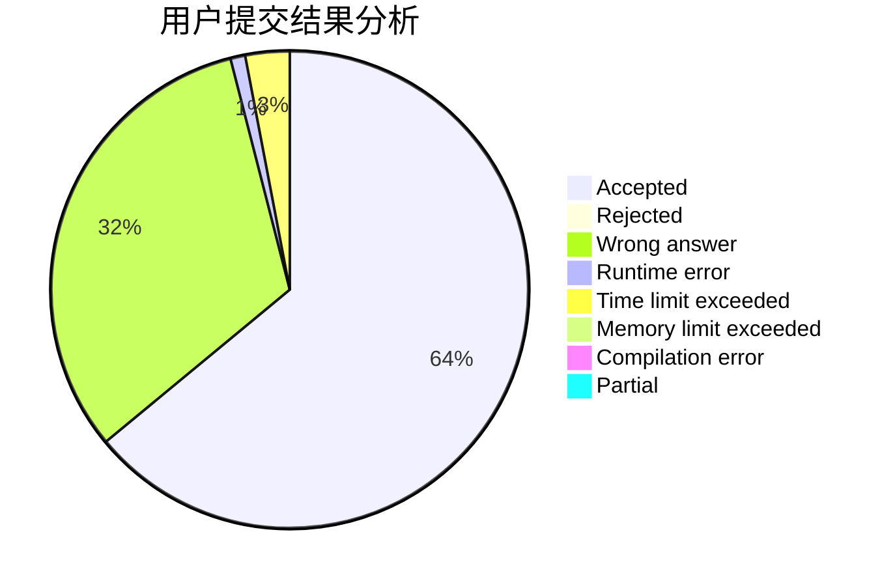
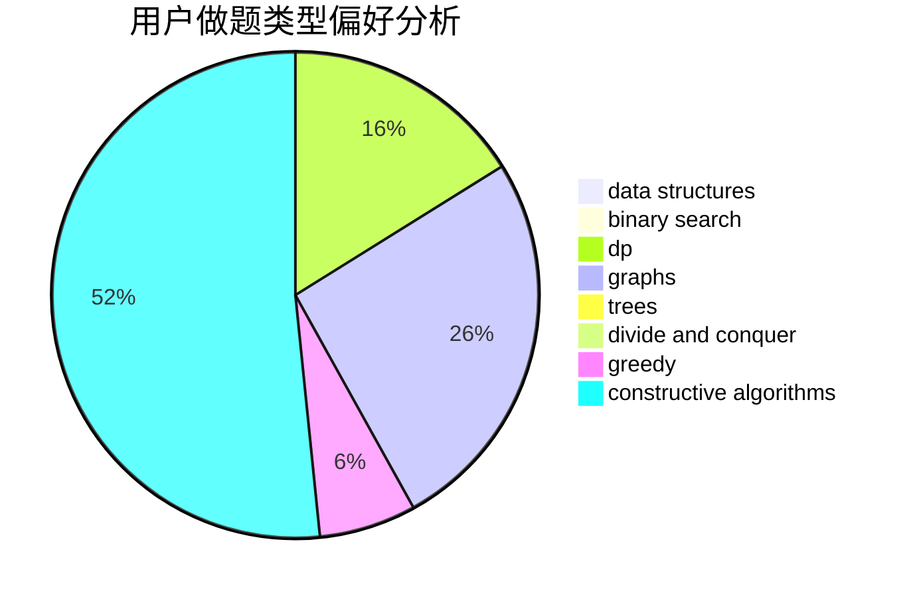

# EricQian

<!-- tabs:start -->

#### **用户提交结果分析**

#### **用户做题类型偏好分析**

#### **用户错题知识点分析**

<!-- tabs:end -->
# 推荐题目
[848C](https://codeforces.com/contest/848/problem/C)		data structures,
                        divide and conquer		  
[1295F](https://codeforces.com/contest/1295/problem/F)		combinatorics,
                        dp,
                        probabilities		  
[220E](https://codeforces.com/contest/220/problem/E)		data structures,
                        two pointers		  
[582C](https://codeforces.com/contest/582/problem/C)		number theory		  
[1424B](https://codeforces.com/contest/1424/problem/B)		dsu,graphs,sortings,trees		  
[32B](https://codeforces.com/contest/32/problem/B)		expression parsing,
                        implementation		  
[1407E](https://codeforces.com/contest/1407/problem/E)		constructive algorithms,
                        dfs and similar,
                        dp,
                        graphs,
                        greedy,
                        shortest paths		  
[516A](https://codeforces.com/contest/516/problem/A)		dsu,graphs,sortings,trees		  
[387D](https://codeforces.com/contest/387/problem/D)		graph matchings		  
[534F](https://codeforces.com/contest/534/problem/F)		bitmasks,
                        dp,
                        hashing,
                        meet-in-the-middle		  
