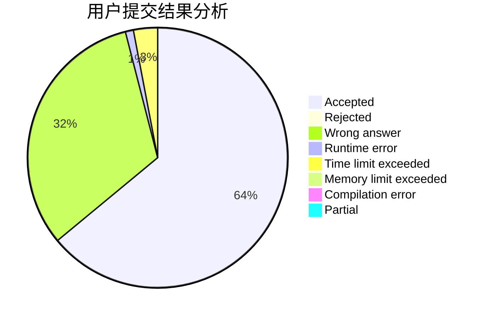
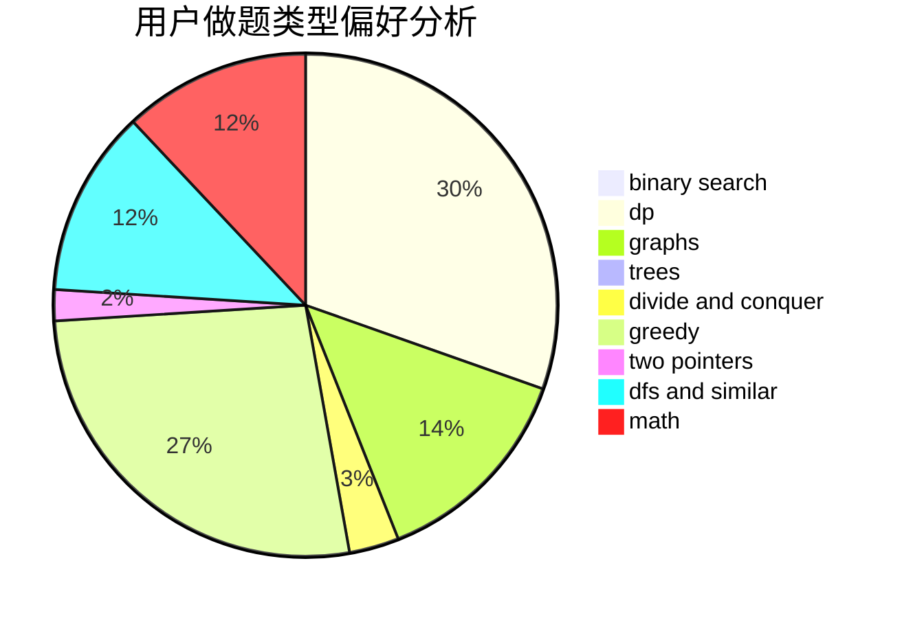

# EricQian

<!-- tabs:start -->

#### **用户提交结果分析**

#### **用户做题类型偏好分析**

<!-- tabs:end -->
# 推荐题目
[848C](https://codeforces.com/contest/848/problem/C)
[1295F](https://codeforces.com/contest/1295/problem/F)
[220E](https://codeforces.com/contest/220/problem/E)
[582C](https://codeforces.com/contest/582/problem/C)
[1424B](https://codeforces.com/contest/1424/problem/B)
[32B](https://codeforces.com/contest/32/problem/B)
[1407E](https://codeforces.com/contest/1407/problem/E)
[516A](https://codeforces.com/contest/516/problem/A)
[387D](https://codeforces.com/contest/387/problem/D)
[534F](https://codeforces.com/contest/534/problem/F)
