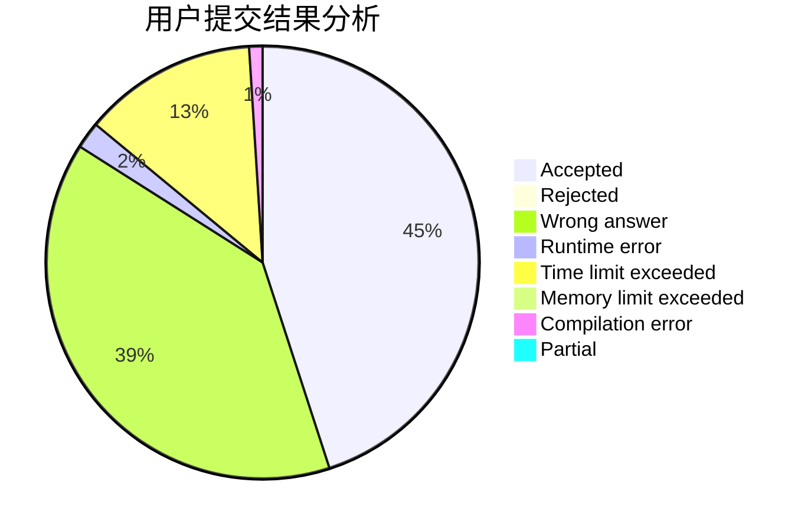
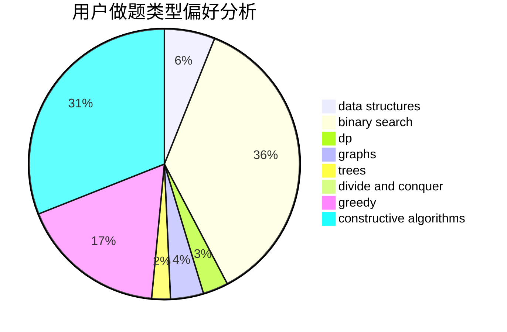
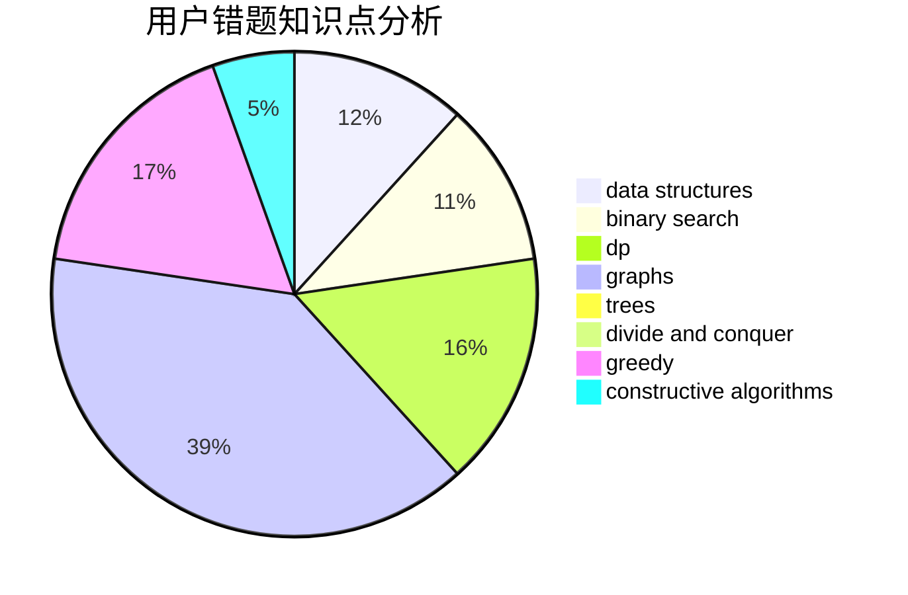

# EricXia

<!-- tabs:start -->

#### **用户提交结果分析**

#### **用户做题类型偏好分析**

#### **用户错题知识点分析**

<!-- tabs:end -->
# 推荐题目
[1207F](https://codeforces.com/contest/1207/problem/F)		brute force,
                        data structures,
                        implementation		  
[364C](https://codeforces.com/contest/364/problem/C)		brute force,
                        number theory		  
[825G](https://codeforces.com/contest/825/problem/G)		dfs and similar,
                        graphs,
                        trees		  
[1452G](https://codeforces.com/contest/1452/problem/G)		data structures,
                        dfs and similar,
                        greedy,
                        trees		  
[827A](https://codeforces.com/contest/827/problem/A)		data structures,
                        greedy,
                        sortings,
                        strings		  
[1185F](https://codeforces.com/contest/1185/problem/F)		bitmasks,
                        brute force		  
[439E](https://codeforces.com/contest/439/problem/E)		combinatorics,
                        dp,
                        math		  
[1340D](https://codeforces.com/contest/1340/problem/D)		constructive algorithms,
                        dfs and similar,
                        graphs,
                        trees		  
[1019D](https://codeforces.com/contest/1019/problem/D)		binary search,
                        geometry,
                        sortings		  
[1191C](https://codeforces.com/contest/1191/problem/C)		dsu,graphs,sortings,trees		  
