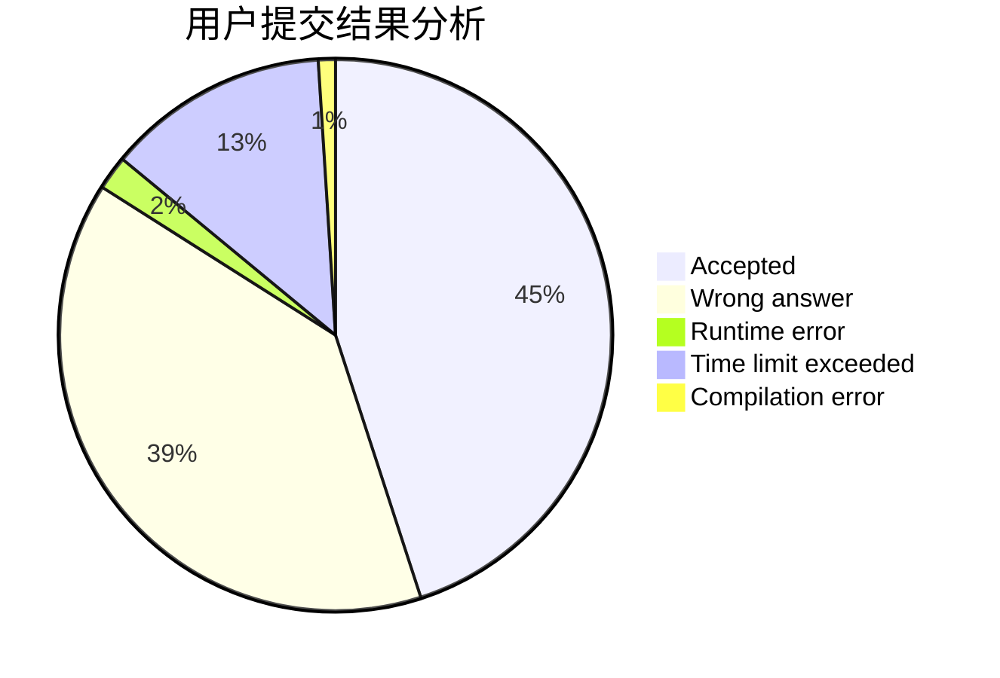
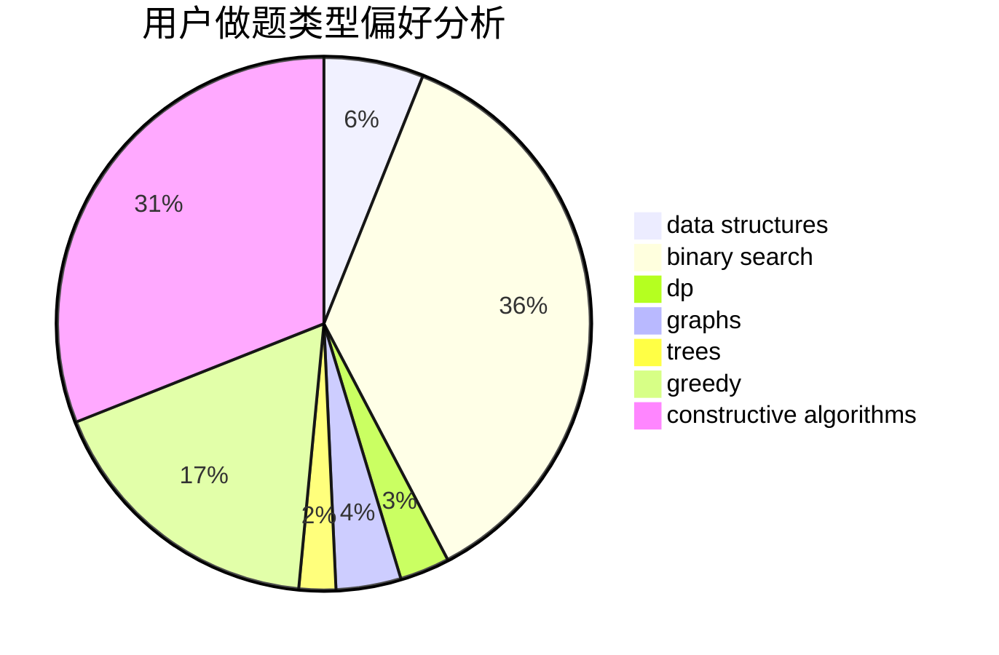
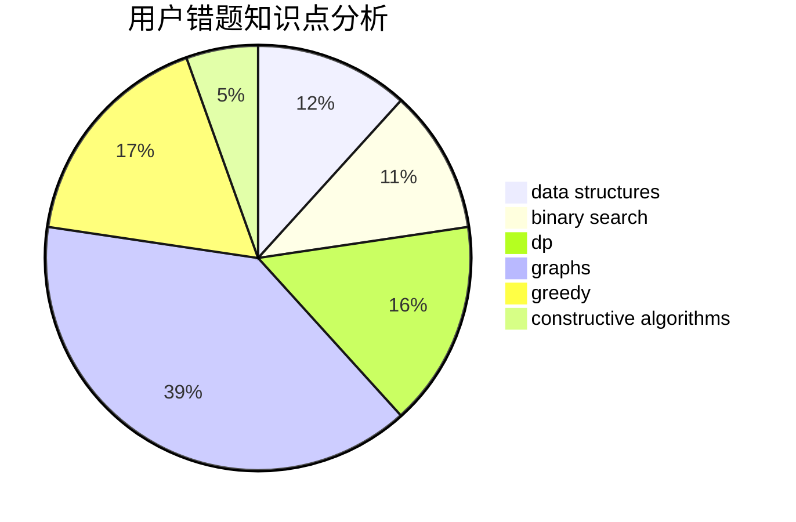

# EricXia
<!-- tabs:start -->
#### **用户提交结果分析**

#### **用户做题类型偏好分析**

#### **用户错题知识点分析**

<!-- tabs:end -->
# 推荐题目
[Prime Number](http://codeforces.com/problemset/problem/359/C)		math,
                        number theory		  
[Beautiful Set](http://codeforces.com/problemset/problem/364/C)		brute force,
                        number theory		  
[Large Triangle](http://codeforces.com/problemset/problem/1019/D)		binary search,
                        geometry,
                        sortings		  
[Tree Queries](http://codeforces.com/problemset/problem/825/G)		dfs and similar,
                        graphs,
                        trees		  
[Nastya and Time Machine](http://codeforces.com/problemset/problem/1340/D)		constructive algorithms,
                        dfs and similar,
                        graphs,
                        trees		  
[Shortest Path](http://codeforces.com/problemset/problem/59/E)		graphs,
                        shortest paths		  
[New Year and Handle Change](http://codeforces.com/problemset/problem/1279/F)		binary search,
                        dp		  
[Valid Sets](http://codeforces.com/problemset/problem/486/D)		dfs and similar,
                        dp,
                        math,
                        trees		  
[Tokitsukaze and Discard Items](https://codeforces.com/contest/1191/problem/C)		implementation,
                        two pointers		  
[String Reconstruction](http://codeforces.com/problemset/problem/827/A)		data structures,
                        greedy,
                        sortings,
                        strings		  
<!-- tabs:start -->
#### **data structures**
[String Reconstruction](http://codeforces.com/problemset/problem/827/A)		data structures,
                        greedy,
                        sortings,
                        strings		  
[Two Strings](http://codeforces.com/problemset/problem/223/B)		data structures,
                        dp,
                        strings		  
[Game On Tree](http://codeforces.com/problemset/problem/1452/G)		data structures,
                        dfs and similar,
                        greedy,
                        trees		  
[Freezing with Style](http://codeforces.com/problemset/problem/150/E)		binary search,
                        data structures,
                        divide and conquer,
                        trees		  
[Remainder Problem](http://codeforces.com/problemset/problem/1207/F)		brute force,
                        data structures,
                        implementation		  
[Three Blocks Palindrome (easy version)](http://codeforces.com/problemset/problem/1335/E1)		binary search,
                        brute force,
                        data structures,
                        dp,
                        two pointers		  
[Maximum width](http://codeforces.com/problemset/problem/1492/C)		binary search,
                        data structures,
                        dp,
                        greedy,
                        two pointers		  
[Old Floppy Drive](http://codeforces.com/problemset/problem/1490/G)		binary search,
                        data structures,
                        math		  
[Odd Mineral Resource](http://codeforces.com/problemset/problem/1479/D)		binary search,
                        bitmasks,
                        brute force,
                        data structures,
                        probabilities,
                        trees		  
[Meximization](http://codeforces.com/problemset/problem/1497/A)		brute force,
                        data structures,
                        greedy,
                        sortings		  
#### **binary search**
[Large Triangle](http://codeforces.com/problemset/problem/1019/D)		binary search,
                        geometry,
                        sortings		  
[New Year and Handle Change](http://codeforces.com/problemset/problem/1279/F)		binary search,
                        dp		  
[Electric Charges](http://codeforces.com/problemset/problem/623/C)		binary search,
                        dp		  
[Skills](https://codeforces.com/contest/614/problem/D)		binary search,
                        brute force,
                        dp,
                        greedy,
                        sortings,
                        two pointers		  
[Firecrackers](http://codeforces.com/problemset/problem/1468/D)		binary search,
                        sortings		  
[Freezing with Style](http://codeforces.com/problemset/problem/150/E)		binary search,
                        data structures,
                        divide and conquer,
                        trees		  
[Three Blocks Palindrome (easy version)](http://codeforces.com/problemset/problem/1335/E1)		binary search,
                        brute force,
                        data structures,
                        dp,
                        two pointers		  
[Maximum width](http://codeforces.com/problemset/problem/1492/C)		binary search,
                        data structures,
                        dp,
                        greedy,
                        two pointers		  
[Pairs](http://codeforces.com/problemset/problem/1463/D)		binary search,
                        constructive algorithms,
                        greedy,
                        two pointers		  
[Old Floppy Drive](http://codeforces.com/problemset/problem/1490/G)		binary search,
                        data structures,
                        math		  
#### **dp**
[New Year and Handle Change](http://codeforces.com/problemset/problem/1279/F)		binary search,
                        dp		  
[Valid Sets](http://codeforces.com/problemset/problem/486/D)		dfs and similar,
                        dp,
                        math,
                        trees		  
[Electric Charges](http://codeforces.com/problemset/problem/623/C)		binary search,
                        dp		  
[Perpetual Motion Machine](http://codeforces.com/problemset/problem/830/E)		constructive algorithms,
                        dp,
                        graphs,
                        implementation,
                        math,
                        trees		  
[Two Strings](http://codeforces.com/problemset/problem/223/B)		data structures,
                        dp,
                        strings		  
[Skills](https://codeforces.com/contest/614/problem/D)		binary search,
                        brute force,
                        dp,
                        greedy,
                        sortings,
                        two pointers		  
[Devu and Birthday Celebration](http://codeforces.com/problemset/problem/439/E)		combinatorics,
                        dp,
                        math		  
[Singer House](http://codeforces.com/problemset/problem/830/D)		combinatorics,
                        dp,
                        graphs,
                        trees		  
[Bag of mice](http://codeforces.com/problemset/problem/148/D)		dp,
                        games,
                        math,
                        probabilities		  
[Three Blocks Palindrome (easy version)](http://codeforces.com/problemset/problem/1335/E1)		binary search,
                        brute force,
                        data structures,
                        dp,
                        two pointers		  
#### **graph**
[Tree Queries](http://codeforces.com/problemset/problem/825/G)		dfs and similar,
                        graphs,
                        trees		  
[Nastya and Time Machine](http://codeforces.com/problemset/problem/1340/D)		constructive algorithms,
                        dfs and similar,
                        graphs,
                        trees		  
[Shortest Path](http://codeforces.com/problemset/problem/59/E)		graphs,
                        shortest paths		  
[Divisor Paths](http://codeforces.com/problemset/problem/1334/E)		combinatorics,
                        graphs,
                        greedy,
                        math,
                        number theory		  
[Perpetual Motion Machine](http://codeforces.com/problemset/problem/830/E)		constructive algorithms,
                        dp,
                        graphs,
                        implementation,
                        math,
                        trees		  
[Singer House](http://codeforces.com/problemset/problem/830/D)		combinatorics,
                        dp,
                        graphs,
                        trees		  
[Minimum Ties](http://codeforces.com/problemset/problem/1487/C)		brute force,
                        constructive algorithms,
                        dfs and similar,
                        graphs,
                        greedy,
                        implementation,
                        math		  
[Chef Monocarp](http://codeforces.com/problemset/problem/1437/C)		dp,
                        flows,
                        graph matchings,
                        greedy,
                        math,
                        sortings		  
[Strange Housing](http://codeforces.com/problemset/problem/1470/D)		constructive algorithms,
                        dfs and similar,
                        graph matchings,
                        graphs,
                        greedy		  
[Longest Simple Cycle](http://codeforces.com/problemset/problem/1476/C)		dp,
                        graphs,
                        greedy		  
#### **trees**
[Tree Queries](http://codeforces.com/problemset/problem/825/G)		dfs and similar,
                        graphs,
                        trees		  
[Nastya and Time Machine](http://codeforces.com/problemset/problem/1340/D)		constructive algorithms,
                        dfs and similar,
                        graphs,
                        trees		  
[Valid Sets](http://codeforces.com/problemset/problem/486/D)		dfs and similar,
                        dp,
                        math,
                        trees		  
[Perpetual Motion Machine](http://codeforces.com/problemset/problem/830/E)		constructive algorithms,
                        dp,
                        graphs,
                        implementation,
                        math,
                        trees		  
[Game On Tree](http://codeforces.com/problemset/problem/1452/G)		data structures,
                        dfs and similar,
                        greedy,
                        trees		  
[Singer House](http://codeforces.com/problemset/problem/830/D)		combinatorics,
                        dp,
                        graphs,
                        trees		  
[Freezing with Style](http://codeforces.com/problemset/problem/150/E)		binary search,
                        data structures,
                        divide and conquer,
                        trees		  
[Odd Mineral Resource](http://codeforces.com/problemset/problem/1479/D)		binary search,
                        bitmasks,
                        brute force,
                        data structures,
                        probabilities,
                        trees		  
[Yet Another Card Deck](http://codeforces.com/problemset/problem/1511/C)		brute force,
                        data structures,
                        implementation,
                        trees		  
[Diameter Cuts](http://codeforces.com/problemset/problem/1499/F)		combinatorics,
                        dfs and similar,
                        dp,
                        trees		  
#### **divide and conquer**
[Freezing with Style](http://codeforces.com/problemset/problem/150/E)		binary search,
                        data structures,
                        divide and conquer,
                        trees		  
[Divide and Summarize](http://codeforces.com/problemset/problem/1461/D)		binary search,
                        brute force,
                        data structures,
                        divide and conquer,
                        implementation,
                        sortings		  
[Song of the Sirens](http://codeforces.com/problemset/problem/1466/G)		combinatorics,
                        divide and conquer,
                        hashing,
                        math,
                        string suffix structures,
                        strings		  
[Permutation Transformation](http://codeforces.com/problemset/problem/1490/D)		dfs and similar,
                        divide and conquer,
                        implementation		  
[Skyline Photo](https://codeforces.com/contest/1483/problem/C)		data structures,
                        divide and conquer,
                        dp		  
[Fib-tree](http://codeforces.com/problemset/problem/1491/E)		brute force,
                        dfs and similar,
                        divide and conquer,
                        number theory,
                        trees		  
[Sum of Prefix Sums](http://codeforces.com/problemset/problem/1303/G)		data structures,
                        divide and conquer,
                        geometry,
                        trees		  
[Dogeforces](http://codeforces.com/problemset/problem/1494/D)		constructive algorithms,
                        data structures,
                        dfs and similar,
                        divide and conquer,
                        dsu,
                        greedy,
                        sortings,
                        trees		  
[Logistical Questions](http://codeforces.com/problemset/problem/566/C)		dfs and similar,
                        divide and conquer,
                        trees		  
[Fruit Sequences](http://codeforces.com/problemset/problem/1428/F)		binary search,
                        data structures,
                        divide and conquer,
                        dp,
                        two pointers		  
#### **greedy**
[String Reconstruction](http://codeforces.com/problemset/problem/827/A)		data structures,
                        greedy,
                        sortings,
                        strings		  
[Divisor Paths](http://codeforces.com/problemset/problem/1334/E)		combinatorics,
                        graphs,
                        greedy,
                        math,
                        number theory		  
[Game On Tree](http://codeforces.com/problemset/problem/1452/G)		data structures,
                        dfs and similar,
                        greedy,
                        trees		  
[Skills](https://codeforces.com/contest/614/problem/D)		binary search,
                        brute force,
                        dp,
                        greedy,
                        sortings,
                        two pointers		  
[Maximum width](http://codeforces.com/problemset/problem/1492/C)		binary search,
                        data structures,
                        dp,
                        greedy,
                        two pointers		  
[Diamond Miner](https://codeforces.com/contest/1496/problem/C)		geometry,
                        greedy,
                        math,
                        sortings		  
[Anti-knapsack](http://codeforces.com/problemset/problem/1493/A)		constructive algorithms,
                        greedy		  
[Pairs](http://codeforces.com/problemset/problem/1463/D)		binary search,
                        constructive algorithms,
                        greedy,
                        two pointers		  
[Unique Number](http://codeforces.com/problemset/problem/1462/C)		brute force,
                        greedy,
                        math		  
[Berland Crossword](http://codeforces.com/problemset/problem/1494/B)		bitmasks,
                        brute force,
                        greedy,
                        implementation		  
#### **constructive algorithms**
[Nastya and Time Machine](http://codeforces.com/problemset/problem/1340/D)		constructive algorithms,
                        dfs and similar,
                        graphs,
                        trees		  
[Perpetual Motion Machine](http://codeforces.com/problemset/problem/830/E)		constructive algorithms,
                        dp,
                        graphs,
                        implementation,
                        math,
                        trees		  
[Anti-knapsack](http://codeforces.com/problemset/problem/1493/A)		constructive algorithms,
                        greedy		  
[Pairs](http://codeforces.com/problemset/problem/1463/D)		binary search,
                        constructive algorithms,
                        greedy,
                        two pointers		  
[XOR-gun](https://codeforces.com/contest/1456/problem/B)		bitmasks,
                        brute force,
                        constructive algorithms		  
[Genius's Gambit](http://codeforces.com/problemset/problem/1492/D)		bitmasks,
                        constructive algorithms,
                        greedy,
                        math		  
[3-Coloring](https://codeforces.com/contest/1504/problem/D)		constructive algorithms,
                        games,
                        interactive		  
[Basic Diplomacy](https://codeforces.com/contest/1483/problem/A)		brute force,
                        constructive algorithms,
                        greedy,
                        implementation		  
[Array and Peaks](http://codeforces.com/problemset/problem/1513/A)		constructive algorithms,
                        implementation		  
[No More Inversions](http://codeforces.com/problemset/problem/1473/C)		constructive algorithms,
                        math		  
#### **sortings**
[Large Triangle](http://codeforces.com/problemset/problem/1019/D)		binary search,
                        geometry,
                        sortings		  
[String Reconstruction](http://codeforces.com/problemset/problem/827/A)		data structures,
                        greedy,
                        sortings,
                        strings		  
[Skills](https://codeforces.com/contest/614/problem/D)		binary search,
                        brute force,
                        dp,
                        greedy,
                        sortings,
                        two pointers		  
[Wavy numbers](http://codeforces.com/problemset/problem/478/E)		brute force,
                        dfs and similar,
                        meet-in-the-middle,
                        sortings		  
[Firecrackers](http://codeforces.com/problemset/problem/1468/D)		binary search,
                        sortings		  
[Diamond Miner](https://codeforces.com/contest/1496/problem/C)		geometry,
                        greedy,
                        math,
                        sortings		  
[Meximization](http://codeforces.com/problemset/problem/1497/A)		brute force,
                        data structures,
                        greedy,
                        sortings		  
[Avoiding Zero](http://codeforces.com/problemset/problem/1427/A)		math,
                        sortings		  
[Divide and Summarize](http://codeforces.com/problemset/problem/1461/D)		binary search,
                        brute force,
                        data structures,
                        divide and conquer,
                        implementation,
                        sortings		  
[Chef Monocarp](http://codeforces.com/problemset/problem/1437/C)		dp,
                        flows,
                        graph matchings,
                        greedy,
                        math,
                        sortings		  
<!-- tabs:end -->
