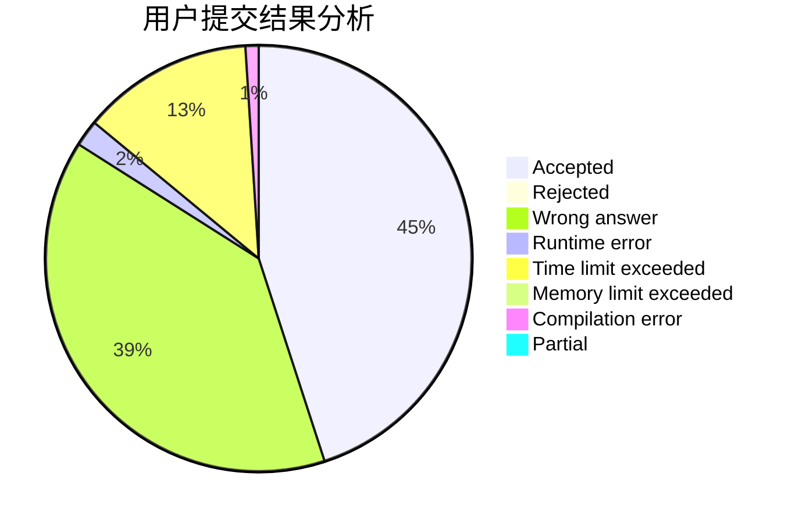
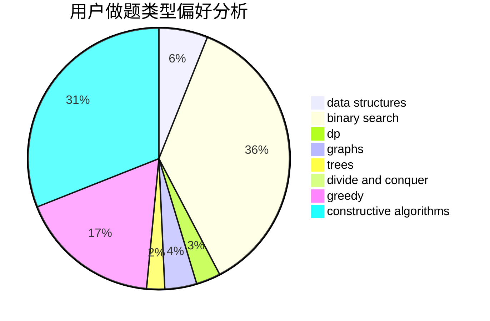
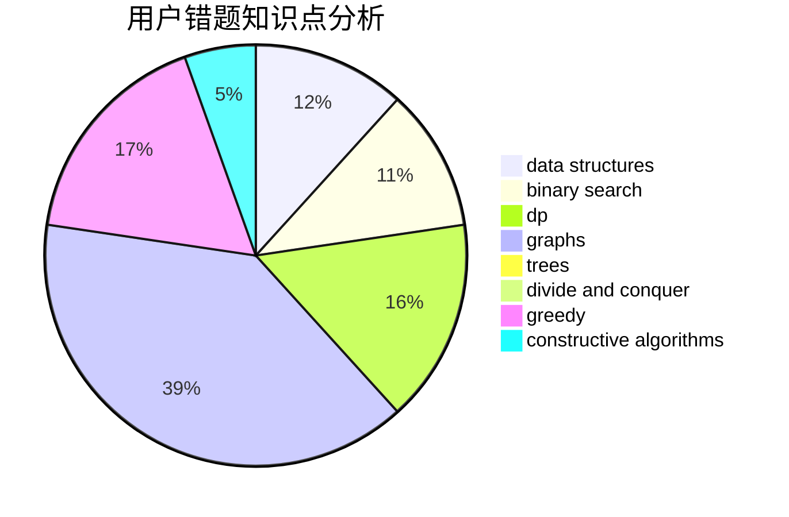

# EricXia
<!-- tabs:start -->
#### **用户提交结果分析**

#### **用户做题类型偏好分析**

#### **用户错题知识点分析**

<!-- tabs:end -->
# 推荐题目
[Prime Number](http://codeforces.com/problemset/problem/359/C)		math,
                        number theory		  
[Beautiful Set](http://codeforces.com/problemset/problem/364/C)		brute force,
                        number theory		  
[Large Triangle](http://codeforces.com/problemset/problem/1019/D)		binary search,
                        geometry,
                        sortings		  
[Tree Queries](http://codeforces.com/problemset/problem/825/G)		dfs and similar,
                        graphs,
                        trees		  
[Nastya and Time Machine](http://codeforces.com/problemset/problem/1340/D)		constructive algorithms,
                        dfs and similar,
                        graphs,
                        trees		  
[Shortest Path](http://codeforces.com/problemset/problem/59/E)		graphs,
                        shortest paths		  
[New Year and Handle Change](http://codeforces.com/problemset/problem/1279/F)		binary search,
                        dp		  
[Valid Sets](http://codeforces.com/problemset/problem/486/D)		dfs and similar,
                        dp,
                        math,
                        trees		  
[Tokitsukaze and Discard Items](https://codeforces.com/contest/1191/problem/C)		implementation,
                        two pointers		  
[String Reconstruction](http://codeforces.com/problemset/problem/827/A)		data structures,
                        greedy,
                        sortings,
                        strings		  
<!-- tabs:start -->
#### **data structures**
[Prime Number](http://codeforces.com/problemset/problem/827/A)		data structures,
                        greedy,
                        sortings,
                        strings		  
[Beautiful Set](http://codeforces.com/problemset/problem/223/B)		data structures,
                        dp,
                        strings		  
[Large Triangle](http://codeforces.com/problemset/problem/1452/G)		data structures,
                        dfs and similar,
                        greedy,
                        trees		  
[Tree Queries](http://codeforces.com/problemset/problem/150/E)		binary search,
                        data structures,
                        divide and conquer,
                        trees		  
[Nastya and Time Machine](http://codeforces.com/problemset/problem/1207/F)		brute force,
                        data structures,
                        implementation		  
[Shortest Path](http://codeforces.com/problemset/problem/1335/E1)		binary search,
                        brute force,
                        data structures,
                        dp,
                        two pointers		  
[New Year and Handle Change](http://codeforces.com/problemset/problem/1492/C)		binary search,
                        data structures,
                        dp,
                        greedy,
                        two pointers		  
[Valid Sets](http://codeforces.com/problemset/problem/1490/G)		binary search,
                        data structures,
                        math		  
[Tokitsukaze and Discard Items](http://codeforces.com/problemset/problem/1479/D)		binary search,
                        bitmasks,
                        brute force,
                        data structures,
                        probabilities,
                        trees		  
[String Reconstruction](http://codeforces.com/problemset/problem/1497/A)		brute force,
                        data structures,
                        greedy,
                        sortings		  
#### **binary search**
[Prime Number](http://codeforces.com/problemset/problem/1019/D)		binary search,
                        geometry,
                        sortings		  
[Beautiful Set](http://codeforces.com/problemset/problem/1279/F)		binary search,
                        dp		  
[Large Triangle](http://codeforces.com/problemset/problem/623/C)		binary search,
                        dp		  
[Tree Queries](https://codeforces.com/contest/614/problem/D)		binary search,
                        brute force,
                        dp,
                        greedy,
                        sortings,
                        two pointers		  
[Nastya and Time Machine](http://codeforces.com/problemset/problem/1468/D)		binary search,
                        sortings		  
[Shortest Path](http://codeforces.com/problemset/problem/150/E)		binary search,
                        data structures,
                        divide and conquer,
                        trees		  
[New Year and Handle Change](http://codeforces.com/problemset/problem/1335/E1)		binary search,
                        brute force,
                        data structures,
                        dp,
                        two pointers		  
[Valid Sets](http://codeforces.com/problemset/problem/1492/C)		binary search,
                        data structures,
                        dp,
                        greedy,
                        two pointers		  
[Tokitsukaze and Discard Items](http://codeforces.com/problemset/problem/1463/D)		binary search,
                        constructive algorithms,
                        greedy,
                        two pointers		  
[String Reconstruction](http://codeforces.com/problemset/problem/1490/G)		binary search,
                        data structures,
                        math		  
#### **dp**
[Prime Number](http://codeforces.com/problemset/problem/1279/F)		binary search,
                        dp		  
[Beautiful Set](http://codeforces.com/problemset/problem/486/D)		dfs and similar,
                        dp,
                        math,
                        trees		  
[Large Triangle](http://codeforces.com/problemset/problem/623/C)		binary search,
                        dp		  
[Tree Queries](http://codeforces.com/problemset/problem/830/E)		constructive algorithms,
                        dp,
                        graphs,
                        implementation,
                        math,
                        trees		  
[Nastya and Time Machine](http://codeforces.com/problemset/problem/223/B)		data structures,
                        dp,
                        strings		  
[Shortest Path](https://codeforces.com/contest/614/problem/D)		binary search,
                        brute force,
                        dp,
                        greedy,
                        sortings,
                        two pointers		  
[New Year and Handle Change](http://codeforces.com/problemset/problem/439/E)		combinatorics,
                        dp,
                        math		  
[Valid Sets](http://codeforces.com/problemset/problem/830/D)		combinatorics,
                        dp,
                        graphs,
                        trees		  
[Tokitsukaze and Discard Items](http://codeforces.com/problemset/problem/148/D)		dp,
                        games,
                        math,
                        probabilities		  
[String Reconstruction](http://codeforces.com/problemset/problem/1335/E1)		binary search,
                        brute force,
                        data structures,
                        dp,
                        two pointers		  
#### **graph**
[Prime Number](http://codeforces.com/problemset/problem/825/G)		dfs and similar,
                        graphs,
                        trees		  
[Beautiful Set](http://codeforces.com/problemset/problem/1340/D)		constructive algorithms,
                        dfs and similar,
                        graphs,
                        trees		  
[Large Triangle](http://codeforces.com/problemset/problem/59/E)		graphs,
                        shortest paths		  
[Tree Queries](http://codeforces.com/problemset/problem/1334/E)		combinatorics,
                        graphs,
                        greedy,
                        math,
                        number theory		  
[Nastya and Time Machine](http://codeforces.com/problemset/problem/830/E)		constructive algorithms,
                        dp,
                        graphs,
                        implementation,
                        math,
                        trees		  
[Shortest Path](http://codeforces.com/problemset/problem/830/D)		combinatorics,
                        dp,
                        graphs,
                        trees		  
[New Year and Handle Change](http://codeforces.com/problemset/problem/1487/C)		brute force,
                        constructive algorithms,
                        dfs and similar,
                        graphs,
                        greedy,
                        implementation,
                        math		  
[Valid Sets](http://codeforces.com/problemset/problem/1437/C)		dp,
                        flows,
                        graph matchings,
                        greedy,
                        math,
                        sortings		  
[Tokitsukaze and Discard Items](http://codeforces.com/problemset/problem/1470/D)		constructive algorithms,
                        dfs and similar,
                        graph matchings,
                        graphs,
                        greedy		  
[String Reconstruction](http://codeforces.com/problemset/problem/1476/C)		dp,
                        graphs,
                        greedy		  
#### **trees**
[Prime Number](http://codeforces.com/problemset/problem/825/G)		dfs and similar,
                        graphs,
                        trees		  
[Beautiful Set](http://codeforces.com/problemset/problem/1340/D)		constructive algorithms,
                        dfs and similar,
                        graphs,
                        trees		  
[Large Triangle](http://codeforces.com/problemset/problem/486/D)		dfs and similar,
                        dp,
                        math,
                        trees		  
[Tree Queries](http://codeforces.com/problemset/problem/830/E)		constructive algorithms,
                        dp,
                        graphs,
                        implementation,
                        math,
                        trees		  
[Nastya and Time Machine](http://codeforces.com/problemset/problem/1452/G)		data structures,
                        dfs and similar,
                        greedy,
                        trees		  
[Shortest Path](http://codeforces.com/problemset/problem/830/D)		combinatorics,
                        dp,
                        graphs,
                        trees		  
[New Year and Handle Change](http://codeforces.com/problemset/problem/150/E)		binary search,
                        data structures,
                        divide and conquer,
                        trees		  
[Valid Sets](http://codeforces.com/problemset/problem/1479/D)		binary search,
                        bitmasks,
                        brute force,
                        data structures,
                        probabilities,
                        trees		  
[Tokitsukaze and Discard Items](http://codeforces.com/problemset/problem/1511/C)		brute force,
                        data structures,
                        implementation,
                        trees		  
[String Reconstruction](http://codeforces.com/problemset/problem/1499/F)		combinatorics,
                        dfs and similar,
                        dp,
                        trees		  
#### **divide and conquer**
[Prime Number](http://codeforces.com/problemset/problem/150/E)		binary search,
                        data structures,
                        divide and conquer,
                        trees		  
[Beautiful Set](http://codeforces.com/problemset/problem/1461/D)		binary search,
                        brute force,
                        data structures,
                        divide and conquer,
                        implementation,
                        sortings		  
[Large Triangle](http://codeforces.com/problemset/problem/1466/G)		combinatorics,
                        divide and conquer,
                        hashing,
                        math,
                        string suffix structures,
                        strings		  
[Tree Queries](http://codeforces.com/problemset/problem/1490/D)		dfs and similar,
                        divide and conquer,
                        implementation		  
[Nastya and Time Machine](https://codeforces.com/contest/1483/problem/C)		data structures,
                        divide and conquer,
                        dp		  
[Shortest Path](http://codeforces.com/problemset/problem/1491/E)		brute force,
                        dfs and similar,
                        divide and conquer,
                        number theory,
                        trees		  
[New Year and Handle Change](http://codeforces.com/problemset/problem/1303/G)		data structures,
                        divide and conquer,
                        geometry,
                        trees		  
[Valid Sets](http://codeforces.com/problemset/problem/1494/D)		constructive algorithms,
                        data structures,
                        dfs and similar,
                        divide and conquer,
                        dsu,
                        greedy,
                        sortings,
                        trees		  
[Tokitsukaze and Discard Items](http://codeforces.com/problemset/problem/1482/E)		data structures,
                        divide and conquer,
                        dp		  
[String Reconstruction](http://codeforces.com/problemset/problem/566/C)		dfs and similar,
                        divide and conquer,
                        trees		  
#### **greedy**
[Prime Number](http://codeforces.com/problemset/problem/827/A)		data structures,
                        greedy,
                        sortings,
                        strings		  
[Beautiful Set](http://codeforces.com/problemset/problem/1334/E)		combinatorics,
                        graphs,
                        greedy,
                        math,
                        number theory		  
[Large Triangle](http://codeforces.com/problemset/problem/1452/G)		data structures,
                        dfs and similar,
                        greedy,
                        trees		  
[Tree Queries](https://codeforces.com/contest/614/problem/D)		binary search,
                        brute force,
                        dp,
                        greedy,
                        sortings,
                        two pointers		  
[Nastya and Time Machine](http://codeforces.com/problemset/problem/1492/C)		binary search,
                        data structures,
                        dp,
                        greedy,
                        two pointers		  
[Shortest Path](https://codeforces.com/contest/1496/problem/C)		geometry,
                        greedy,
                        math,
                        sortings		  
[New Year and Handle Change](http://codeforces.com/problemset/problem/1493/A)		constructive algorithms,
                        greedy		  
[Valid Sets](http://codeforces.com/problemset/problem/1463/D)		binary search,
                        constructive algorithms,
                        greedy,
                        two pointers		  
[Tokitsukaze and Discard Items](http://codeforces.com/problemset/problem/1462/C)		brute force,
                        greedy,
                        math		  
[String Reconstruction](http://codeforces.com/problemset/problem/1494/B)		bitmasks,
                        brute force,
                        greedy,
                        implementation		  
#### **constructive algorithms**
[Prime Number](http://codeforces.com/problemset/problem/1340/D)		constructive algorithms,
                        dfs and similar,
                        graphs,
                        trees		  
[Beautiful Set](http://codeforces.com/problemset/problem/830/E)		constructive algorithms,
                        dp,
                        graphs,
                        implementation,
                        math,
                        trees		  
[Large Triangle](http://codeforces.com/problemset/problem/1493/A)		constructive algorithms,
                        greedy		  
[Tree Queries](http://codeforces.com/problemset/problem/1463/D)		binary search,
                        constructive algorithms,
                        greedy,
                        two pointers		  
[Nastya and Time Machine](https://codeforces.com/contest/1456/problem/B)		bitmasks,
                        brute force,
                        constructive algorithms		  
[Shortest Path](http://codeforces.com/problemset/problem/1492/D)		bitmasks,
                        constructive algorithms,
                        greedy,
                        math		  
[New Year and Handle Change](https://codeforces.com/contest/1504/problem/D)		constructive algorithms,
                        games,
                        interactive		  
[Valid Sets](https://codeforces.com/contest/1483/problem/A)		brute force,
                        constructive algorithms,
                        greedy,
                        implementation		  
[Tokitsukaze and Discard Items](https://codeforces.com/contest/1457/problem/D)		bitmasks,
                        brute force,
                        constructive algorithms		  
[String Reconstruction](http://codeforces.com/problemset/problem/1513/A)		constructive algorithms,
                        implementation		  
#### **sortings**
[Prime Number](http://codeforces.com/problemset/problem/1019/D)		binary search,
                        geometry,
                        sortings		  
[Beautiful Set](http://codeforces.com/problemset/problem/827/A)		data structures,
                        greedy,
                        sortings,
                        strings		  
[Large Triangle](https://codeforces.com/contest/614/problem/D)		binary search,
                        brute force,
                        dp,
                        greedy,
                        sortings,
                        two pointers		  
[Tree Queries](http://codeforces.com/problemset/problem/478/E)		brute force,
                        dfs and similar,
                        meet-in-the-middle,
                        sortings		  
[Nastya and Time Machine](http://codeforces.com/problemset/problem/1468/D)		binary search,
                        sortings		  
[Shortest Path](https://codeforces.com/contest/1496/problem/C)		geometry,
                        greedy,
                        math,
                        sortings		  
[New Year and Handle Change](http://codeforces.com/problemset/problem/1495/A)		geometry,
                        greedy,
                        math,
                        sortings		  
[Valid Sets](http://codeforces.com/problemset/problem/1497/A)		brute force,
                        data structures,
                        greedy,
                        sortings		  
[Tokitsukaze and Discard Items](http://codeforces.com/problemset/problem/1427/A)		math,
                        sortings		  
[String Reconstruction](http://codeforces.com/problemset/problem/1461/D)		binary search,
                        brute force,
                        data structures,
                        divide and conquer,
                        implementation,
                        sortings		  
<!-- tabs:end -->
