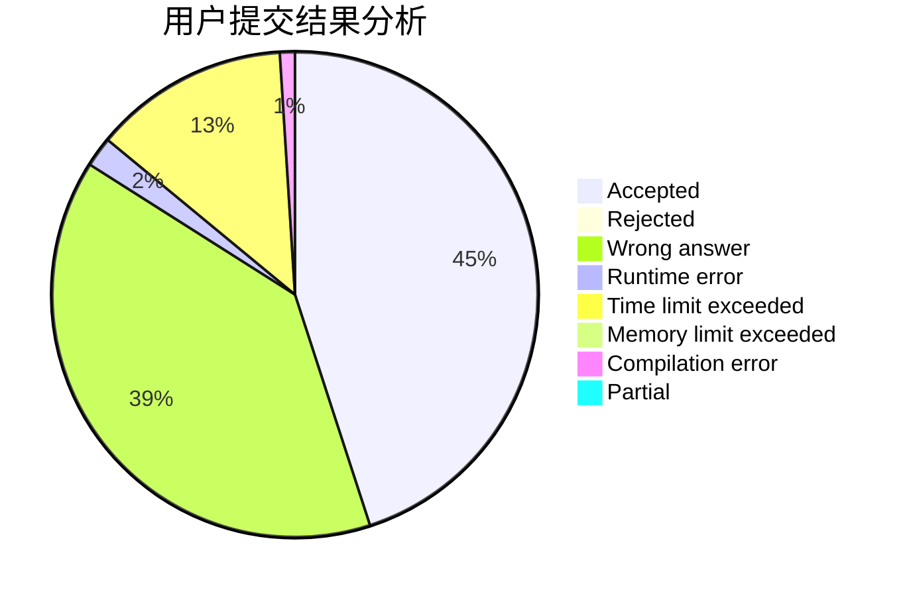
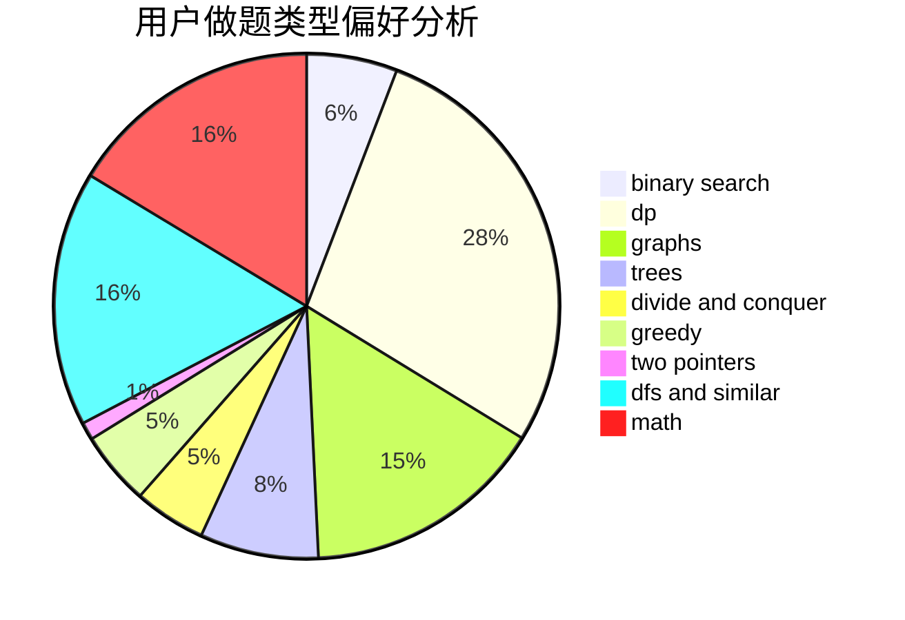

# EricXia

<!-- tabs:start -->

#### **用户提交结果分析**

#### **用户做题类型偏好分析**

<!-- tabs:end -->
# 推荐题目
[1213B](https://codeforces.com/contest/1213/problem/B)
[3912](https://codeforces.com/contest/391/problem/2)
[845C](https://codeforces.com/contest/845/problem/C)
[1462B](https://codeforces.com/contest/1462/problem/B)
[845D](https://codeforces.com/contest/845/problem/D)
[118A](https://codeforces.com/contest/118/problem/A)
[461A](https://codeforces.com/contest/461/problem/A)
[1347C](https://codeforces.com/contest/1347/problem/C)
[101D](https://codeforces.com/contest/101/problem/D)
[1197B](https://codeforces.com/contest/1197/problem/B)
