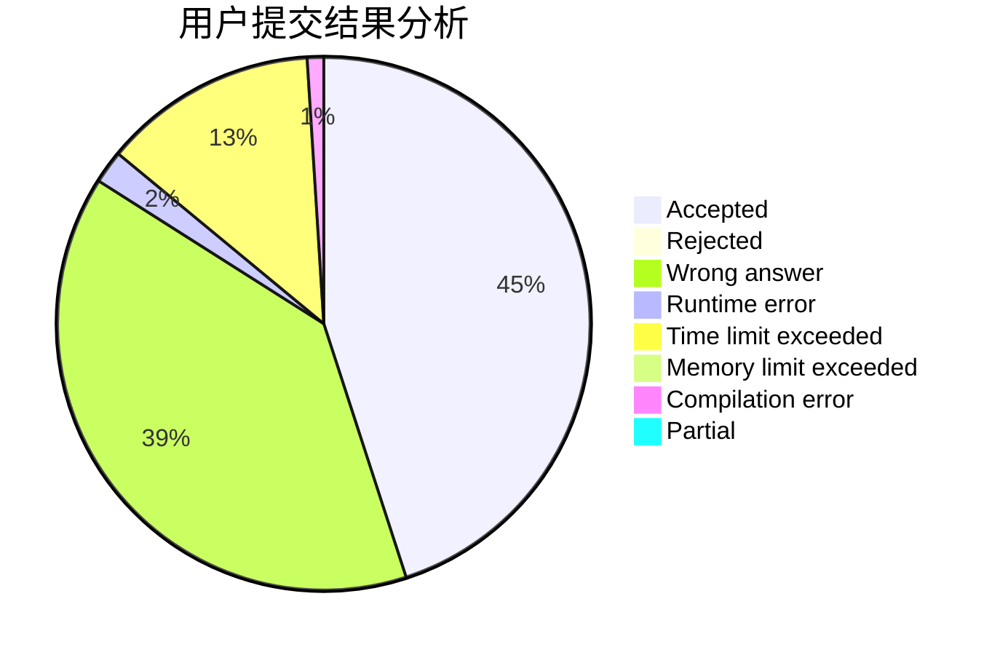
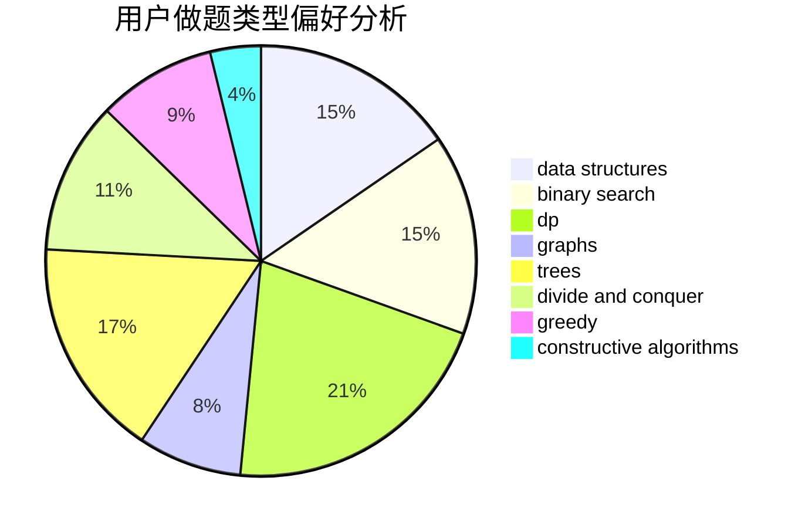
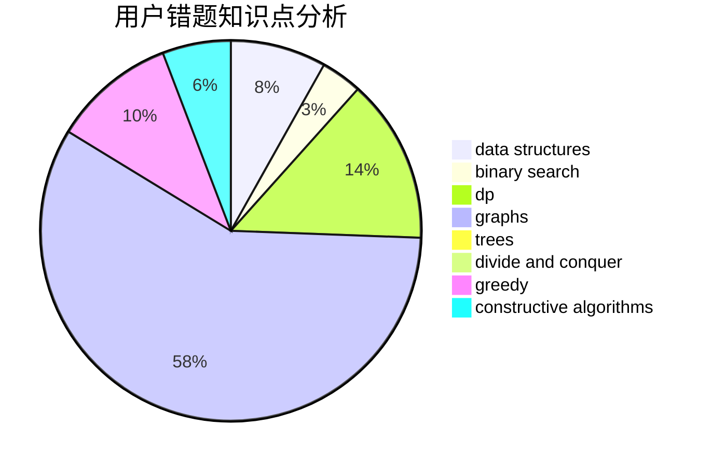

# EricXia

<!-- tabs:start -->

#### **用户提交结果分析**

#### **用户做题类型偏好分析**

#### **用户错题知识点分析**

<!-- tabs:end -->
# 推荐题目
[1213B](https://codeforces.com/contest/1213/problem/B)		data structures,
                        implementation		  
[3912](https://codeforces.com/contest/391/problem/2)		dsu,graphs,sortings,trees		  
[845C](https://codeforces.com/contest/845/problem/C)		data structures,
                        greedy,
                        sortings		  
[1462B](https://codeforces.com/contest/1462/problem/B)		dp,
                        implementation,
                        strings		  
[845D](https://codeforces.com/contest/845/problem/D)		data structures,
                        dp,
                        greedy		  
[118A](https://codeforces.com/contest/118/problem/A)		implementation,
                        strings		  
[461A](https://codeforces.com/contest/461/problem/A)		greedy,
                        sortings		  
[1347C](https://codeforces.com/contest/1347/problem/C)		dsu,graphs,sortings,trees		  
[101D](https://codeforces.com/contest/101/problem/D)		dp,
                        greedy,
                        probabilities,
                        sortings,
                        trees		  
[1197B](https://codeforces.com/contest/1197/problem/B)		greedy,
                        implementation		  
