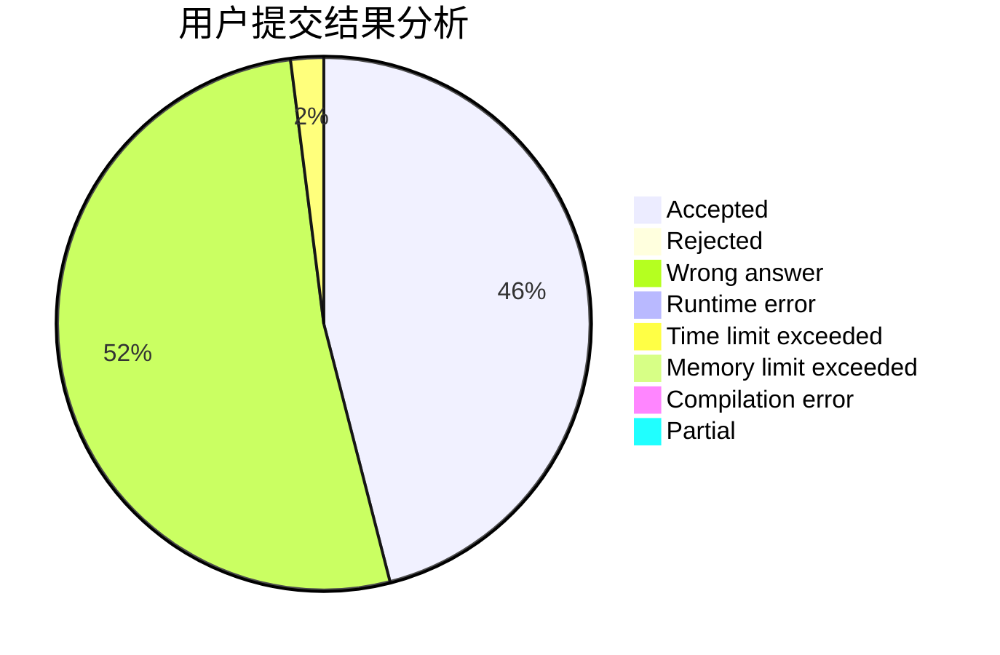
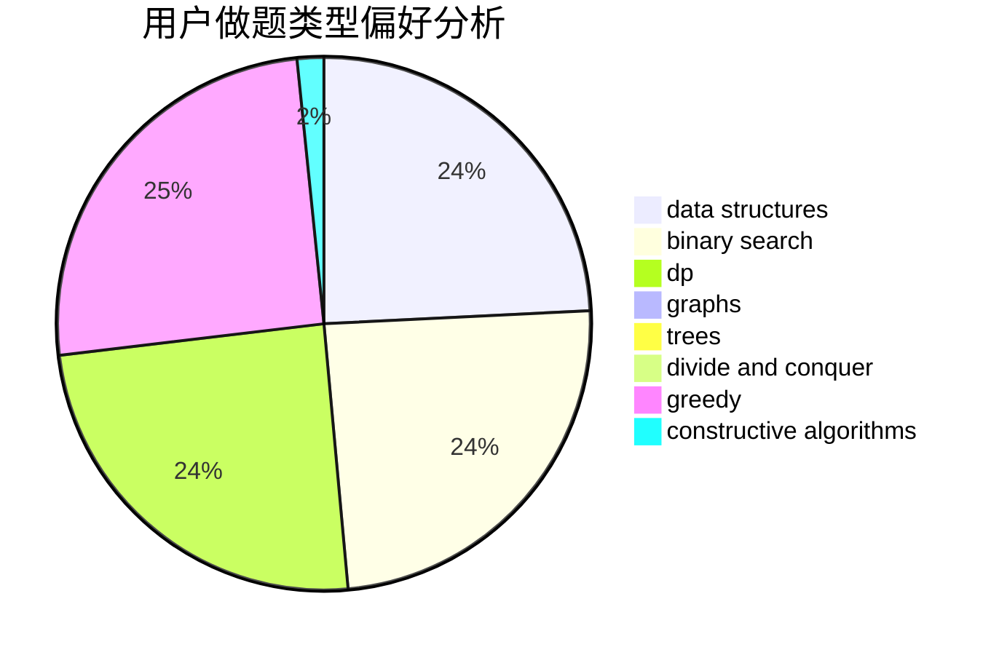
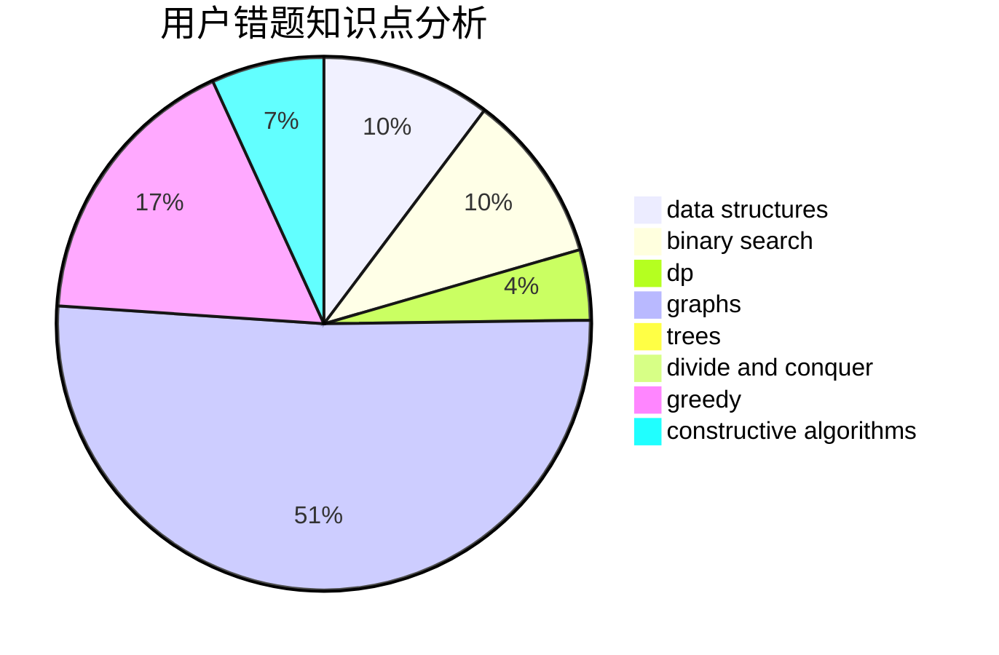

# Eric_Qian

<!-- tabs:start -->

#### **用户提交结果分析**

#### **用户做题类型偏好分析**

#### **用户错题知识点分析**

<!-- tabs:end -->
# 推荐题目
[1099D](https://codeforces.com/contest/1099/problem/D)		dsu,graphs,sortings,trees		  
[506C](https://codeforces.com/contest/506/problem/C)		dsu,graphs,sortings,trees		  
[366D](https://codeforces.com/contest/366/problem/D)		binary search,
                        data structures,
                        dfs and similar,
                        dsu,
                        shortest paths,
                        two pointers		  
[827A](https://codeforces.com/contest/827/problem/A)		data structures,
                        greedy,
                        sortings,
                        strings		  
[543A](https://codeforces.com/contest/543/problem/A)		dp		  
[1399F](https://codeforces.com/contest/1399/problem/F)		data structures,
                        dp,
                        graphs,
                        sortings		  
[81E](https://codeforces.com/contest/81/problem/E)		dfs and similar,
                        dp,
                        dsu,
                        graphs,
                        implementation,
                        trees		  
[831A](https://codeforces.com/contest/831/problem/A)		implementation		  
[831B](https://codeforces.com/contest/831/problem/B)		implementation,
                        strings		  
[633D](https://codeforces.com/contest/633/problem/D)		brute force,
                        dp,
                        hashing,
                        implementation,
                        math		  
