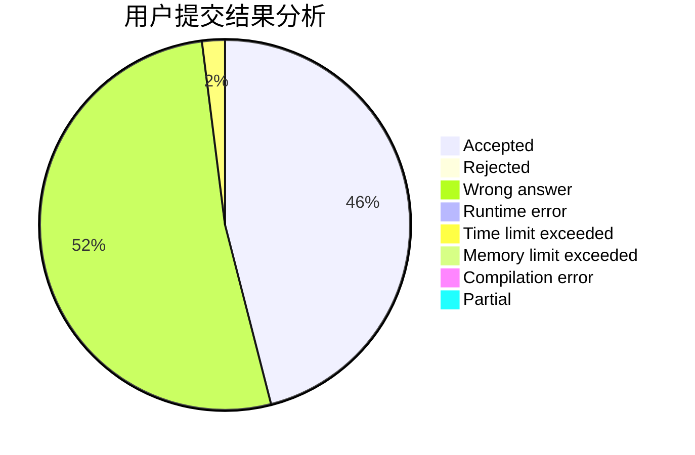
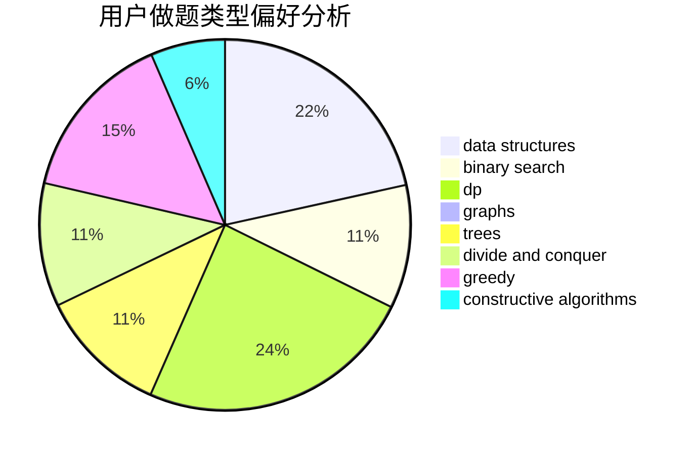
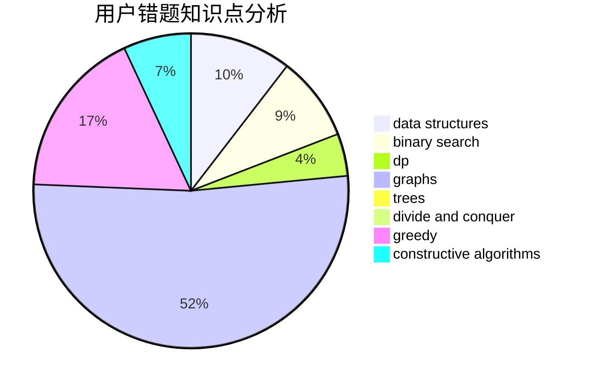

# Eric_Qian

<!-- tabs:start -->

#### **用户提交结果分析**

#### **用户做题类型偏好分析**

#### **用户错题知识点分析**

<!-- tabs:end -->
# 推荐题目
[109A](https://codeforces.com/contest/109/problem/A)		brute force,
                        implementation		  
[526F](https://codeforces.com/contest/526/problem/F)		data structures,
                        divide and conquer		  
[396C](https://codeforces.com/contest/396/problem/C)		data structures,
                        graphs,
                        trees		  
[845D](https://codeforces.com/contest/845/problem/D)		data structures,
                        dp,
                        greedy		  
[567C](https://codeforces.com/contest/567/problem/C)		binary search,
                        data structures,
                        dp		  
[1408H](https://codeforces.com/contest/1408/problem/H)		binary search,
                        data structures,
                        flows,
                        greedy		  
[83B](https://codeforces.com/contest/83/problem/B)		binary search,
                        math,
                        sortings		  
[849A](https://codeforces.com/contest/849/problem/A)		implementation		  
[849B](https://codeforces.com/contest/849/problem/B)		brute force,
                        geometry		  
[665F](https://codeforces.com/contest/665/problem/F)		data structures,
                        dp,
                        math,
                        number theory,
                        sortings,
                        two pointers		  
