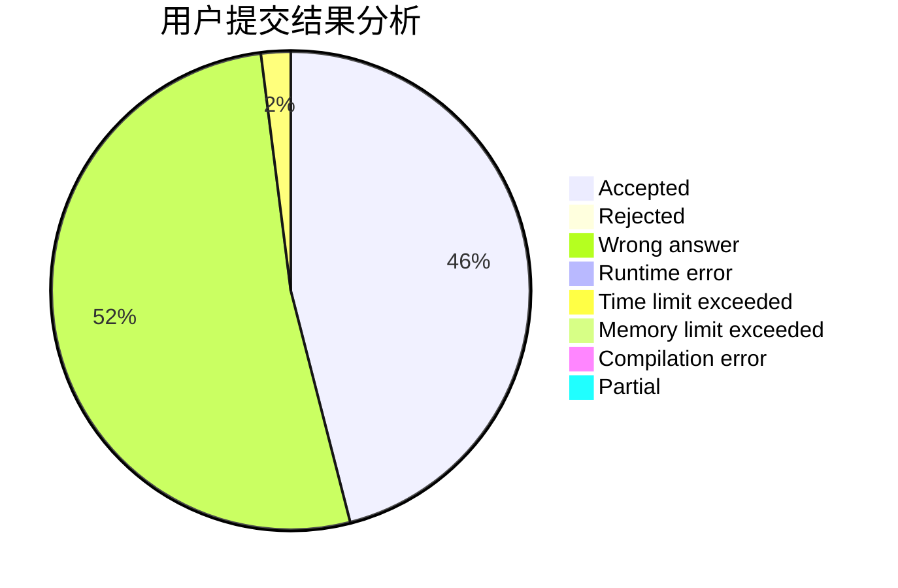
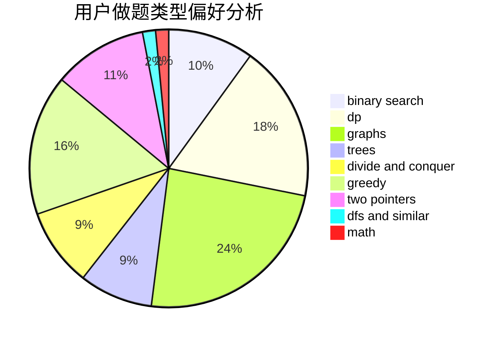

# Eric_Qian

<!-- tabs:start -->

#### **用户提交结果分析**

#### **用户做题类型偏好分析**

<!-- tabs:end -->
# 推荐题目
[109A](https://codeforces.com/contest/109/problem/A)
[526F](https://codeforces.com/contest/526/problem/F)
[396C](https://codeforces.com/contest/396/problem/C)
[845D](https://codeforces.com/contest/845/problem/D)
[567C](https://codeforces.com/contest/567/problem/C)
[1408H](https://codeforces.com/contest/1408/problem/H)
[83B](https://codeforces.com/contest/83/problem/B)
[849A](https://codeforces.com/contest/849/problem/A)
[849B](https://codeforces.com/contest/849/problem/B)
[665F](https://codeforces.com/contest/665/problem/F)
