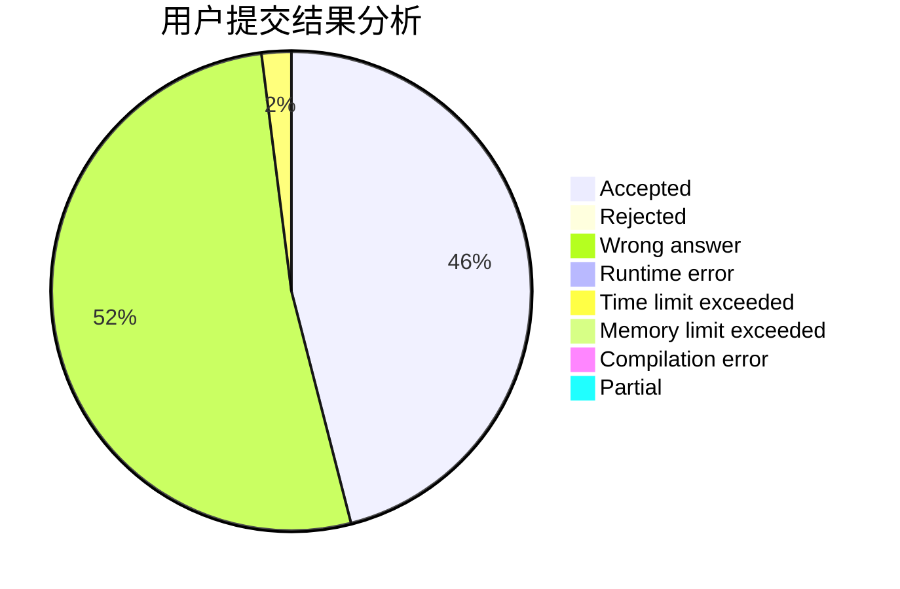
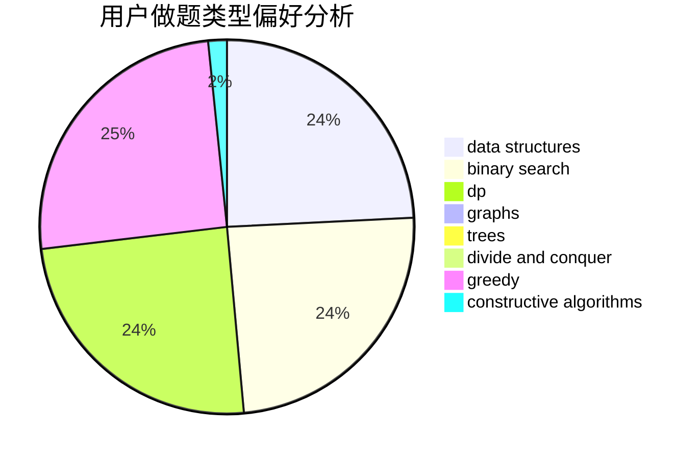
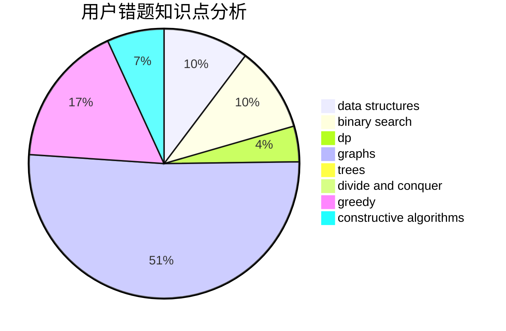

# Eric_Qian
<!-- tabs:start -->
#### **用户提交结果分析**

#### **用户做题类型偏好分析**

#### **用户错题知识点分析**

<!-- tabs:end -->
# 推荐题目
[Sum in the tree](https://codeforces.com/contest/1099/problem/D)		constructive algorithms,
                        dfs and similar,
                        greedy,
                        trees		  
[Dima and Trap Graph](http://codeforces.com/problemset/problem/366/D)		binary search,
                        data structures,
                        dfs and similar,
                        dsu,
                        shortest paths,
                        two pointers		  
[Keyboard Layouts](http://codeforces.com/problemset/problem/831/B)		implementation,
                        strings		  
[Fibonacci-ish](http://codeforces.com/problemset/problem/633/D)		brute force,
                        dp,
                        hashing,
                        implementation,
                        math		  
[Yet Another Segments Subset](http://codeforces.com/problemset/problem/1399/F)		data structures,
                        dp,
                        graphs,
                        sortings		  
[String Reconstruction](http://codeforces.com/problemset/problem/827/A)		data structures,
                        greedy,
                        sortings,
                        strings		  
[Success Rate](https://codeforces.com/contest/807/problem/C)		binary search,
                        math		  
[Letter](http://codeforces.com/problemset/problem/14/A)		implementation		  
[Sum of Digits](http://codeforces.com/problemset/problem/102/B)		implementation		  
[Mr. Kitayuta vs. Bamboos](https://codeforces.com/contest/506/problem/C)		binary search,
                        greedy		  
<!-- tabs:start -->
#### **data structures**
[Sum in the tree](http://codeforces.com/problemset/problem/366/D)		binary search,
                        data structures,
                        dfs and similar,
                        dsu,
                        shortest paths,
                        two pointers		  
[Dima and Trap Graph](http://codeforces.com/problemset/problem/1399/F)		data structures,
                        dp,
                        graphs,
                        sortings		  
[Keyboard Layouts](http://codeforces.com/problemset/problem/827/A)		data structures,
                        greedy,
                        sortings,
                        strings		  
[Fibonacci-ish](http://codeforces.com/problemset/problem/1209/F)		data structures,
                        dfs and similar,
                        graphs,
                        shortest paths,
                        strings,
                        trees		  
[Yet Another Segments Subset](http://codeforces.com/problemset/problem/1491/H)		data structures,
                        trees		  
[String Reconstruction](https://codeforces.com/contest/1291/problem/C)		brute force,
                        data structures,
                        implementation		  
[Success Rate](http://codeforces.com/problemset/problem/1492/C)		binary search,
                        data structures,
                        dp,
                        greedy,
                        two pointers		  
[Letter](http://codeforces.com/problemset/problem/1490/G)		binary search,
                        data structures,
                        math		  
[Sum of Digits](http://codeforces.com/problemset/problem/1479/D)		binary search,
                        bitmasks,
                        brute force,
                        data structures,
                        probabilities,
                        trees		  
[Mr. Kitayuta vs. Bamboos](http://codeforces.com/problemset/problem/1497/A)		brute force,
                        data structures,
                        greedy,
                        sortings		  
#### **binary search**
[Sum in the tree](http://codeforces.com/problemset/problem/366/D)		binary search,
                        data structures,
                        dfs and similar,
                        dsu,
                        shortest paths,
                        two pointers		  
[Dima and Trap Graph](https://codeforces.com/contest/807/problem/C)		binary search,
                        math		  
[Keyboard Layouts](https://codeforces.com/contest/506/problem/C)		binary search,
                        greedy		  
[Fibonacci-ish](http://codeforces.com/problemset/problem/1488/D)		*special problem,
                        binary search,
                        greedy		  
[Yet Another Segments Subset](http://codeforces.com/problemset/problem/232/A)		binary search,
                        constructive algorithms,
                        graphs,
                        greedy		  
[String Reconstruction](http://codeforces.com/problemset/problem/1493/C)		binary search,
                        brute force,
                        constructive algorithms,
                        greedy,
                        strings		  
[Success Rate](http://codeforces.com/problemset/problem/1492/C)		binary search,
                        data structures,
                        dp,
                        greedy,
                        two pointers		  
[Letter](http://codeforces.com/problemset/problem/1463/D)		binary search,
                        constructive algorithms,
                        greedy,
                        two pointers		  
[Sum of Digits](http://codeforces.com/problemset/problem/1490/G)		binary search,
                        data structures,
                        math		  
[Mr. Kitayuta vs. Bamboos](http://codeforces.com/problemset/problem/1479/D)		binary search,
                        bitmasks,
                        brute force,
                        data structures,
                        probabilities,
                        trees		  
#### **dp**
[Sum in the tree](http://codeforces.com/problemset/problem/633/D)		brute force,
                        dp,
                        hashing,
                        implementation,
                        math		  
[Dima and Trap Graph](http://codeforces.com/problemset/problem/1399/F)		data structures,
                        dp,
                        graphs,
                        sortings		  
[Keyboard Layouts](http://codeforces.com/problemset/problem/543/A)		dp		  
[Fibonacci-ish](http://codeforces.com/problemset/problem/81/E)		dfs and similar,
                        dp,
                        dsu,
                        graphs,
                        implementation,
                        trees		  
[Yet Another Segments Subset](http://codeforces.com/problemset/problem/1492/C)		binary search,
                        data structures,
                        dp,
                        greedy,
                        two pointers		  
[String Reconstruction](https://codeforces.com/contest/1457/problem/C)		brute force,
                        dp,
                        implementation		  
[Success Rate](http://codeforces.com/problemset/problem/1491/C)		brute force,
                        data structures,
                        dp,
                        greedy,
                        implementation		  
[Letter](http://codeforces.com/problemset/problem/1437/C)		dp,
                        flows,
                        graph matchings,
                        greedy,
                        math,
                        sortings		  
[Sum of Digits](http://codeforces.com/problemset/problem/1499/B)		brute force,
                        dp,
                        greedy,
                        implementation		  
[Mr. Kitayuta vs. Bamboos](http://codeforces.com/problemset/problem/1491/D)		bitmasks,
                        constructive algorithms,
                        dp,
                        greedy,
                        math		  
#### **graph**
[Sum in the tree](http://codeforces.com/problemset/problem/1399/F)		data structures,
                        dp,
                        graphs,
                        sortings		  
[Dima and Trap Graph](http://codeforces.com/problemset/problem/1209/F)		data structures,
                        dfs and similar,
                        graphs,
                        shortest paths,
                        strings,
                        trees		  
[Keyboard Layouts](http://codeforces.com/problemset/problem/232/A)		binary search,
                        constructive algorithms,
                        graphs,
                        greedy		  
[Fibonacci-ish](http://codeforces.com/problemset/problem/81/E)		dfs and similar,
                        dp,
                        dsu,
                        graphs,
                        implementation,
                        trees		  
[Yet Another Segments Subset](http://codeforces.com/problemset/problem/1487/C)		brute force,
                        constructive algorithms,
                        dfs and similar,
                        graphs,
                        greedy,
                        implementation,
                        math		  
[String Reconstruction](http://codeforces.com/problemset/problem/1437/C)		dp,
                        flows,
                        graph matchings,
                        greedy,
                        math,
                        sortings		  
[Success Rate](http://codeforces.com/problemset/problem/1470/D)		constructive algorithms,
                        dfs and similar,
                        graph matchings,
                        graphs,
                        greedy		  
[Letter](http://codeforces.com/problemset/problem/1476/C)		dp,
                        graphs,
                        greedy		  
[Sum of Digits](http://codeforces.com/problemset/problem/1304/D)		constructive algorithms,
                        graphs,
                        greedy,
                        two pointers		  
[Mr. Kitayuta vs. Bamboos](http://codeforces.com/problemset/problem/1475/C)		combinatorics,
                        graphs,
                        math		  
#### **trees**
[Sum in the tree](https://codeforces.com/contest/1099/problem/D)		constructive algorithms,
                        dfs and similar,
                        greedy,
                        trees		  
[Dima and Trap Graph](http://codeforces.com/problemset/problem/1209/F)		data structures,
                        dfs and similar,
                        graphs,
                        shortest paths,
                        strings,
                        trees		  
[Keyboard Layouts](http://codeforces.com/problemset/problem/81/E)		dfs and similar,
                        dp,
                        dsu,
                        graphs,
                        implementation,
                        trees		  
[Fibonacci-ish](http://codeforces.com/problemset/problem/1491/H)		data structures,
                        trees		  
[Yet Another Segments Subset](http://codeforces.com/problemset/problem/1479/D)		binary search,
                        bitmasks,
                        brute force,
                        data structures,
                        probabilities,
                        trees		  
[String Reconstruction](http://codeforces.com/problemset/problem/1511/C)		brute force,
                        data structures,
                        implementation,
                        trees		  
[Success Rate](http://codeforces.com/problemset/problem/1499/F)		combinatorics,
                        dfs and similar,
                        dp,
                        trees		  
[Letter](http://codeforces.com/problemset/problem/1491/E)		brute force,
                        dfs and similar,
                        divide and conquer,
                        number theory,
                        trees		  
[Sum of Digits](http://codeforces.com/problemset/problem/1466/D)		data structures,
                        greedy,
                        sortings,
                        trees		  
[Mr. Kitayuta vs. Bamboos](http://codeforces.com/problemset/problem/1495/D)		combinatorics,
                        dfs and similar,
                        graphs,
                        math,
                        shortest paths,
                        trees		  
#### **divide and conquer**
[Sum in the tree](http://codeforces.com/problemset/problem/1461/D)		binary search,
                        brute force,
                        data structures,
                        divide and conquer,
                        implementation,
                        sortings		  
[Dima and Trap Graph](http://codeforces.com/problemset/problem/1466/G)		combinatorics,
                        divide and conquer,
                        hashing,
                        math,
                        string suffix structures,
                        strings		  
[Keyboard Layouts](http://codeforces.com/problemset/problem/1490/D)		dfs and similar,
                        divide and conquer,
                        implementation		  
[Fibonacci-ish](https://codeforces.com/contest/1483/problem/C)		data structures,
                        divide and conquer,
                        dp		  
[Yet Another Segments Subset](http://codeforces.com/problemset/problem/1491/E)		brute force,
                        dfs and similar,
                        divide and conquer,
                        number theory,
                        trees		  
[String Reconstruction](http://codeforces.com/problemset/problem/1303/G)		data structures,
                        divide and conquer,
                        geometry,
                        trees		  
[Success Rate](http://codeforces.com/problemset/problem/1494/D)		constructive algorithms,
                        data structures,
                        dfs and similar,
                        divide and conquer,
                        dsu,
                        greedy,
                        sortings,
                        trees		  
[Letter](http://codeforces.com/problemset/problem/1482/E)		data structures,
                        divide and conquer,
                        dp		  
[Sum of Digits](http://codeforces.com/problemset/problem/566/C)		dfs and similar,
                        divide and conquer,
                        trees		  
[Mr. Kitayuta vs. Bamboos](http://codeforces.com/problemset/problem/1428/F)		binary search,
                        data structures,
                        divide and conquer,
                        dp,
                        two pointers		  
#### **greedy**
[Sum in the tree](https://codeforces.com/contest/1099/problem/D)		constructive algorithms,
                        dfs and similar,
                        greedy,
                        trees		  
[Dima and Trap Graph](http://codeforces.com/problemset/problem/827/A)		data structures,
                        greedy,
                        sortings,
                        strings		  
[Keyboard Layouts](https://codeforces.com/contest/506/problem/C)		binary search,
                        greedy		  
[Fibonacci-ish](http://codeforces.com/problemset/problem/266/C)		constructive algorithms,
                        greedy,
                        math		  
[Yet Another Segments Subset](http://codeforces.com/problemset/problem/1488/D)		*special problem,
                        binary search,
                        greedy		  
[String Reconstruction](https://codeforces.com/contest/1432/problem/F)		greedy		  
[Success Rate](http://codeforces.com/problemset/problem/232/A)		binary search,
                        constructive algorithms,
                        graphs,
                        greedy		  
[Letter](http://codeforces.com/problemset/problem/381/A)		greedy,
                        implementation,
                        two pointers		  
[Sum of Digits](http://codeforces.com/problemset/problem/1493/C)		binary search,
                        brute force,
                        constructive algorithms,
                        greedy,
                        strings		  
[Mr. Kitayuta vs. Bamboos](http://codeforces.com/problemset/problem/1299/A)		brute force,
                        greedy,
                        math		  
#### **constructive algorithms**
[Sum in the tree](https://codeforces.com/contest/1099/problem/D)		constructive algorithms,
                        dfs and similar,
                        greedy,
                        trees		  
[Dima and Trap Graph](http://codeforces.com/problemset/problem/266/C)		constructive algorithms,
                        greedy,
                        math		  
[Keyboard Layouts](http://codeforces.com/problemset/problem/831/C)		brute force,
                        constructive algorithms		  
[Fibonacci-ish](http://codeforces.com/problemset/problem/622/D)		constructive algorithms		  
[Yet Another Segments Subset](http://codeforces.com/problemset/problem/232/A)		binary search,
                        constructive algorithms,
                        graphs,
                        greedy		  
[String Reconstruction](http://codeforces.com/problemset/problem/1493/C)		binary search,
                        brute force,
                        constructive algorithms,
                        greedy,
                        strings		  
[Success Rate](http://codeforces.com/problemset/problem/1493/A)		constructive algorithms,
                        greedy		  
[Letter](http://codeforces.com/problemset/problem/1463/D)		binary search,
                        constructive algorithms,
                        greedy,
                        two pointers		  
[Sum of Digits](https://codeforces.com/contest/1456/problem/B)		bitmasks,
                        brute force,
                        constructive algorithms		  
[Mr. Kitayuta vs. Bamboos](http://codeforces.com/problemset/problem/1492/D)		bitmasks,
                        constructive algorithms,
                        greedy,
                        math		  
#### **sortings**
[Sum in the tree](http://codeforces.com/problemset/problem/1399/F)		data structures,
                        dp,
                        graphs,
                        sortings		  
[Dima and Trap Graph](http://codeforces.com/problemset/problem/827/A)		data structures,
                        greedy,
                        sortings,
                        strings		  
[Keyboard Layouts](http://codeforces.com/problemset/problem/1165/E)		greedy,
                        math,
                        sortings		  
[Fibonacci-ish](https://codeforces.com/contest/1496/problem/C)		geometry,
                        greedy,
                        math,
                        sortings		  
[Yet Another Segments Subset](http://codeforces.com/problemset/problem/1495/A)		geometry,
                        greedy,
                        math,
                        sortings		  
[String Reconstruction](http://codeforces.com/problemset/problem/1497/A)		brute force,
                        data structures,
                        greedy,
                        sortings		  
[Success Rate](http://codeforces.com/problemset/problem/1427/A)		math,
                        sortings		  
[Letter](http://codeforces.com/problemset/problem/1461/D)		binary search,
                        brute force,
                        data structures,
                        divide and conquer,
                        implementation,
                        sortings		  
[Sum of Digits](http://codeforces.com/problemset/problem/1437/C)		dp,
                        flows,
                        graph matchings,
                        greedy,
                        math,
                        sortings		  
[Mr. Kitayuta vs. Bamboos](http://codeforces.com/problemset/problem/1473/A)		greedy,
                        implementation,
                        math,
                        sortings		  
<!-- tabs:end -->
