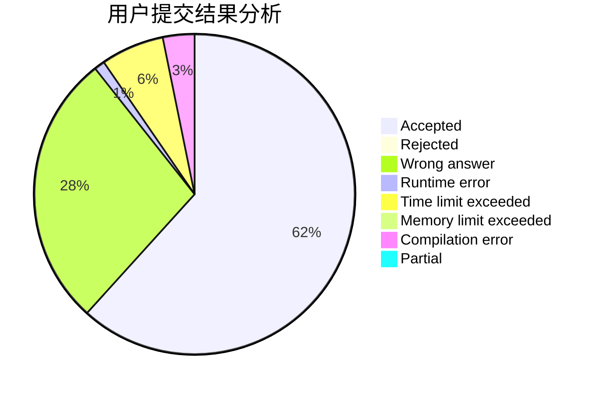
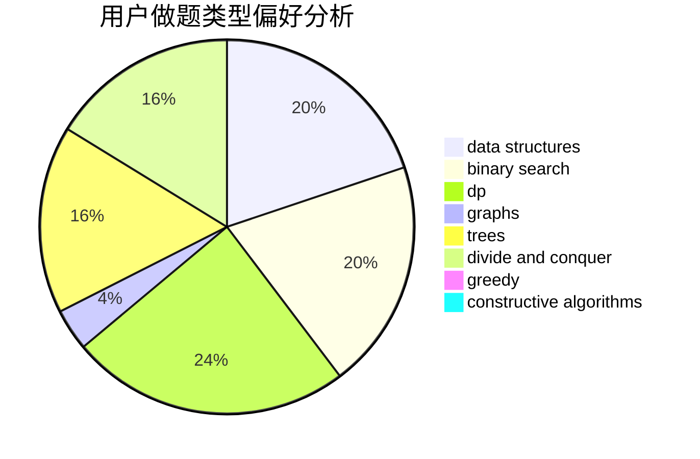
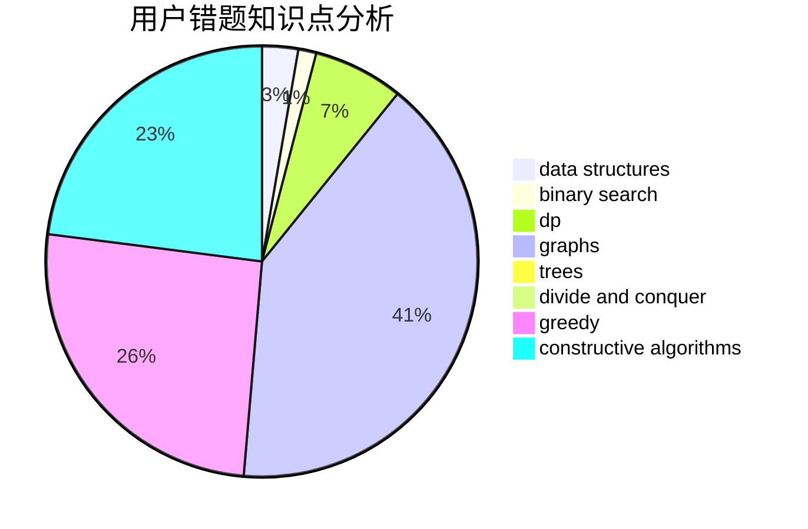

# Ericxiaoxi

<!-- tabs:start -->

#### **用户提交结果分析**

#### **用户做题类型偏好分析**

#### **用户错题知识点分析**

<!-- tabs:end -->
# 推荐题目
[1040B](https://codeforces.com/contest/1040/problem/B)		dp,
                        greedy,
                        math		  
[594D](https://codeforces.com/contest/594/problem/D)		data structures,
                        number theory		  
[702C](https://codeforces.com/contest/702/problem/C)		binary search,
                        implementation,
                        two pointers		  
[84C](https://codeforces.com/contest/84/problem/C)		binary search,
                        implementation		  
[12102](https://codeforces.com/contest/1210/problem/2)		dsu,graphs,sortings,trees		  
[1488F](https://codeforces.com/contest/1488/problem/F)		*special problem,
                        *special problem,
                        binary search,
                        data structures		  
[850A](https://codeforces.com/contest/850/problem/A)		brute force,
                        geometry,
                        math		  
[1473C](https://codeforces.com/contest/1473/problem/C)		constructive algorithms,
                        math		  
[1442C](https://codeforces.com/contest/1442/problem/C)		dfs and similar,
                        graphs,
                        greedy,
                        shortest paths		  
[1499A](https://codeforces.com/contest/1499/problem/A)		combinatorics,
                        constructive algorithms,
                        math		  
