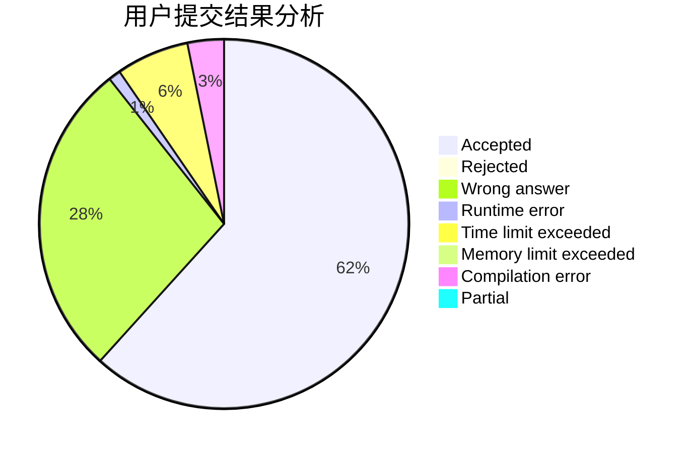
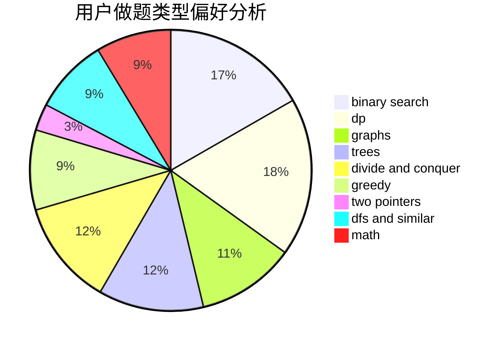

# Ericxiaoxi

<!-- tabs:start -->

#### **用户提交结果分析**

#### **用户做题类型偏好分析**

<!-- tabs:end -->
# 推荐题目
[1040B](https://codeforces.com/contest/1040/problem/B)
[594D](https://codeforces.com/contest/594/problem/D)
[702C](https://codeforces.com/contest/702/problem/C)
[84C](https://codeforces.com/contest/84/problem/C)
[12102](https://codeforces.com/contest/1210/problem/2)
[1488F](https://codeforces.com/contest/1488/problem/F)
[850A](https://codeforces.com/contest/850/problem/A)
[1473C](https://codeforces.com/contest/1473/problem/C)
[1442C](https://codeforces.com/contest/1442/problem/C)
[1499A](https://codeforces.com/contest/1499/problem/A)
