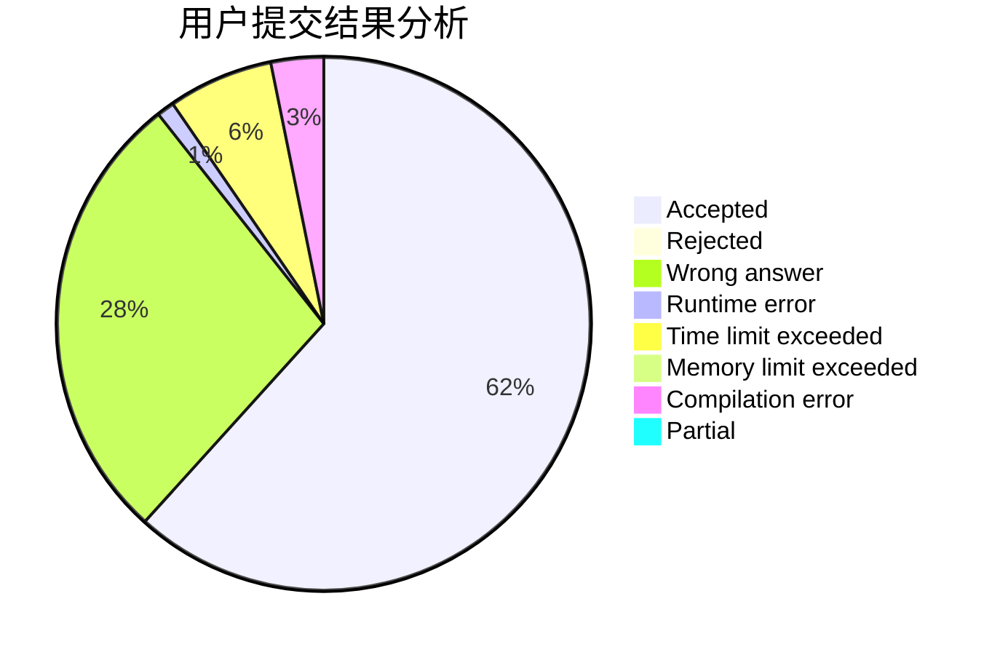
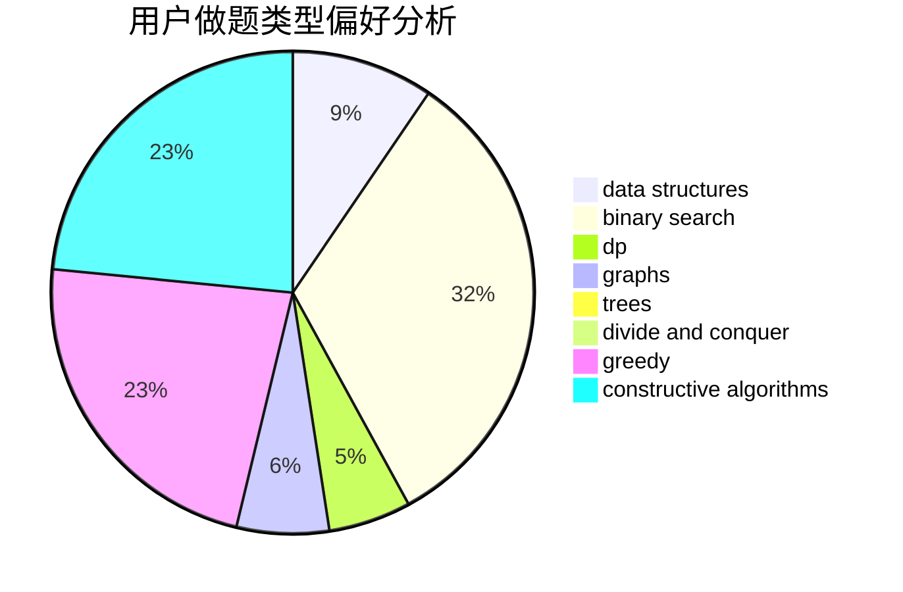
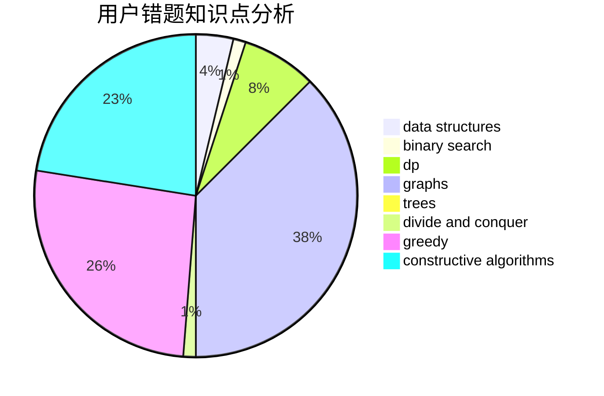

# Ericxiaoxi

<!-- tabs:start -->

#### **用户提交结果分析**

#### **用户做题类型偏好分析**

#### **用户错题知识点分析**

<!-- tabs:end -->
# 推荐题目
[103D](https://codeforces.com/contest/103/problem/D)		brute force,
                        data structures,
                        sortings		  
[574C](https://codeforces.com/contest/574/problem/C)		dsu,graphs,sortings,trees		  
[678E](https://codeforces.com/contest/678/problem/E)		bitmasks,
                        dp,
                        math,
                        probabilities		  
[831D](https://codeforces.com/contest/831/problem/D)		dsu,graphs,sortings,trees		  
[1206A](https://codeforces.com/contest/1206/problem/A)		math,
                        sortings		  
[1480B](https://codeforces.com/contest/1480/problem/B)		greedy,
                        implementation,
                        sortings		  
[831E](https://codeforces.com/contest/831/problem/E)		dsu,graphs,sortings,trees		  
[1466C](https://codeforces.com/contest/1466/problem/C)		dp,
                        greedy,
                        strings		  
[1432D](https://codeforces.com/contest/1432/problem/D)		dsu,graphs,sortings,trees		  
[1490B](https://codeforces.com/contest/1490/problem/B)		brute force,
                        constructive algorithms,
                        math		  
