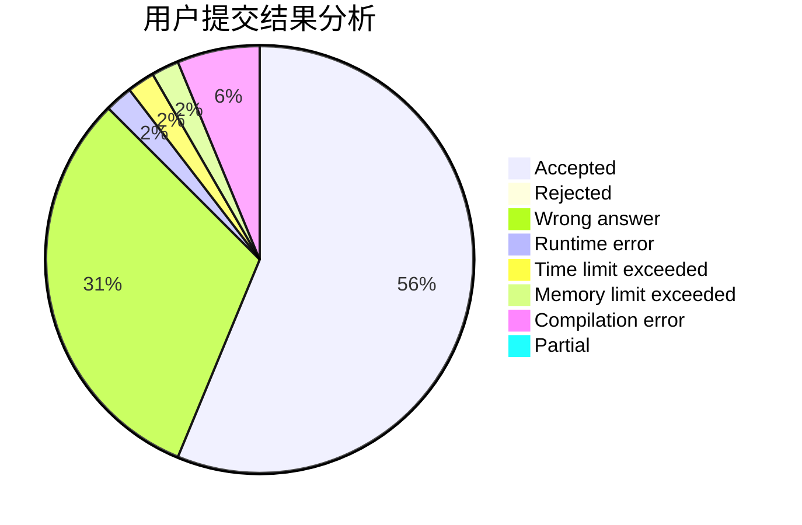
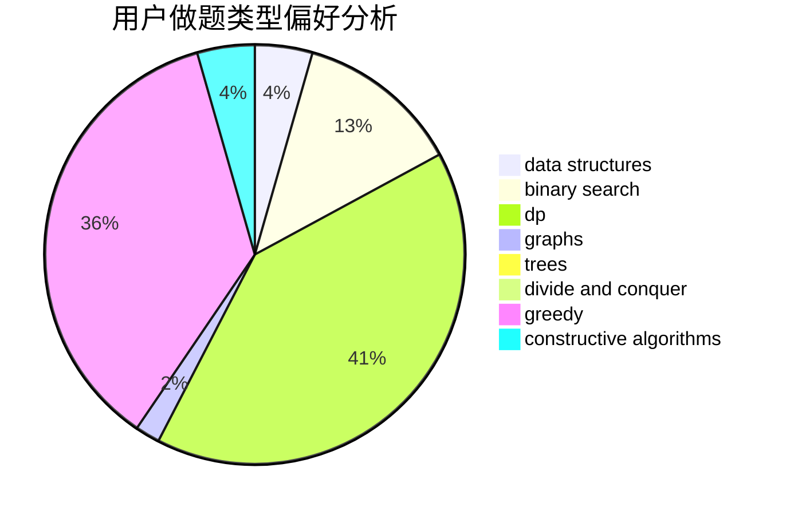
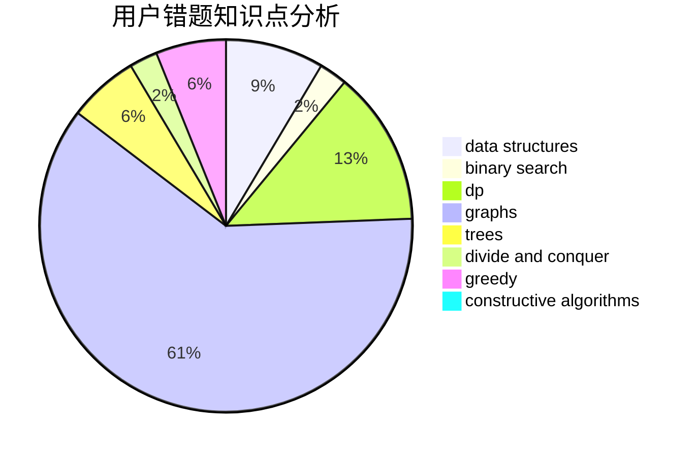

# EternHope

<!-- tabs:start -->

#### **用户提交结果分析**

#### **用户做题类型偏好分析**

#### **用户错题知识点分析**

<!-- tabs:end -->
# 推荐题目
[1320A](https://codeforces.com/contest/1320/problem/A)		data structures,
                        dp,
                        greedy,
                        math,
                        sortings		  
[1304C](https://codeforces.com/contest/1304/problem/C)		dp,
                        greedy,
                        implementation,
                        sortings,
                        two pointers		  
[1161A](https://codeforces.com/contest/1161/problem/A)		dsu,graphs,sortings,trees		  
[818A](https://codeforces.com/contest/818/problem/A)		implementation,
                        math		  
[1422B](https://codeforces.com/contest/1422/problem/B)		greedy,
                        implementation,
                        math		  
[367A](https://codeforces.com/contest/367/problem/A)		data structures,
                        implementation		  
[1247B2](https://codeforces.com/contest/1247B/problem/2)		dsu,graphs,sortings,trees		  
[831F](https://codeforces.com/contest/831/problem/F)		dsu,graphs,sortings,trees		  
[1272D](https://codeforces.com/contest/1272/problem/D)		brute force,
                        dp		  
[832A](https://codeforces.com/contest/832/problem/A)		games,
                        math		  
