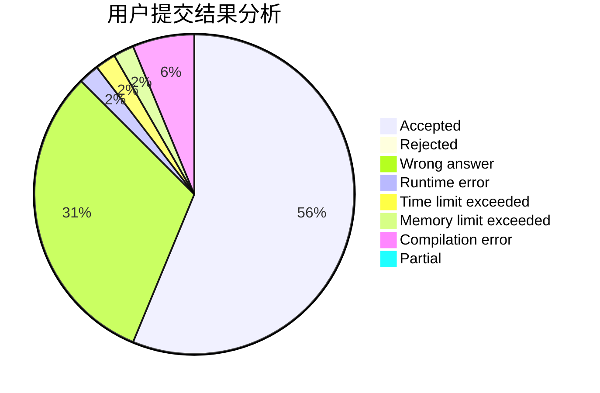
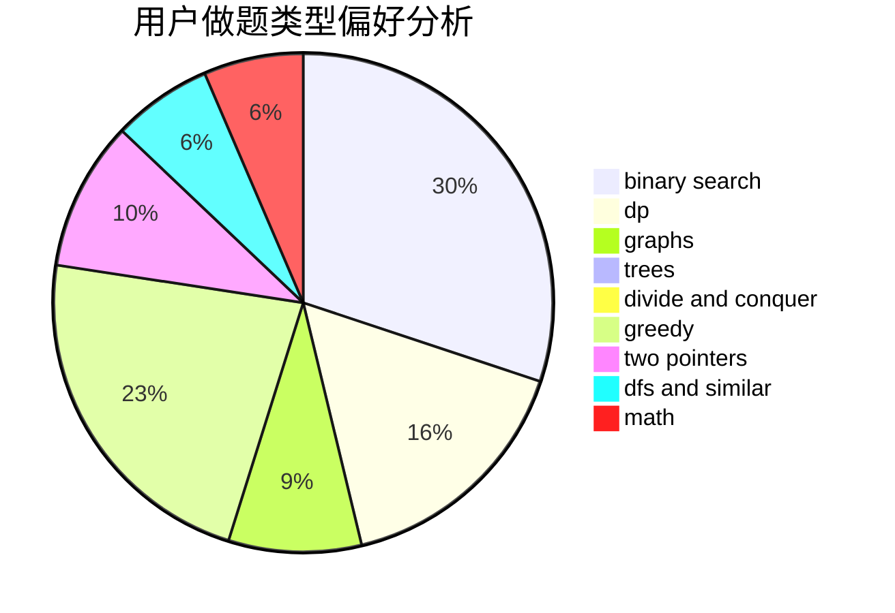

# EternHope

<!-- tabs:start -->

#### **用户提交结果分析**

#### **用户做题类型偏好分析**

<!-- tabs:end -->
# 推荐题目
[1327A](https://codeforces.com/contest/1327/problem/A)
[13131](https://codeforces.com/contest/1313/problem/1)
[1163D](https://codeforces.com/contest/1163/problem/D)
[837G](https://codeforces.com/contest/837/problem/G)
[142D](https://codeforces.com/contest/142/problem/D)
[397E](https://codeforces.com/contest/397/problem/E)
[1251A](https://codeforces.com/contest/1251/problem/A)
[850B](https://codeforces.com/contest/850/problem/B)
[1281F](https://codeforces.com/contest/1281/problem/F)
[850C](https://codeforces.com/contest/850/problem/C)
