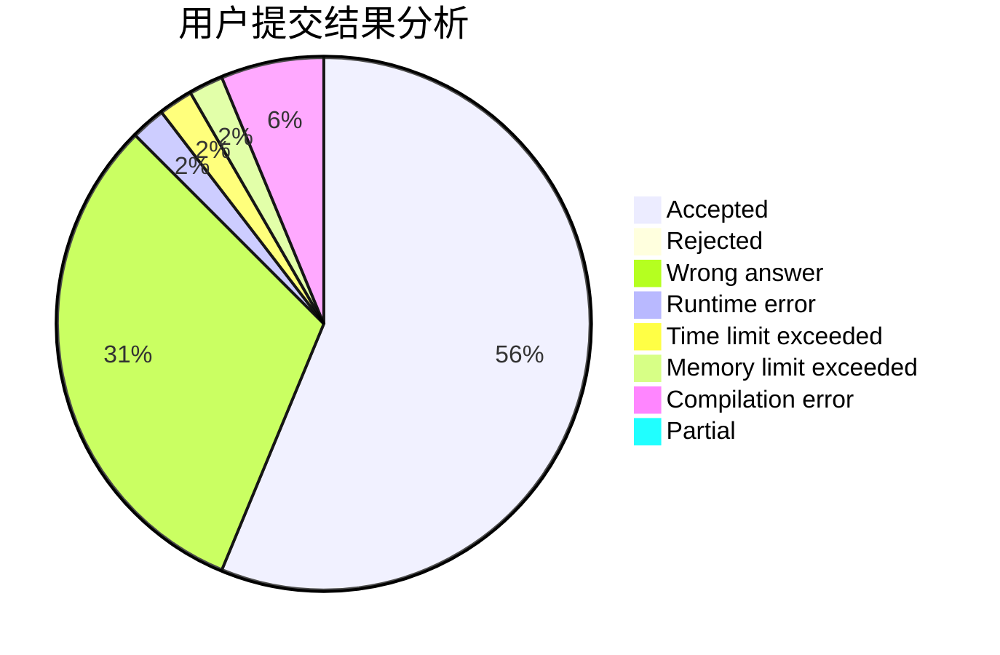
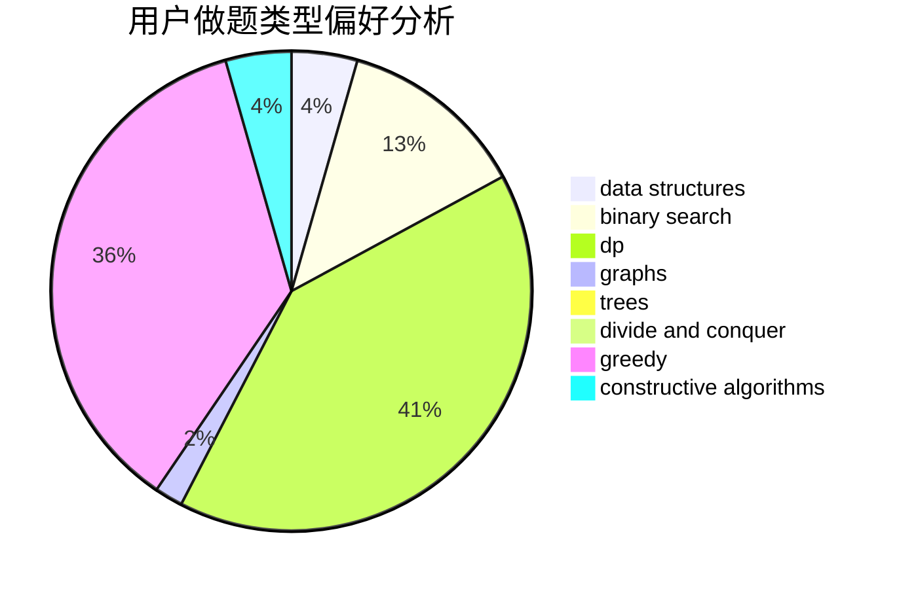
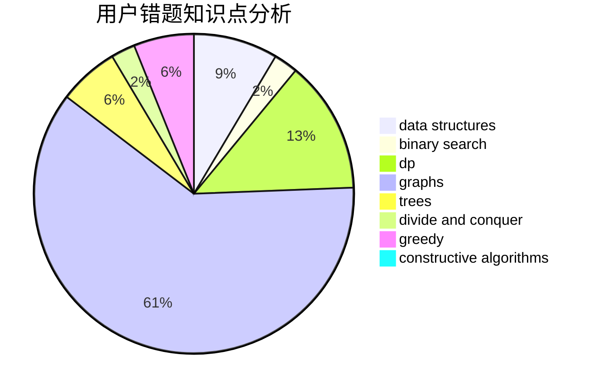

# EternHope
<!-- tabs:start -->
#### **用户提交结果分析**

#### **用户做题类型偏好分析**

#### **用户错题知识点分析**

<!-- tabs:end -->
# 推荐题目
[Journey Planning](http://codeforces.com/problemset/problem/1320/A)		data structures,
                        dp,
                        greedy,
                        math,
                        sortings		  
[Hide and Seek](https://codeforces.com/contest/1161/problem/A)		graphs		  
[Sereja and Algorithm](http://codeforces.com/problemset/problem/367/A)		data structures,
                        implementation		  
[Bamboo Partition](https://codeforces.com/contest/831/problem/F)		brute force,
                        data structures,
                        implementation,
                        math,
                        number theory,
                        sortings,
                        two pointers		  
[April Fools' Problem (hard)](http://codeforces.com/problemset/problem/802/O)		binary search,
                        data structures,
                        flows		  
[Sasha and Sticks](http://codeforces.com/problemset/problem/832/A)		games,
                        math		  
[Anton and currency you all know](http://codeforces.com/problemset/problem/508/B)		greedy,
                        math,
                        strings		  
[Non-zero Segments](http://codeforces.com/problemset/problem/1426/D)		constructive algorithms,
                        data structures,
                        greedy,
                        sortings		  
[Colored Tree](http://codeforces.com/problemset/problem/1260/F)		data structures,
                        trees		  
[Remove One Element](http://codeforces.com/problemset/problem/1272/D)		brute force,
                        dp		  
<!-- tabs:start -->
#### **data structures**
[Journey Planning](http://codeforces.com/problemset/problem/1320/A)		data structures,
                        dp,
                        greedy,
                        math,
                        sortings		  
[Hide and Seek](http://codeforces.com/problemset/problem/367/A)		data structures,
                        implementation		  
[Sereja and Algorithm](https://codeforces.com/contest/831/problem/F)		brute force,
                        data structures,
                        implementation,
                        math,
                        number theory,
                        sortings,
                        two pointers		  
[Bamboo Partition](http://codeforces.com/problemset/problem/802/O)		binary search,
                        data structures,
                        flows		  
[April Fools' Problem (hard)](http://codeforces.com/problemset/problem/1426/D)		constructive algorithms,
                        data structures,
                        greedy,
                        sortings		  
[Sasha and Sticks](http://codeforces.com/problemset/problem/1260/F)		data structures,
                        trees		  
[Anton and currency you all know](http://codeforces.com/problemset/problem/1492/C)		binary search,
                        data structures,
                        dp,
                        greedy,
                        two pointers		  
[Non-zero Segments](http://codeforces.com/problemset/problem/1490/G)		binary search,
                        data structures,
                        math		  
[Colored Tree](http://codeforces.com/problemset/problem/1479/D)		binary search,
                        bitmasks,
                        brute force,
                        data structures,
                        probabilities,
                        trees		  
[Remove One Element](http://codeforces.com/problemset/problem/1497/A)		brute force,
                        data structures,
                        greedy,
                        sortings		  
#### **binary search**
[Journey Planning](http://codeforces.com/problemset/problem/802/O)		binary search,
                        data structures,
                        flows		  
[Hide and Seek](http://codeforces.com/problemset/problem/1492/C)		binary search,
                        data structures,
                        dp,
                        greedy,
                        two pointers		  
[Sereja and Algorithm](http://codeforces.com/problemset/problem/1463/D)		binary search,
                        constructive algorithms,
                        greedy,
                        two pointers		  
[Bamboo Partition](http://codeforces.com/problemset/problem/1490/G)		binary search,
                        data structures,
                        math		  
[April Fools' Problem (hard)](http://codeforces.com/problemset/problem/1479/D)		binary search,
                        bitmasks,
                        brute force,
                        data structures,
                        probabilities,
                        trees		  
[Sasha and Sticks](http://codeforces.com/problemset/problem/1436/E)		binary search,
                        data structures,
                        two pointers		  
[Anton and currency you all know](http://codeforces.com/problemset/problem/1461/D)		binary search,
                        brute force,
                        data structures,
                        divide and conquer,
                        implementation,
                        sortings		  
[Non-zero Segments](http://codeforces.com/problemset/problem/1493/C)		binary search,
                        brute force,
                        constructive algorithms,
                        greedy,
                        strings		  
[Colored Tree](http://codeforces.com/problemset/problem/1487/D)		binary search,
                        brute force,
                        math,
                        number theory		  
[Remove One Element](http://codeforces.com/problemset/problem/1486/B)		binary search,
                        geometry,
                        shortest paths,
                        sortings		  
#### **dp**
[Journey Planning](http://codeforces.com/problemset/problem/1320/A)		data structures,
                        dp,
                        greedy,
                        math,
                        sortings		  
[Hide and Seek](http://codeforces.com/problemset/problem/1272/D)		brute force,
                        dp		  
[Sereja and Algorithm](http://codeforces.com/problemset/problem/1304/C)		dp,
                        greedy,
                        implementation,
                        sortings,
                        two pointers		  
[Bamboo Partition](http://codeforces.com/problemset/problem/1492/C)		binary search,
                        data structures,
                        dp,
                        greedy,
                        two pointers		  
[April Fools' Problem (hard)](https://codeforces.com/contest/1457/problem/C)		brute force,
                        dp,
                        implementation		  
[Sasha and Sticks](http://codeforces.com/problemset/problem/1491/C)		brute force,
                        data structures,
                        dp,
                        greedy,
                        implementation		  
[Anton and currency you all know](http://codeforces.com/problemset/problem/1437/C)		dp,
                        flows,
                        graph matchings,
                        greedy,
                        math,
                        sortings		  
[Non-zero Segments](http://codeforces.com/problemset/problem/1499/B)		brute force,
                        dp,
                        greedy,
                        implementation		  
[Colored Tree](http://codeforces.com/problemset/problem/1491/D)		bitmasks,
                        constructive algorithms,
                        dp,
                        greedy,
                        math		  
[Remove One Element](http://codeforces.com/problemset/problem/1497/E1)		data structures,
                        dp,
                        greedy,
                        math,
                        number theory,
                        two pointers		  
#### **graph**
[Journey Planning](https://codeforces.com/contest/1161/problem/A)		graphs		  
[Hide and Seek](http://codeforces.com/problemset/problem/1487/C)		brute force,
                        constructive algorithms,
                        dfs and similar,
                        graphs,
                        greedy,
                        implementation,
                        math		  
[Sereja and Algorithm](http://codeforces.com/problemset/problem/1437/C)		dp,
                        flows,
                        graph matchings,
                        greedy,
                        math,
                        sortings		  
[Bamboo Partition](http://codeforces.com/problemset/problem/1470/D)		constructive algorithms,
                        dfs and similar,
                        graph matchings,
                        graphs,
                        greedy		  
[April Fools' Problem (hard)](http://codeforces.com/problemset/problem/1476/C)		dp,
                        graphs,
                        greedy		  
[Sasha and Sticks](http://codeforces.com/problemset/problem/1304/D)		constructive algorithms,
                        graphs,
                        greedy,
                        two pointers		  
[Anton and currency you all know](http://codeforces.com/problemset/problem/1475/C)		combinatorics,
                        graphs,
                        math		  
[Non-zero Segments](http://codeforces.com/problemset/problem/553/E)		dp,
                        fft,
                        graphs,
                        math,
                        probabilities		  
[Colored Tree](http://codeforces.com/problemset/problem/1495/C)		constructive algorithms,
                        graphs		  
[Remove One Element](http://codeforces.com/problemset/problem/1510/K)		brute force,
                        graphs,
                        implementation		  
#### **trees**
[Journey Planning](http://codeforces.com/problemset/problem/1260/F)		data structures,
                        trees		  
[Hide and Seek](http://codeforces.com/problemset/problem/1479/D)		binary search,
                        bitmasks,
                        brute force,
                        data structures,
                        probabilities,
                        trees		  
[Sereja and Algorithm](http://codeforces.com/problemset/problem/1511/C)		brute force,
                        data structures,
                        implementation,
                        trees		  
[Bamboo Partition](http://codeforces.com/problemset/problem/1499/F)		combinatorics,
                        dfs and similar,
                        dp,
                        trees		  
[April Fools' Problem (hard)](http://codeforces.com/problemset/problem/1491/E)		brute force,
                        dfs and similar,
                        divide and conquer,
                        number theory,
                        trees		  
[Sasha and Sticks](http://codeforces.com/problemset/problem/1466/D)		data structures,
                        greedy,
                        sortings,
                        trees		  
[Anton and currency you all know](http://codeforces.com/problemset/problem/1495/D)		combinatorics,
                        dfs and similar,
                        graphs,
                        math,
                        shortest paths,
                        trees		  
[Non-zero Segments](http://codeforces.com/problemset/problem/1303/G)		data structures,
                        divide and conquer,
                        geometry,
                        trees		  
[Colored Tree](http://codeforces.com/problemset/problem/1454/E)		combinatorics,
                        dfs and similar,
                        graphs,
                        trees		  
[Remove One Element](http://codeforces.com/problemset/problem/1494/D)		constructive algorithms,
                        data structures,
                        dfs and similar,
                        divide and conquer,
                        dsu,
                        greedy,
                        sortings,
                        trees		  
#### **divide and conquer**
[Journey Planning](http://codeforces.com/problemset/problem/1461/D)		binary search,
                        brute force,
                        data structures,
                        divide and conquer,
                        implementation,
                        sortings		  
[Hide and Seek](http://codeforces.com/problemset/problem/1466/G)		combinatorics,
                        divide and conquer,
                        hashing,
                        math,
                        string suffix structures,
                        strings		  
[Sereja and Algorithm](http://codeforces.com/problemset/problem/1490/D)		dfs and similar,
                        divide and conquer,
                        implementation		  
[Bamboo Partition](https://codeforces.com/contest/1483/problem/C)		data structures,
                        divide and conquer,
                        dp		  
[April Fools' Problem (hard)](http://codeforces.com/problemset/problem/1491/E)		brute force,
                        dfs and similar,
                        divide and conquer,
                        number theory,
                        trees		  
[Sasha and Sticks](http://codeforces.com/problemset/problem/1303/G)		data structures,
                        divide and conquer,
                        geometry,
                        trees		  
[Anton and currency you all know](http://codeforces.com/problemset/problem/1494/D)		constructive algorithms,
                        data structures,
                        dfs and similar,
                        divide and conquer,
                        dsu,
                        greedy,
                        sortings,
                        trees		  
[Non-zero Segments](http://codeforces.com/problemset/problem/1482/E)		data structures,
                        divide and conquer,
                        dp		  
[Colored Tree](http://codeforces.com/problemset/problem/566/C)		dfs and similar,
                        divide and conquer,
                        trees		  
[Remove One Element](http://codeforces.com/problemset/problem/1428/F)		binary search,
                        data structures,
                        divide and conquer,
                        dp,
                        two pointers		  
#### **greedy**
[Journey Planning](http://codeforces.com/problemset/problem/1320/A)		data structures,
                        dp,
                        greedy,
                        math,
                        sortings		  
[Hide and Seek](http://codeforces.com/problemset/problem/508/B)		greedy,
                        math,
                        strings		  
[Sereja and Algorithm](http://codeforces.com/problemset/problem/1426/D)		constructive algorithms,
                        data structures,
                        greedy,
                        sortings		  
[Bamboo Partition](http://codeforces.com/problemset/problem/1304/C)		dp,
                        greedy,
                        implementation,
                        sortings,
                        two pointers		  
[April Fools' Problem (hard)](http://codeforces.com/problemset/problem/1422/B)		greedy,
                        implementation,
                        math		  
[Sasha and Sticks](http://codeforces.com/problemset/problem/1492/C)		binary search,
                        data structures,
                        dp,
                        greedy,
                        two pointers		  
[Anton and currency you all know](https://codeforces.com/contest/1496/problem/C)		geometry,
                        greedy,
                        math,
                        sortings		  
[Non-zero Segments](http://codeforces.com/problemset/problem/1493/A)		constructive algorithms,
                        greedy		  
[Colored Tree](http://codeforces.com/problemset/problem/1463/D)		binary search,
                        constructive algorithms,
                        greedy,
                        two pointers		  
[Remove One Element](http://codeforces.com/problemset/problem/1462/C)		brute force,
                        greedy,
                        math		  
#### **constructive algorithms**
[Journey Planning](http://codeforces.com/problemset/problem/1426/D)		constructive algorithms,
                        data structures,
                        greedy,
                        sortings		  
[Hide and Seek](http://codeforces.com/problemset/problem/1493/A)		constructive algorithms,
                        greedy		  
[Sereja and Algorithm](http://codeforces.com/problemset/problem/1463/D)		binary search,
                        constructive algorithms,
                        greedy,
                        two pointers		  
[Bamboo Partition](https://codeforces.com/contest/1456/problem/B)		bitmasks,
                        brute force,
                        constructive algorithms		  
[April Fools' Problem (hard)](http://codeforces.com/problemset/problem/1492/D)		bitmasks,
                        constructive algorithms,
                        greedy,
                        math		  
[Sasha and Sticks](https://codeforces.com/contest/1504/problem/D)		constructive algorithms,
                        games,
                        interactive		  
[Anton and currency you all know](https://codeforces.com/contest/1483/problem/A)		brute force,
                        constructive algorithms,
                        greedy,
                        implementation		  
[Non-zero Segments](https://codeforces.com/contest/1457/problem/D)		bitmasks,
                        brute force,
                        constructive algorithms		  
[Colored Tree](http://codeforces.com/problemset/problem/1513/A)		constructive algorithms,
                        implementation		  
[Remove One Element](http://codeforces.com/problemset/problem/1473/C)		constructive algorithms,
                        math		  
#### **sortings**
[Journey Planning](http://codeforces.com/problemset/problem/1320/A)		data structures,
                        dp,
                        greedy,
                        math,
                        sortings		  
[Hide and Seek](https://codeforces.com/contest/831/problem/F)		brute force,
                        data structures,
                        implementation,
                        math,
                        number theory,
                        sortings,
                        two pointers		  
[Sereja and Algorithm](http://codeforces.com/problemset/problem/1426/D)		constructive algorithms,
                        data structures,
                        greedy,
                        sortings		  
[Bamboo Partition](http://codeforces.com/problemset/problem/1304/C)		dp,
                        greedy,
                        implementation,
                        sortings,
                        two pointers		  
[April Fools' Problem (hard)](https://codeforces.com/contest/1496/problem/C)		geometry,
                        greedy,
                        math,
                        sortings		  
[Sasha and Sticks](http://codeforces.com/problemset/problem/1495/A)		geometry,
                        greedy,
                        math,
                        sortings		  
[Anton and currency you all know](http://codeforces.com/problemset/problem/1497/A)		brute force,
                        data structures,
                        greedy,
                        sortings		  
[Non-zero Segments](http://codeforces.com/problemset/problem/1427/A)		math,
                        sortings		  
[Colored Tree](http://codeforces.com/problemset/problem/1461/D)		binary search,
                        brute force,
                        data structures,
                        divide and conquer,
                        implementation,
                        sortings		  
[Remove One Element](http://codeforces.com/problemset/problem/1437/C)		dp,
                        flows,
                        graph matchings,
                        greedy,
                        math,
                        sortings		  
<!-- tabs:end -->
