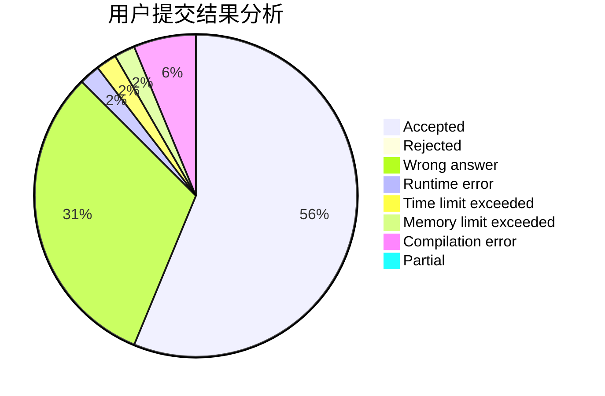
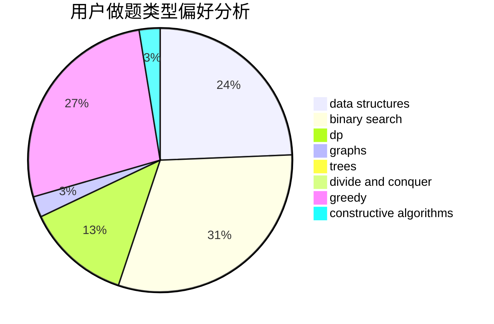
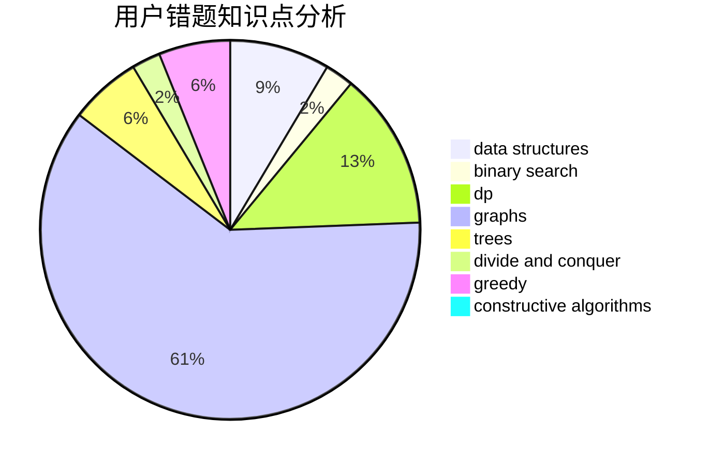

# EternHope

<!-- tabs:start -->

#### **用户提交结果分析**

#### **用户做题类型偏好分析**

#### **用户错题知识点分析**

<!-- tabs:end -->
# 推荐题目
[1327A](https://codeforces.com/contest/1327/problem/A)		math		  
[13131](https://codeforces.com/contest/1313/problem/1)		dsu,graphs,sortings,trees		  
[1163D](https://codeforces.com/contest/1163/problem/D)		dp,
                        strings		  
[837G](https://codeforces.com/contest/837/problem/G)		data structures		  
[142D](https://codeforces.com/contest/142/problem/D)		games		  
[397E](https://codeforces.com/contest/397/problem/E)		dsu,graphs,sortings,trees		  
[1251A](https://codeforces.com/contest/1251/problem/A)		brute force,
                        strings,
                        two pointers		  
[850B](https://codeforces.com/contest/850/problem/B)		implementation,
                        number theory		  
[1281F](https://codeforces.com/contest/1281/problem/F)		dsu,graphs,sortings,trees		  
[850C](https://codeforces.com/contest/850/problem/C)		bitmasks,
                        dp,
                        games		  
