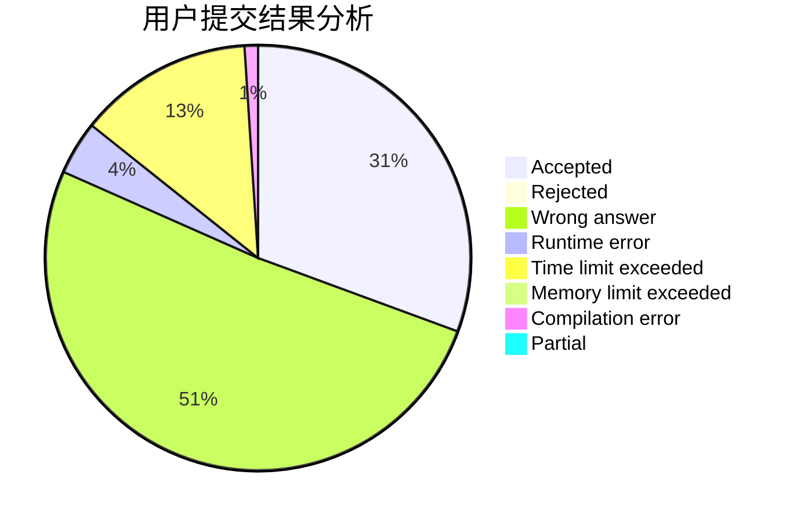
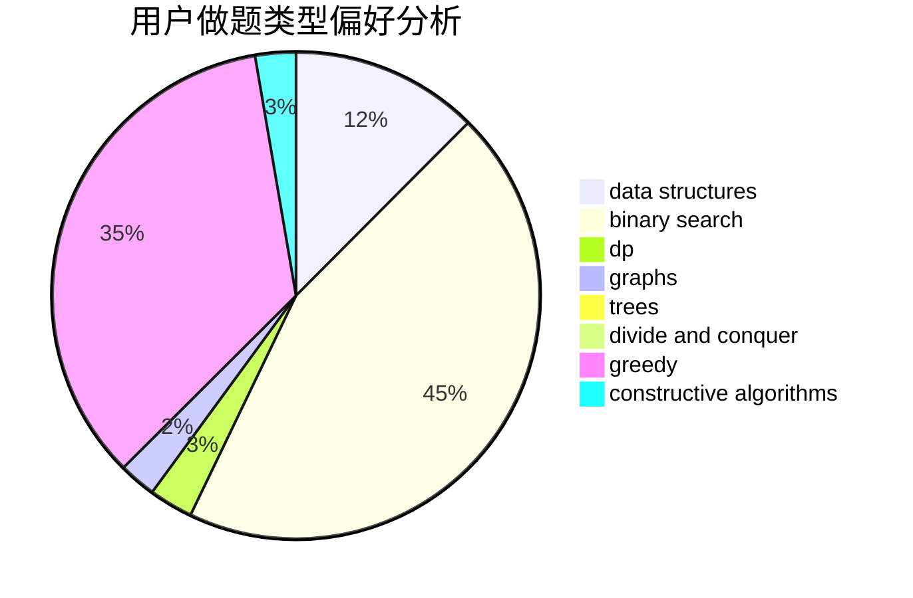
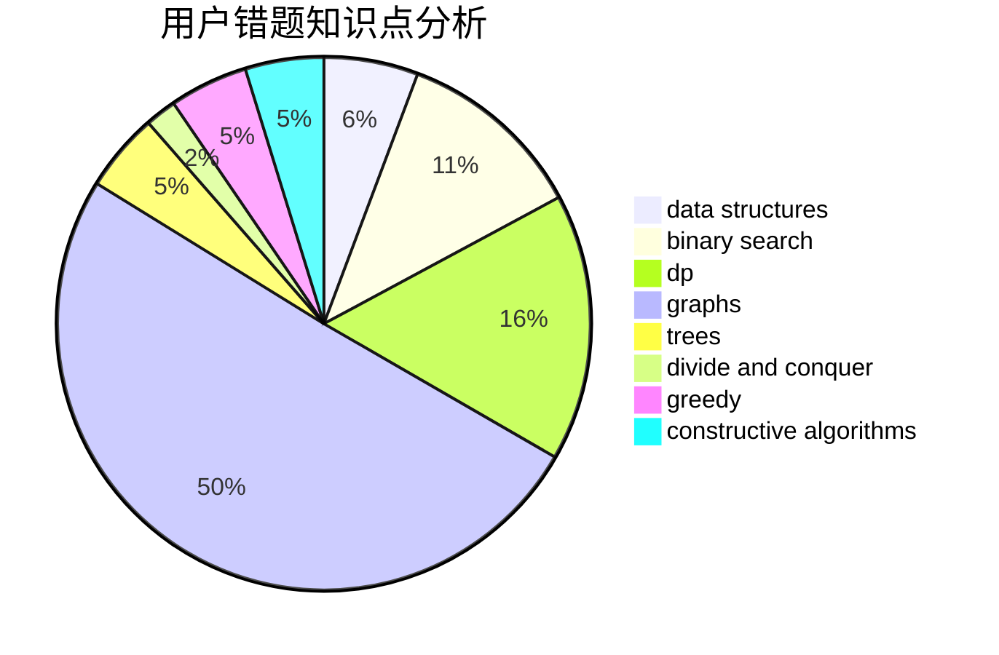

# EternalAlexander
<!-- tabs:start -->
#### **用户提交结果分析**

#### **用户做题类型偏好分析**

#### **用户错题知识点分析**

<!-- tabs:end -->
# 推荐题目
[Berserk And Fireball](http://codeforces.com/problemset/problem/1380/D)		constructive algorithms,
                        greedy,
                        implementation,
                        math,
                        two pointers		  
[Inversion Expectation](http://codeforces.com/problemset/problem/1096/F)		dp,
                        math,
                        probabilities		  
[Tower of Hanoi](http://codeforces.com/problemset/problem/392/B)		dp		  
[Negative Prefixes](http://codeforces.com/problemset/problem/1418/B)		greedy,
                        sortings		  
[Two Merged Sequences](http://codeforces.com/problemset/problem/1144/G)		dp,
                        greedy		  
[Yaroslav and Divisors](http://codeforces.com/problemset/problem/301/D)		data structures		  
[Multithreading (Hard Version)](http://codeforces.com/problemset/problem/1450/H2)		combinatorics,
                        implementation,
                        math		  
[Isolation](http://codeforces.com/problemset/problem/1129/D)		data structures,
                        dp		  
[Insomnia cure](http://codeforces.com/problemset/problem/148/A)		constructive algorithms,
                        implementation,
                        math		  
[Meme Problem](http://codeforces.com/problemset/problem/1076/C)		binary search,
                        math		  
<!-- tabs:start -->
#### **data structures**
[Yaroslav and Divisors](http://codeforces.com/problemset/problem/301/D)		data structures		  
[Isolation](http://codeforces.com/problemset/problem/1129/D)		data structures,
                        dp		  
[Red-Black Cobweb](http://codeforces.com/problemset/problem/833/D)		data structures,
                        divide and conquer,
                        implementation,
                        trees		  
[The Festive Evening](http://codeforces.com/problemset/problem/834/B)		data structures,
                        implementation		  
[Counter Attack](http://codeforces.com/problemset/problem/190/E)		data structures,
                        dsu,
                        graphs,
                        hashing,
                        sortings		  
[The Bakery](http://codeforces.com/problemset/problem/833/B)		binary search,
                        data structures,
                        divide and conquer,
                        dp,
                        two pointers		  
[Hyperset](http://codeforces.com/problemset/problem/1287/B)		brute force,
                        data structures,
                        implementation		  
[Maximum width](http://codeforces.com/problemset/problem/1492/C)		binary search,
                        data structures,
                        dp,
                        greedy,
                        two pointers		  
[Old Floppy Drive](http://codeforces.com/problemset/problem/1490/G)		binary search,
                        data structures,
                        math		  
[Odd Mineral Resource](http://codeforces.com/problemset/problem/1479/D)		binary search,
                        bitmasks,
                        brute force,
                        data structures,
                        probabilities,
                        trees		  
#### **binary search**
[Meme Problem](http://codeforces.com/problemset/problem/1076/C)		binary search,
                        math		  
[Strange Radiation](http://codeforces.com/problemset/problem/832/C)		binary search,
                        implementation,
                        math		  
[The Tower is Going Home](https://codeforces.com/contest/1074/problem/A)		binary search,
                        two pointers		  
[Stock Exchange](http://codeforces.com/problemset/problem/1178/H)		binary search,
                        flows,
                        graphs		  
[The Bakery](http://codeforces.com/problemset/problem/833/B)		binary search,
                        data structures,
                        divide and conquer,
                        dp,
                        two pointers		  
[Maximum width](http://codeforces.com/problemset/problem/1492/C)		binary search,
                        data structures,
                        dp,
                        greedy,
                        two pointers		  
[Pairs](http://codeforces.com/problemset/problem/1463/D)		binary search,
                        constructive algorithms,
                        greedy,
                        two pointers		  
[Old Floppy Drive](http://codeforces.com/problemset/problem/1490/G)		binary search,
                        data structures,
                        math		  
[Odd Mineral Resource](http://codeforces.com/problemset/problem/1479/D)		binary search,
                        bitmasks,
                        brute force,
                        data structures,
                        probabilities,
                        trees		  
[Complicated Computations](http://codeforces.com/problemset/problem/1436/E)		binary search,
                        data structures,
                        two pointers		  
#### **dp**
[Inversion Expectation](http://codeforces.com/problemset/problem/1096/F)		dp,
                        math,
                        probabilities		  
[Tower of Hanoi](http://codeforces.com/problemset/problem/392/B)		dp		  
[Two Merged Sequences](http://codeforces.com/problemset/problem/1144/G)		dp,
                        greedy		  
[Isolation](http://codeforces.com/problemset/problem/1129/D)		data structures,
                        dp		  
[Garland](https://codeforces.com/contest/1287/problem/C)		dp,
                        greedy,
                        sortings		  
[BerSU Ball](http://codeforces.com/problemset/problem/489/B)		dfs and similar,
                        dp,
                        graph matchings,
                        greedy,
                        sortings,
                        two pointers		  
[Solitaire](http://codeforces.com/problemset/problem/208/B)		dfs and similar,
                        dp		  
[Transmitting Levels](http://codeforces.com/problemset/problem/526/E)		dp,
                        implementation		  
[Product Oriented Recurrence](http://codeforces.com/problemset/problem/1182/E)		dp,
                        math,
                        matrices,
                        number theory		  
[The Bakery](http://codeforces.com/problemset/problem/833/B)		binary search,
                        data structures,
                        divide and conquer,
                        dp,
                        two pointers		  
#### **graph**
[BerSU Ball](http://codeforces.com/problemset/problem/489/B)		dfs and similar,
                        dp,
                        graph matchings,
                        greedy,
                        sortings,
                        two pointers		  
[Counter Attack](http://codeforces.com/problemset/problem/190/E)		data structures,
                        dsu,
                        graphs,
                        hashing,
                        sortings		  
[Stock Exchange](http://codeforces.com/problemset/problem/1178/H)		binary search,
                        flows,
                        graphs		  
[Misha, Grisha and Underground](http://codeforces.com/problemset/problem/832/D)		dfs and similar,
                        graphs,
                        trees		  
[Minimum Ties](http://codeforces.com/problemset/problem/1487/C)		brute force,
                        constructive algorithms,
                        dfs and similar,
                        graphs,
                        greedy,
                        implementation,
                        math		  
[Chef Monocarp](http://codeforces.com/problemset/problem/1437/C)		dp,
                        flows,
                        graph matchings,
                        greedy,
                        math,
                        sortings		  
[Strange Housing](http://codeforces.com/problemset/problem/1470/D)		constructive algorithms,
                        dfs and similar,
                        graph matchings,
                        graphs,
                        greedy		  
[Longest Simple Cycle](http://codeforces.com/problemset/problem/1476/C)		dp,
                        graphs,
                        greedy		  
[Shortest and Longest LIS](http://codeforces.com/problemset/problem/1304/D)		constructive algorithms,
                        graphs,
                        greedy,
                        two pointers		  
[Ball in Berland](http://codeforces.com/problemset/problem/1475/C)		combinatorics,
                        graphs,
                        math		  
#### **trees**
[Red-Black Cobweb](http://codeforces.com/problemset/problem/833/D)		data structures,
                        divide and conquer,
                        implementation,
                        trees		  
[Misha, Grisha and Underground](http://codeforces.com/problemset/problem/832/D)		dfs and similar,
                        graphs,
                        trees		  
[Odd Mineral Resource](http://codeforces.com/problemset/problem/1479/D)		binary search,
                        bitmasks,
                        brute force,
                        data structures,
                        probabilities,
                        trees		  
[Yet Another Card Deck](http://codeforces.com/problemset/problem/1511/C)		brute force,
                        data structures,
                        implementation,
                        trees		  
[Diameter Cuts](http://codeforces.com/problemset/problem/1499/F)		combinatorics,
                        dfs and similar,
                        dp,
                        trees		  
[Fib-tree](http://codeforces.com/problemset/problem/1491/E)		brute force,
                        dfs and similar,
                        divide and conquer,
                        number theory,
                        trees		  
[13th Labour of Heracles](http://codeforces.com/problemset/problem/1466/D)		data structures,
                        greedy,
                        sortings,
                        trees		  
[BFS Trees](http://codeforces.com/problemset/problem/1495/D)		combinatorics,
                        dfs and similar,
                        graphs,
                        math,
                        shortest paths,
                        trees		  
[Sum of Prefix Sums](http://codeforces.com/problemset/problem/1303/G)		data structures,
                        divide and conquer,
                        geometry,
                        trees		  
[Number of Simple Paths](http://codeforces.com/problemset/problem/1454/E)		combinatorics,
                        dfs and similar,
                        graphs,
                        trees		  
#### **divide and conquer**
[Red-Black Cobweb](http://codeforces.com/problemset/problem/833/D)		data structures,
                        divide and conquer,
                        implementation,
                        trees		  
[The Bakery](http://codeforces.com/problemset/problem/833/B)		binary search,
                        data structures,
                        divide and conquer,
                        dp,
                        two pointers		  
[Divide and Summarize](http://codeforces.com/problemset/problem/1461/D)		binary search,
                        brute force,
                        data structures,
                        divide and conquer,
                        implementation,
                        sortings		  
[Song of the Sirens](http://codeforces.com/problemset/problem/1466/G)		combinatorics,
                        divide and conquer,
                        hashing,
                        math,
                        string suffix structures,
                        strings		  
[Permutation Transformation](http://codeforces.com/problemset/problem/1490/D)		dfs and similar,
                        divide and conquer,
                        implementation		  
[Skyline Photo](https://codeforces.com/contest/1483/problem/C)		data structures,
                        divide and conquer,
                        dp		  
[Fib-tree](http://codeforces.com/problemset/problem/1491/E)		brute force,
                        dfs and similar,
                        divide and conquer,
                        number theory,
                        trees		  
[Sum of Prefix Sums](http://codeforces.com/problemset/problem/1303/G)		data structures,
                        divide and conquer,
                        geometry,
                        trees		  
[Dogeforces](http://codeforces.com/problemset/problem/1494/D)		constructive algorithms,
                        data structures,
                        dfs and similar,
                        divide and conquer,
                        dsu,
                        greedy,
                        sortings,
                        trees		  
[Skyline Photo](http://codeforces.com/problemset/problem/1482/E)		data structures,
                        divide and conquer,
                        dp		  
#### **greedy**
[Berserk And Fireball](http://codeforces.com/problemset/problem/1380/D)		constructive algorithms,
                        greedy,
                        implementation,
                        math,
                        two pointers		  
[Negative Prefixes](http://codeforces.com/problemset/problem/1418/B)		greedy,
                        sortings		  
[Two Merged Sequences](http://codeforces.com/problemset/problem/1144/G)		dp,
                        greedy		  
[Sorting Railway Cars](https://codeforces.com/contest/606/problem/C)		constructive algorithms,
                        greedy		  
[Garland](https://codeforces.com/contest/1287/problem/C)		dp,
                        greedy,
                        sortings		  
[BerSU Ball](http://codeforces.com/problemset/problem/489/B)		dfs and similar,
                        dp,
                        graph matchings,
                        greedy,
                        sortings,
                        two pointers		  
[Ever-Hungry Krakozyabra](http://codeforces.com/problemset/problem/833/C)		brute force,
                        combinatorics,
                        greedy,
                        math		  
[Neko Finds Grapes](http://codeforces.com/problemset/problem/1152/A)		greedy,
                        implementation,
                        math		  
[Add to Neighbour and Remove](http://codeforces.com/problemset/problem/1462/D)		greedy,
                        math,
                        number theory		  
[Beautiful Regional Contest](http://codeforces.com/problemset/problem/1264/A)		greedy,
                        implementation		  
#### **constructive algorithms**
[Berserk And Fireball](http://codeforces.com/problemset/problem/1380/D)		constructive algorithms,
                        greedy,
                        implementation,
                        math,
                        two pointers		  
[Insomnia cure](http://codeforces.com/problemset/problem/148/A)		constructive algorithms,
                        implementation,
                        math		  
[Sorting Railway Cars](https://codeforces.com/contest/606/problem/C)		constructive algorithms,
                        greedy		  
[Headquarters](http://codeforces.com/problemset/problem/183/A)		constructive algorithms,
                        math		  
[Ichihime and Triangle](http://codeforces.com/problemset/problem/1337/A)		constructive algorithms,
                        math		  
[Find The Array](http://codeforces.com/problemset/problem/1463/B)		bitmasks,
                        constructive algorithms,
                        greedy		  
[Anti-knapsack](http://codeforces.com/problemset/problem/1493/A)		constructive algorithms,
                        greedy		  
[Pairs](http://codeforces.com/problemset/problem/1463/D)		binary search,
                        constructive algorithms,
                        greedy,
                        two pointers		  
[XOR-gun](https://codeforces.com/contest/1456/problem/B)		bitmasks,
                        brute force,
                        constructive algorithms		  
[Genius's Gambit](http://codeforces.com/problemset/problem/1492/D)		bitmasks,
                        constructive algorithms,
                        greedy,
                        math		  
#### **sortings**
[Negative Prefixes](http://codeforces.com/problemset/problem/1418/B)		greedy,
                        sortings		  
[Garland](https://codeforces.com/contest/1287/problem/C)		dp,
                        greedy,
                        sortings		  
[BerSU Ball](http://codeforces.com/problemset/problem/489/B)		dfs and similar,
                        dp,
                        graph matchings,
                        greedy,
                        sortings,
                        two pointers		  
[Counter Attack](http://codeforces.com/problemset/problem/190/E)		data structures,
                        dsu,
                        graphs,
                        hashing,
                        sortings		  
[Diamond Miner](https://codeforces.com/contest/1496/problem/C)		geometry,
                        greedy,
                        math,
                        sortings		  
[Diamond Miner](http://codeforces.com/problemset/problem/1495/A)		geometry,
                        greedy,
                        math,
                        sortings		  
[Meximization](http://codeforces.com/problemset/problem/1497/A)		brute force,
                        data structures,
                        greedy,
                        sortings		  
[Avoiding Zero](http://codeforces.com/problemset/problem/1427/A)		math,
                        sortings		  
[Divide and Summarize](http://codeforces.com/problemset/problem/1461/D)		binary search,
                        brute force,
                        data structures,
                        divide and conquer,
                        implementation,
                        sortings		  
[Chef Monocarp](http://codeforces.com/problemset/problem/1437/C)		dp,
                        flows,
                        graph matchings,
                        greedy,
                        math,
                        sortings		  
<!-- tabs:end -->
