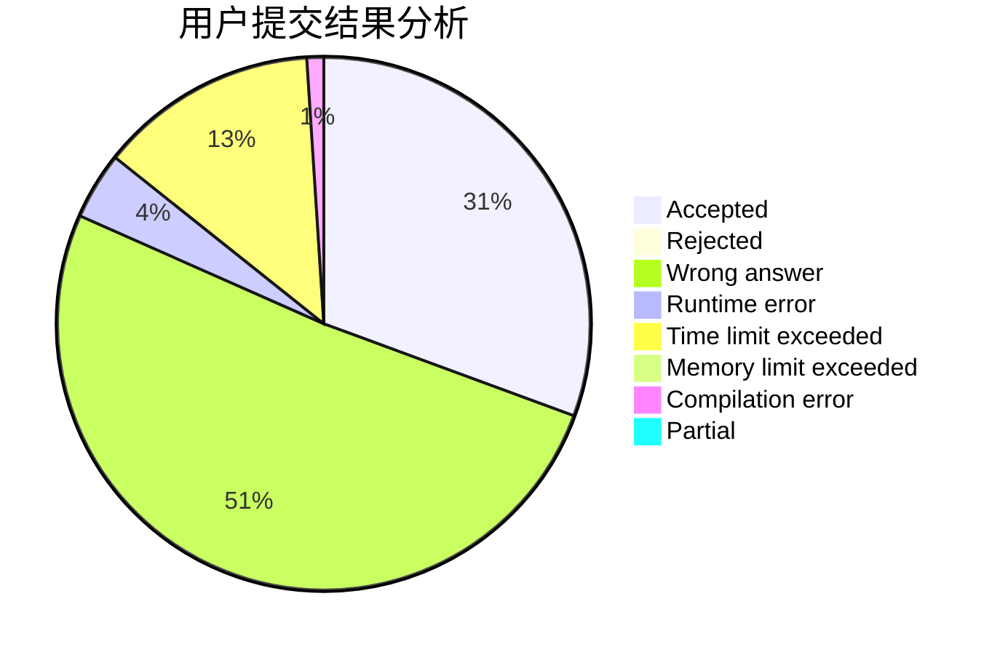
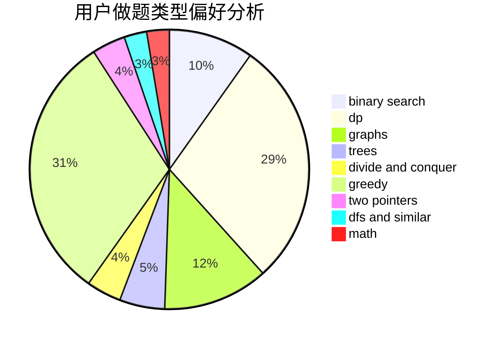

# EternalAlexander

<!-- tabs:start -->

#### **用户提交结果分析**

#### **用户做题类型偏好分析**

<!-- tabs:end -->
# 推荐题目
[1181C](https://codeforces.com/contest/1181/problem/C)
[209C](https://codeforces.com/contest/209/problem/C)
[1459F](https://codeforces.com/contest/1459/problem/F)
[320B](https://codeforces.com/contest/320/problem/B)
[1294F](https://codeforces.com/contest/1294/problem/F)
[421A](https://codeforces.com/contest/421/problem/A)
[1147A](https://codeforces.com/contest/1147/problem/A)
[1389G](https://codeforces.com/contest/1389/problem/G)
[851D](https://codeforces.com/contest/851/problem/D)
[625B](https://codeforces.com/contest/625/problem/B)
