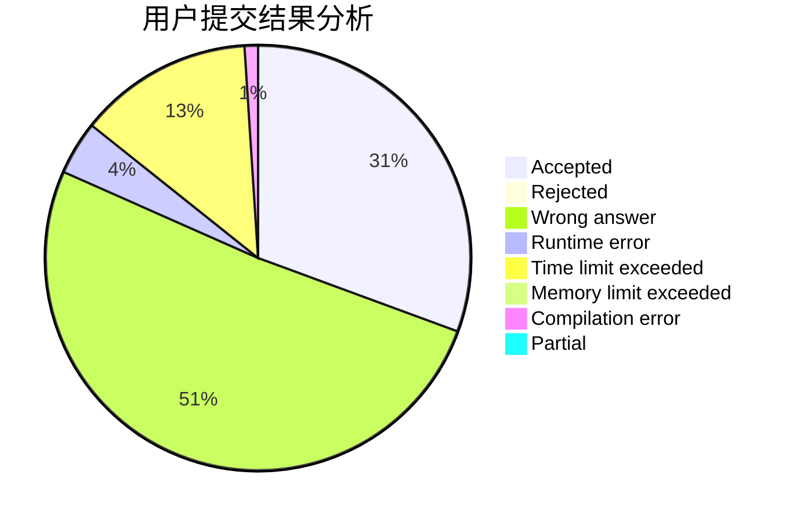
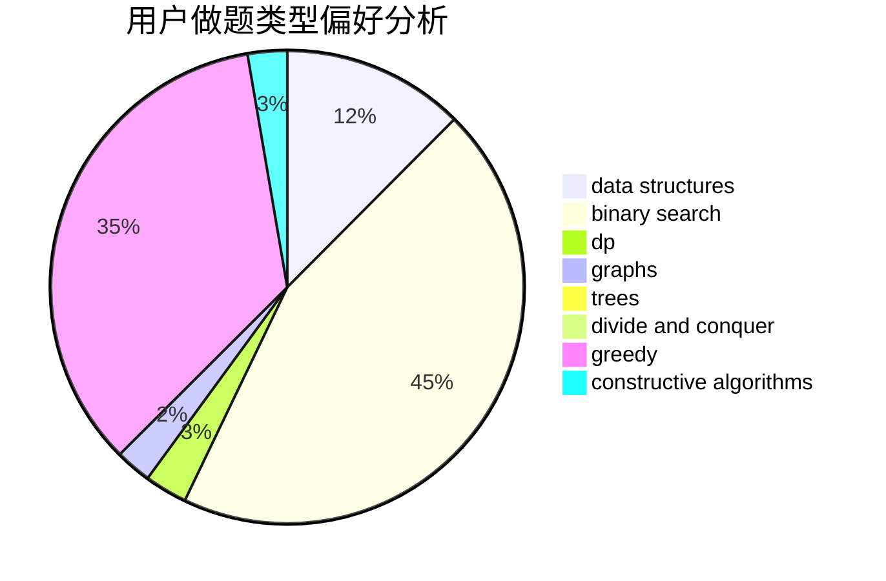
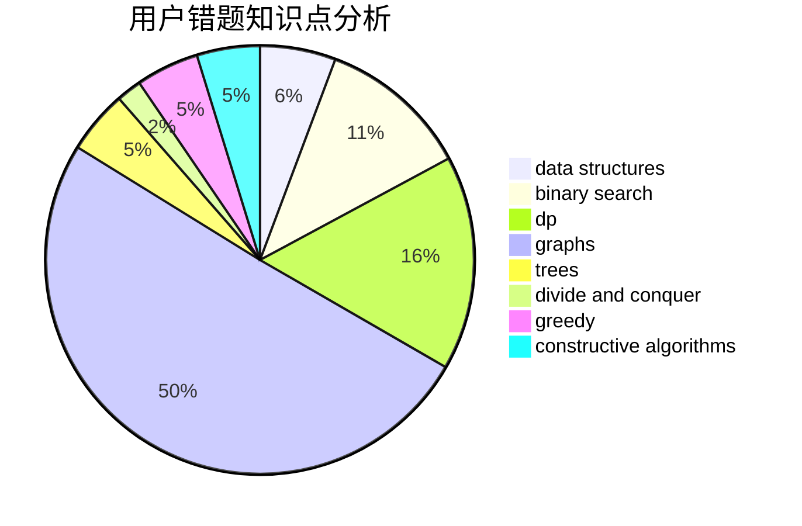

# EternalAlexander
<!-- tabs:start -->
#### **用户提交结果分析**

#### **用户做题类型偏好分析**

#### **用户错题知识点分析**

<!-- tabs:end -->
# 推荐题目
[Berserk And Fireball](http://codeforces.com/problemset/problem/1380/D)		constructive algorithms,
                        greedy,
                        implementation,
                        math,
                        two pointers		  
[Inversion Expectation](http://codeforces.com/problemset/problem/1096/F)		dp,
                        math,
                        probabilities		  
[Tower of Hanoi](http://codeforces.com/problemset/problem/392/B)		dp		  
[Negative Prefixes](http://codeforces.com/problemset/problem/1418/B)		greedy,
                        sortings		  
[Two Merged Sequences](http://codeforces.com/problemset/problem/1144/G)		dp,
                        greedy		  
[Yaroslav and Divisors](http://codeforces.com/problemset/problem/301/D)		data structures		  
[Multithreading (Hard Version)](http://codeforces.com/problemset/problem/1450/H2)		combinatorics,
                        implementation,
                        math		  
[Isolation](http://codeforces.com/problemset/problem/1129/D)		data structures,
                        dp		  
[Insomnia cure](http://codeforces.com/problemset/problem/148/A)		constructive algorithms,
                        implementation,
                        math		  
[Meme Problem](http://codeforces.com/problemset/problem/1076/C)		binary search,
                        math		  
<!-- tabs:start -->
#### **data structures**
[Berserk And Fireball](http://codeforces.com/problemset/problem/301/D)		data structures		  
[Inversion Expectation](http://codeforces.com/problemset/problem/1129/D)		data structures,
                        dp		  
[Tower of Hanoi](http://codeforces.com/problemset/problem/833/D)		data structures,
                        divide and conquer,
                        implementation,
                        trees		  
[Negative Prefixes](http://codeforces.com/problemset/problem/834/B)		data structures,
                        implementation		  
[Two Merged Sequences](http://codeforces.com/problemset/problem/190/E)		data structures,
                        dsu,
                        graphs,
                        hashing,
                        sortings		  
[Yaroslav and Divisors](http://codeforces.com/problemset/problem/833/B)		binary search,
                        data structures,
                        divide and conquer,
                        dp,
                        two pointers		  
[Multithreading (Hard Version)](http://codeforces.com/problemset/problem/1287/B)		brute force,
                        data structures,
                        implementation		  
[Isolation](http://codeforces.com/problemset/problem/1492/C)		binary search,
                        data structures,
                        dp,
                        greedy,
                        two pointers		  
[Insomnia cure](http://codeforces.com/problemset/problem/1490/G)		binary search,
                        data structures,
                        math		  
[Meme Problem](http://codeforces.com/problemset/problem/1479/D)		binary search,
                        bitmasks,
                        brute force,
                        data structures,
                        probabilities,
                        trees		  
#### **binary search**
[Berserk And Fireball](http://codeforces.com/problemset/problem/1076/C)		binary search,
                        math		  
[Inversion Expectation](http://codeforces.com/problemset/problem/832/C)		binary search,
                        implementation,
                        math		  
[Tower of Hanoi](https://codeforces.com/contest/1074/problem/A)		binary search,
                        two pointers		  
[Negative Prefixes](http://codeforces.com/problemset/problem/1178/H)		binary search,
                        flows,
                        graphs		  
[Two Merged Sequences](http://codeforces.com/problemset/problem/833/B)		binary search,
                        data structures,
                        divide and conquer,
                        dp,
                        two pointers		  
[Yaroslav and Divisors](http://codeforces.com/problemset/problem/1492/C)		binary search,
                        data structures,
                        dp,
                        greedy,
                        two pointers		  
[Multithreading (Hard Version)](http://codeforces.com/problemset/problem/1463/D)		binary search,
                        constructive algorithms,
                        greedy,
                        two pointers		  
[Isolation](http://codeforces.com/problemset/problem/1490/G)		binary search,
                        data structures,
                        math		  
[Insomnia cure](http://codeforces.com/problemset/problem/1479/D)		binary search,
                        bitmasks,
                        brute force,
                        data structures,
                        probabilities,
                        trees		  
[Meme Problem](http://codeforces.com/problemset/problem/1436/E)		binary search,
                        data structures,
                        two pointers		  
#### **dp**
[Berserk And Fireball](http://codeforces.com/problemset/problem/1096/F)		dp,
                        math,
                        probabilities		  
[Inversion Expectation](http://codeforces.com/problemset/problem/392/B)		dp		  
[Tower of Hanoi](http://codeforces.com/problemset/problem/1144/G)		dp,
                        greedy		  
[Negative Prefixes](http://codeforces.com/problemset/problem/1129/D)		data structures,
                        dp		  
[Two Merged Sequences](https://codeforces.com/contest/1287/problem/C)		dp,
                        greedy,
                        sortings		  
[Yaroslav and Divisors](http://codeforces.com/problemset/problem/489/B)		dfs and similar,
                        dp,
                        graph matchings,
                        greedy,
                        sortings,
                        two pointers		  
[Multithreading (Hard Version)](http://codeforces.com/problemset/problem/208/B)		dfs and similar,
                        dp		  
[Isolation](http://codeforces.com/problemset/problem/526/E)		dp,
                        implementation		  
[Insomnia cure](http://codeforces.com/problemset/problem/1182/E)		dp,
                        math,
                        matrices,
                        number theory		  
[Meme Problem](http://codeforces.com/problemset/problem/833/B)		binary search,
                        data structures,
                        divide and conquer,
                        dp,
                        two pointers		  
#### **graph**
[Berserk And Fireball](http://codeforces.com/problemset/problem/489/B)		dfs and similar,
                        dp,
                        graph matchings,
                        greedy,
                        sortings,
                        two pointers		  
[Inversion Expectation](http://codeforces.com/problemset/problem/190/E)		data structures,
                        dsu,
                        graphs,
                        hashing,
                        sortings		  
[Tower of Hanoi](http://codeforces.com/problemset/problem/1178/H)		binary search,
                        flows,
                        graphs		  
[Negative Prefixes](http://codeforces.com/problemset/problem/832/D)		dfs and similar,
                        graphs,
                        trees		  
[Two Merged Sequences](http://codeforces.com/problemset/problem/1487/C)		brute force,
                        constructive algorithms,
                        dfs and similar,
                        graphs,
                        greedy,
                        implementation,
                        math		  
[Yaroslav and Divisors](http://codeforces.com/problemset/problem/1437/C)		dp,
                        flows,
                        graph matchings,
                        greedy,
                        math,
                        sortings		  
[Multithreading (Hard Version)](http://codeforces.com/problemset/problem/1470/D)		constructive algorithms,
                        dfs and similar,
                        graph matchings,
                        graphs,
                        greedy		  
[Isolation](http://codeforces.com/problemset/problem/1476/C)		dp,
                        graphs,
                        greedy		  
[Insomnia cure](http://codeforces.com/problemset/problem/1304/D)		constructive algorithms,
                        graphs,
                        greedy,
                        two pointers		  
[Meme Problem](http://codeforces.com/problemset/problem/1475/C)		combinatorics,
                        graphs,
                        math		  
#### **trees**
[Berserk And Fireball](http://codeforces.com/problemset/problem/833/D)		data structures,
                        divide and conquer,
                        implementation,
                        trees		  
[Inversion Expectation](http://codeforces.com/problemset/problem/832/D)		dfs and similar,
                        graphs,
                        trees		  
[Tower of Hanoi](http://codeforces.com/problemset/problem/1479/D)		binary search,
                        bitmasks,
                        brute force,
                        data structures,
                        probabilities,
                        trees		  
[Negative Prefixes](http://codeforces.com/problemset/problem/1511/C)		brute force,
                        data structures,
                        implementation,
                        trees		  
[Two Merged Sequences](http://codeforces.com/problemset/problem/1499/F)		combinatorics,
                        dfs and similar,
                        dp,
                        trees		  
[Yaroslav and Divisors](http://codeforces.com/problemset/problem/1491/E)		brute force,
                        dfs and similar,
                        divide and conquer,
                        number theory,
                        trees		  
[Multithreading (Hard Version)](http://codeforces.com/problemset/problem/1466/D)		data structures,
                        greedy,
                        sortings,
                        trees		  
[Isolation](http://codeforces.com/problemset/problem/1495/D)		combinatorics,
                        dfs and similar,
                        graphs,
                        math,
                        shortest paths,
                        trees		  
[Insomnia cure](http://codeforces.com/problemset/problem/1303/G)		data structures,
                        divide and conquer,
                        geometry,
                        trees		  
[Meme Problem](http://codeforces.com/problemset/problem/1454/E)		combinatorics,
                        dfs and similar,
                        graphs,
                        trees		  
#### **divide and conquer**
[Berserk And Fireball](http://codeforces.com/problemset/problem/833/D)		data structures,
                        divide and conquer,
                        implementation,
                        trees		  
[Inversion Expectation](http://codeforces.com/problemset/problem/833/B)		binary search,
                        data structures,
                        divide and conquer,
                        dp,
                        two pointers		  
[Tower of Hanoi](http://codeforces.com/problemset/problem/1461/D)		binary search,
                        brute force,
                        data structures,
                        divide and conquer,
                        implementation,
                        sortings		  
[Negative Prefixes](http://codeforces.com/problemset/problem/1466/G)		combinatorics,
                        divide and conquer,
                        hashing,
                        math,
                        string suffix structures,
                        strings		  
[Two Merged Sequences](http://codeforces.com/problemset/problem/1490/D)		dfs and similar,
                        divide and conquer,
                        implementation		  
[Yaroslav and Divisors](https://codeforces.com/contest/1483/problem/C)		data structures,
                        divide and conquer,
                        dp		  
[Multithreading (Hard Version)](http://codeforces.com/problemset/problem/1491/E)		brute force,
                        dfs and similar,
                        divide and conquer,
                        number theory,
                        trees		  
[Isolation](http://codeforces.com/problemset/problem/1303/G)		data structures,
                        divide and conquer,
                        geometry,
                        trees		  
[Insomnia cure](http://codeforces.com/problemset/problem/1494/D)		constructive algorithms,
                        data structures,
                        dfs and similar,
                        divide and conquer,
                        dsu,
                        greedy,
                        sortings,
                        trees		  
[Meme Problem](http://codeforces.com/problemset/problem/1482/E)		data structures,
                        divide and conquer,
                        dp		  
#### **greedy**
[Berserk And Fireball](http://codeforces.com/problemset/problem/1380/D)		constructive algorithms,
                        greedy,
                        implementation,
                        math,
                        two pointers		  
[Inversion Expectation](http://codeforces.com/problemset/problem/1418/B)		greedy,
                        sortings		  
[Tower of Hanoi](http://codeforces.com/problemset/problem/1144/G)		dp,
                        greedy		  
[Negative Prefixes](https://codeforces.com/contest/606/problem/C)		constructive algorithms,
                        greedy		  
[Two Merged Sequences](https://codeforces.com/contest/1287/problem/C)		dp,
                        greedy,
                        sortings		  
[Yaroslav and Divisors](http://codeforces.com/problemset/problem/489/B)		dfs and similar,
                        dp,
                        graph matchings,
                        greedy,
                        sortings,
                        two pointers		  
[Multithreading (Hard Version)](http://codeforces.com/problemset/problem/833/C)		brute force,
                        combinatorics,
                        greedy,
                        math		  
[Isolation](http://codeforces.com/problemset/problem/1152/A)		greedy,
                        implementation,
                        math		  
[Insomnia cure](http://codeforces.com/problemset/problem/1462/D)		greedy,
                        math,
                        number theory		  
[Meme Problem](http://codeforces.com/problemset/problem/1264/A)		greedy,
                        implementation		  
#### **constructive algorithms**
[Berserk And Fireball](http://codeforces.com/problemset/problem/1380/D)		constructive algorithms,
                        greedy,
                        implementation,
                        math,
                        two pointers		  
[Inversion Expectation](http://codeforces.com/problemset/problem/148/A)		constructive algorithms,
                        implementation,
                        math		  
[Tower of Hanoi](https://codeforces.com/contest/606/problem/C)		constructive algorithms,
                        greedy		  
[Negative Prefixes](http://codeforces.com/problemset/problem/183/A)		constructive algorithms,
                        math		  
[Two Merged Sequences](http://codeforces.com/problemset/problem/1337/A)		constructive algorithms,
                        math		  
[Yaroslav and Divisors](http://codeforces.com/problemset/problem/1463/B)		bitmasks,
                        constructive algorithms,
                        greedy		  
[Multithreading (Hard Version)](http://codeforces.com/problemset/problem/1493/A)		constructive algorithms,
                        greedy		  
[Isolation](http://codeforces.com/problemset/problem/1463/D)		binary search,
                        constructive algorithms,
                        greedy,
                        two pointers		  
[Insomnia cure](https://codeforces.com/contest/1456/problem/B)		bitmasks,
                        brute force,
                        constructive algorithms		  
[Meme Problem](http://codeforces.com/problemset/problem/1492/D)		bitmasks,
                        constructive algorithms,
                        greedy,
                        math		  
#### **sortings**
[Berserk And Fireball](http://codeforces.com/problemset/problem/1418/B)		greedy,
                        sortings		  
[Inversion Expectation](https://codeforces.com/contest/1287/problem/C)		dp,
                        greedy,
                        sortings		  
[Tower of Hanoi](http://codeforces.com/problemset/problem/489/B)		dfs and similar,
                        dp,
                        graph matchings,
                        greedy,
                        sortings,
                        two pointers		  
[Negative Prefixes](http://codeforces.com/problemset/problem/190/E)		data structures,
                        dsu,
                        graphs,
                        hashing,
                        sortings		  
[Two Merged Sequences](https://codeforces.com/contest/1496/problem/C)		geometry,
                        greedy,
                        math,
                        sortings		  
[Yaroslav and Divisors](http://codeforces.com/problemset/problem/1495/A)		geometry,
                        greedy,
                        math,
                        sortings		  
[Multithreading (Hard Version)](http://codeforces.com/problemset/problem/1497/A)		brute force,
                        data structures,
                        greedy,
                        sortings		  
[Isolation](http://codeforces.com/problemset/problem/1427/A)		math,
                        sortings		  
[Insomnia cure](http://codeforces.com/problemset/problem/1461/D)		binary search,
                        brute force,
                        data structures,
                        divide and conquer,
                        implementation,
                        sortings		  
[Meme Problem](http://codeforces.com/problemset/problem/1437/C)		dp,
                        flows,
                        graph matchings,
                        greedy,
                        math,
                        sortings		  
<!-- tabs:end -->
