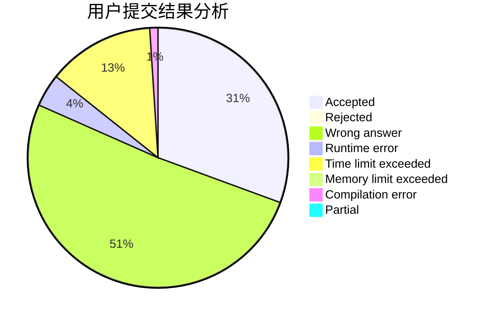
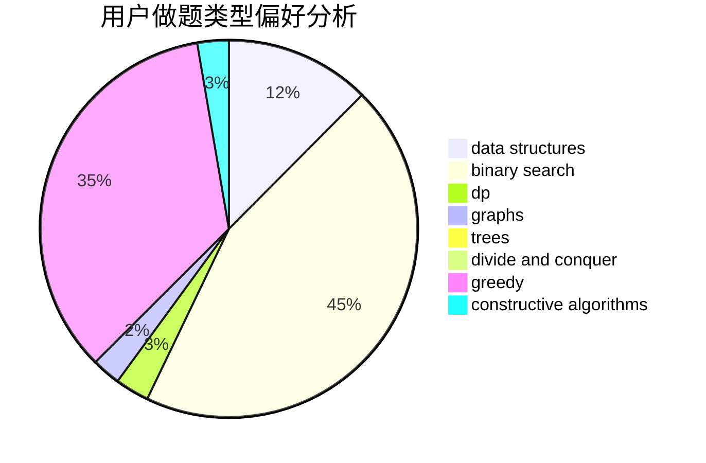
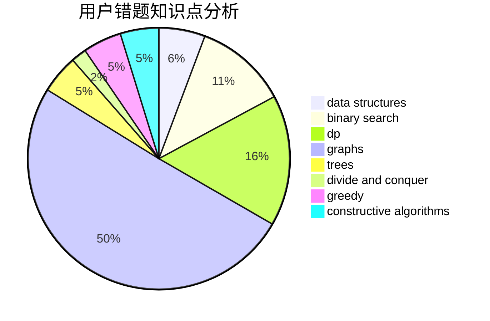

# EternalAlexander

<!-- tabs:start -->

#### **用户提交结果分析**

#### **用户做题类型偏好分析**

#### **用户错题知识点分析**

<!-- tabs:end -->
# 推荐题目
[1178H](https://codeforces.com/contest/1178/problem/H)		binary search,
                        flows,
                        graphs		  
[183A](https://codeforces.com/contest/183/problem/A)		constructive algorithms,
                        math		  
[1450H2](https://codeforces.com/contest/1450H/problem/2)		combinatorics,
                        implementation,
                        math		  
[301D](https://codeforces.com/contest/301/problem/D)		data structures		  
[1287C](https://codeforces.com/contest/1287/problem/C)		dsu,graphs,sortings,trees		  
[392B](https://codeforces.com/contest/392/problem/B)		dp		  
[1144G](https://codeforces.com/contest/1144/problem/G)		dp,
                        greedy		  
[1380D](https://codeforces.com/contest/1380/problem/D)		constructive algorithms,
                        greedy,
                        implementation,
                        math,
                        two pointers		  
[833D](https://codeforces.com/contest/833/problem/D)		data structures,
                        divide and conquer,
                        implementation,
                        trees		  
[606C](https://codeforces.com/contest/606/problem/C)		dsu,graphs,sortings,trees		  
