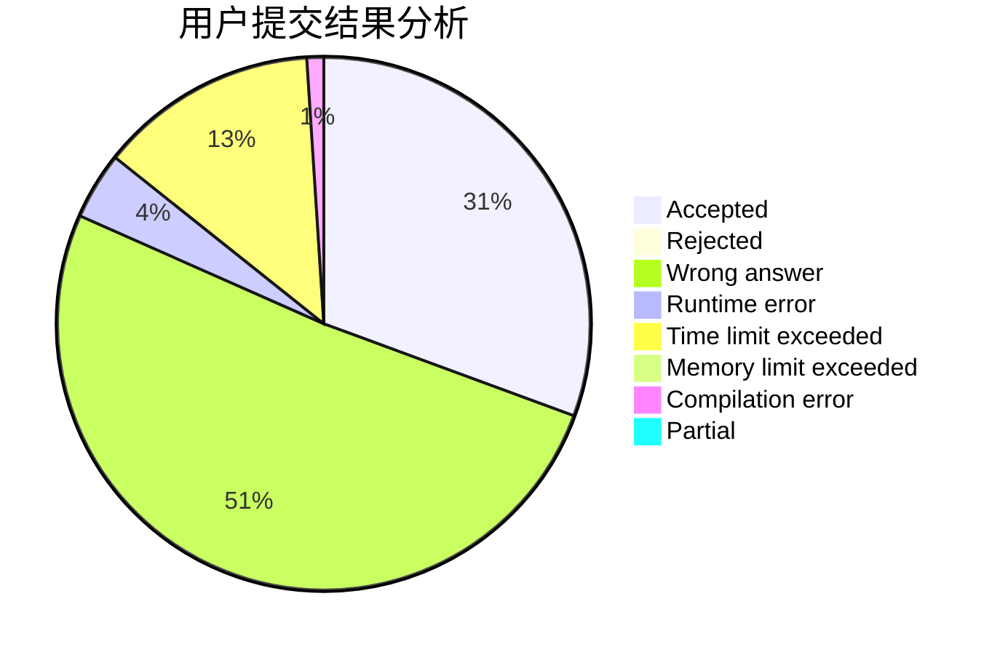
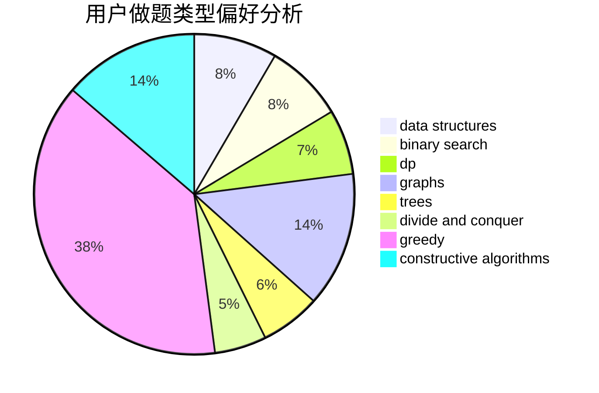
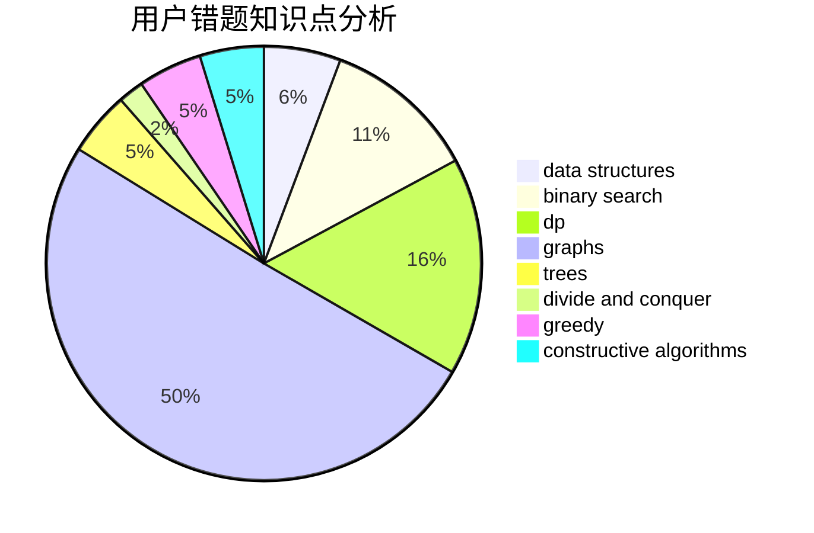

# EternalAlexander

<!-- tabs:start -->

#### **用户提交结果分析**

#### **用户做题类型偏好分析**

#### **用户错题知识点分析**

<!-- tabs:end -->
# 推荐题目
[1181C](https://codeforces.com/contest/1181/problem/C)		brute force,
                        combinatorics,
                        dp,
                        implementation		  
[209C](https://codeforces.com/contest/209/problem/C)		constructive algorithms,
                        dsu,
                        graphs,
                        greedy		  
[1459F](https://codeforces.com/contest/1459/problem/F)		dsu,graphs,sortings,trees		  
[320B](https://codeforces.com/contest/320/problem/B)		dfs and similar,
                        graphs		  
[1294F](https://codeforces.com/contest/1294/problem/F)		dfs and similar,
                        dp,
                        greedy,
                        trees		  
[421A](https://codeforces.com/contest/421/problem/A)		constructive algorithms,
                        implementation		  
[1147A](https://codeforces.com/contest/1147/problem/A)		graphs		  
[1389G](https://codeforces.com/contest/1389/problem/G)		dfs and similar,
                        dp,
                        graphs,
                        trees		  
[851D](https://codeforces.com/contest/851/problem/D)		dsu,graphs,sortings,trees		  
[625B](https://codeforces.com/contest/625/problem/B)		constructive algorithms,
                        greedy,
                        strings		  
